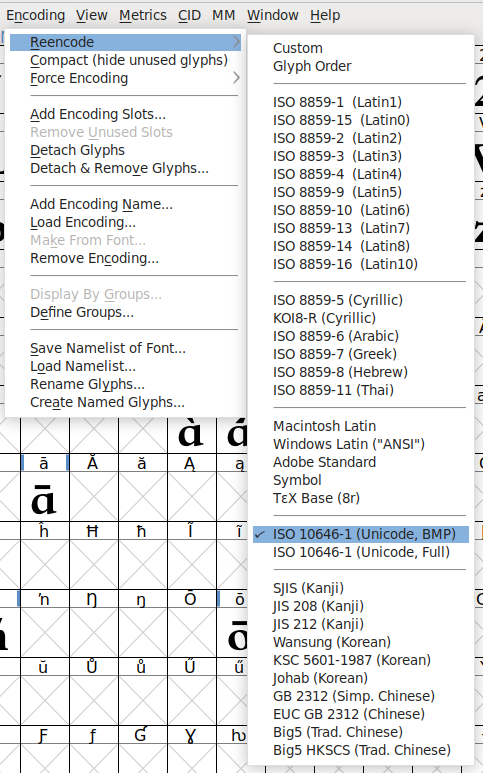

# 使用 FontForge 剪裁字体文件

2024-11-11 19:00

最近写网页想应用自定义字体。中文不同于“字母系”语言，
字符非常多，这导致字体文件很大，使得网页渲染速度变慢，FontForge正好
可以对字体库文件进行“裁剪”。

FontForge 是一款开源，自体开发维护软件。
我使用它使字体文件的大小经过剪裁后从`2MB`减小为`1.5KB`。

思路是打开原字体文件，并创建一个空字体文件，将需要的字符“粘贴”过去，然后导出。

{: .note }
一、确保二者（新建的和原文件）字体编码一致。例如需要剪裁的字体编码为`ISO 10646-1`，这是适合于中国毛笔字体的国际标准编码格式。



{: .note }
二、创建字体信息


{: .note }
三、输入相关命名


{: .note }
四、确保二者（新建的和原文件）字体格式一致。（可理解为在“田子格”的位置）


{: .note }
五、生成字体


{: .note }
六、根据需要导出字体文件，这里用在网页上，可以使用woff2格式。


{: .important }
至此，字体文件的大小经过剪裁后从`2MB`减小为`1.5KB`，网页渲染速度提升。

css:
```css
@font-face {
  src: url('YOUR_FONT_NAME.woff2');
  font-family: 'your-font-name';
}

.your-font-name {
  font-family: 'your-font-name';
  color: #c21a1a;
}
```

html:
```html
<h1 class="your-font-name">我即宇宙 宇宙即我</h1>
```