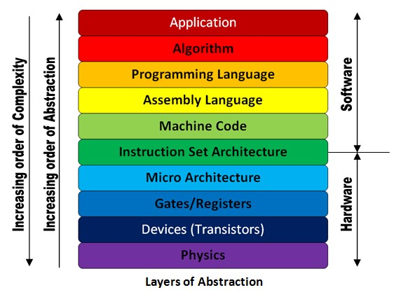
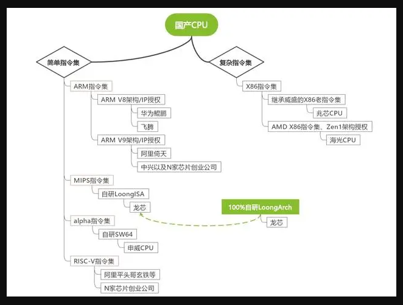

# 关于 CPU 指令集和信创的思考

2024-11-18 14:00

最近想在电脑上写一个插件可以实时显示当前网卡下载和上传速率，
在GUI的最上层，不受上层框架限制，并尽可能兼容 PC PAD Phone设备。

前半部分看起来很简单，难得是兼容不同设备。直觉告诉我要使用汇编语言实现。

+ 电路板（Phisics）
+ 最小设备单元：晶体管（Transistors）
+ 逻辑门和寄存器（Gates/Registers）
+ 微体系结构（Mico Architecture）
+ 指令集结构 Instruction set architecture (ISA)
+ 机器码（Machine code）
+ 汇编语言（Assembly Language）
+ 编程语言（Programming Language）
+ 算法（Algorithm）
+ 应用程序（Application）

中间的指令集结构是既是硬件和软件的桥梁，也是硬件和软件的“鸿沟”。
说他是桥梁是因为ISA将特定的机器码传送给硬件，使得硬件有条不紊的工作。
我想，计算机的初衷是为了解决人类的生产效率，那么编写代码的初心就是想让他
尽可能的运行在最多的设备上。
`不幸的是，ISA不止有一种，这导致ISA以上的部分全部都会额外去实现“兼容”。`

可以说ISA就是潘多拉的魔盒。

从上图大致可以看到国产CPU的ISA架构，商业公司大多使用的ARM架构，
就连当今全球市值第一的某果研发的 M 芯片也是基于 arm 架构。
我看来 arm 有3个优点： 简单指令集性能出众，并在设计之初就加入了安全性考量，
最后他有足够多的商业应用支持。
它占据了商业工业最看重的3个指标。
不幸的是 arm 架构是需要商业授权的。即“卡脖子”技术。

为了解决“卡脖子”问题，我们需要设计新的ISA架构，但是更要考虑兼容问题，
架构再好，也需要形形色色的应用程序来填充。

综上，回到最初我想实现的问题。那么至少需要2套代码来实现：arm
和 x86。

编程语言也可以划分编译型语言和解释型语言，解释型语言抽象层次更高。
当今开源项目 dart 的 flutter 项目可以一套代码实现多端应用。
有人说他是胶水语言，挺形象，他的抽象层次更高。通过dart编写代码，生成
不同架构上的编程语言，例如java和swift，而在java和swift层面
也实现了对不同架构的兼容。 
