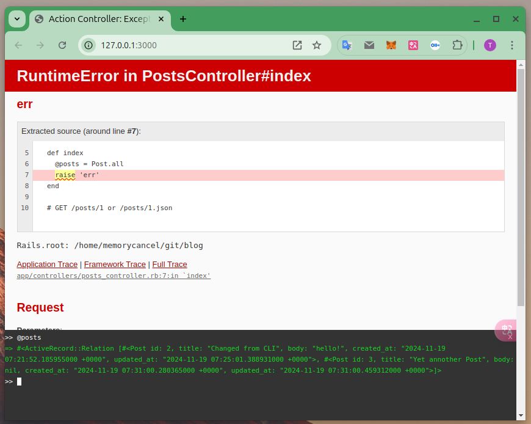
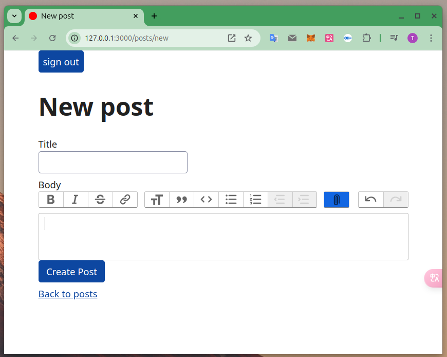

# 浅谈 Rails 8.0.0 特性

2024-11-20 18:00

Rails 8.0.0 引入了很多新东西，有一些是前面版本作为单独项目开发使用，
这次全部正式打包进了rails。

`Rails 8.0.0`  版本基于 `Ruby 3.3.5`

分几个部分介绍：开发、中间件、部署。

## 一、开发

### 1.1 使用开发模式启动rails服务器
```shell
dev
```

### 1.2 脚手架/资源
```shell
rails generate scaffold post title:string body:text
```
这会生成全部MVC，DB migration，以及 spec 测试文件。
如果不需要View可以使用：
```shell
rails g resource comment references:post comment:string
```

### 1.3 通过`CDN`的方式快速引入`CSS`

编辑`app/views/layouts/application.html.erb`，插入一行`<%= stylesheet_link_tag "https://cdn.simplecss.org/simple.css" %>`。

```ruby
<%# Includes all stylesheet files in app/assets/stylesheets %>
    <%= stylesheet_link_tag :app, "data-turbo-track": "reload" %>
    <%= stylesheet_link_tag "https://cdn.simplecss.org/simple.css" %>
    <%= javascript_importmap_tags %>
```

### 1.4 方便的前端console debug功能

```ruby
class PostsController < ApplicationController
  before_action :set_post, only: %i[ show edit update destroy ]

  # GET /posts or /posts.json
  def index
    @posts = Post.all
    raise 'err'
  end
  ...
```



### 1.5 一行代码创建富文本编辑
```shell
rails action_text:install
```

修改`model`，添加对应富文本字段`has_rich_text :body`:

```ruby
class Post < ApplicationRecord
	has_rich_text :body
	has_many :comments
end
```

修改`view`，将`textarea`修改为`rich_textarea`:

```ruby
<div>
    <%= form.label :body, style: "display: block" %>
    <%= form.rich_textarea :body %>
</div>
```


### 1.6 使用基于`websocket`的`hotwired`功能，让页面数据`实时`更新：

修改`View`在页面添加`turbo_stream_from`标签：

```ruby
<%= turbo_stream_from @post %>
```

修改`model`添加`broadcasts_to`：

```ruby
class Comment < ApplicationRecord
  belongs_to :post
  broadcasts_to :post
end
```

此时我们同时打开2个网页，在一个网页上更新一条数据，那么在另外1个网页页面会实时更新，
而不用按下“F5”。

将鼠标移到链接上，从日志可以看到接收到了`get`请求，为什么页面跳转会变快，
从这里也“可见一斑”。


也就是说当鼠标移到链接上（还没有点击时），服务器已经开始处理请求了。
这会大大提高客户端的使用体验，服务器也会增加一定的负担。

### 1.7 内置身份验证

只需运行一条命令就可完成登陆功能：

```shell
rails generate authentication
rails db:migrate
```

在`application.html.erb`加入退出登陆：

```
<body>
	<%= button_to "sign out", session_path, method: :delete if authenticated?  %>
	<%= yield %>
</body>
```

### 1.8 脚本文件管理

```shell
bin/rails generate script my_script
bundle exec ruby script/my_script.rb
```

## 二、中间件

### 2.1 后端中间件

官方原话是Solid Adapters（可靠的适配器）。在国内我们喜欢用“中间件”这一词。
主要有3部分：`Solid Cable`、`Solid Cache`、`Solid Queue`。
`rails 8` 放弃了对`redis`的依赖。取而代之使用`SQLite`和3个中间件融合解决了`pub/sub` websocket服务器、
缓存、以及队列3个重要功能。

这三个适配器的设计理念很简单：现代固态硬盘和 NVMe 硬盘的速度足以处理许多以前需要内存解决方案才能完成的任务。通过利用这些高速驱动器，Rails 不再需要单独的基于 RAM 的工具，如 Redis。

### 2.2 前端中间件

Rails 8 还引入了 `Propshaft `作为新的assets pipeline默认设置，取代了沿用已久的 `Sprockets` 。它是一种更简单、更现代的assets管理方法，围绕当今开发人员的核心需求而构建的。它的目的很简单：为assets提供清晰的路径，并应用digest进行缓存。

## 三、部署

部署方面 rails8 默认加入了`Kamal 2` 和 `Thruster`，分别解决了docker容器化部署
以及`https`自动证书问题。
但国内目前并没有与之适配基础设施，慎用。
如果需要跳过`kamal`执行：

```
rails new blog --skip-kamal
```


## 参考：

+ [https://guides.rubyonrails.org/v8.0/](https://guides.rubyonrails.org/v8.0/)
+ [https://blog.appsignal.com/2024/10/07/whats-new-in-ruby-on-rails-8.html](https://blog.appsignal.com/2024/10/07/whats-new-in-ruby-on-rails-8.html)
+ [https://edgeguides.rubyonrails.org/8_0_release_notes.html](https://edgeguides.rubyonrails.org/8_0_release_notes.html)
