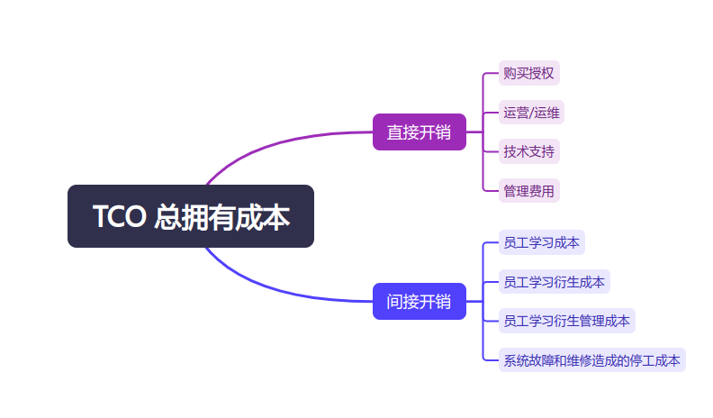

# 为什么 Linux 无法取代 Windows 和 MacOS

2024-11-22 14:00

{: .note }
PS:本文大部分观点来自《GUIDE to Unix and Linux》，并加入了我的一些理解。

Linux的用户早已超过Windows和MacOS，但是为什么无法取代他们呢？
因为在企业世界中，大型商业机构倾向于选择商业软件/硬件（而不是自由软件）。

{: .note }
其实将 free software 翻译成“免费”是欠妥的，应该叫“自由”软件。
免费只是自由的一部分。源码开放，免费使用，自由更改。

这其实挺反直觉的。

免费的不好吗？拿来就用，而且有成千上万的开发者共同维护、
提供新的功能，并且代码开源。

{: .important }
答案是：他们关注的是`总拥有成本（Total Cost of Ownership）TCO`

对我而言，免费软件就是政治正确的，因为免费，就算我是用开源软件而让系统死机，我重启就好了。
（何况现在开源软件日趋成熟有非常严谨的测试流水线体系）

而对大型商业机构，“这个免费”仅仅是初始开销，在TCO中所占份额只是冰山一角。
想象一下一家大型商业银行、航空公司、铁路又或者是运营商因为一次更新或者bug而让业务停摆
，这是难以让人承受的事情。

而`初始开销`又是`直接开销`的一部分，而`直接开销`也仅仅是`TCO`的一部分。
在公司选定一个重要的硬件或软件系统之前，它们的财政分析人员会检查所谓的直接开销和间接开销。
如下图：

直接开销包括硬件和软件：初始购买或租借费用、运营、运维、技术支持以及管理费用。
间接开销与生产力损失相关。具体包括员工在学习如何使用系统上花费的时间量，员工由于帮助其他员工而浪费的时间量
，管理上带来的时间量（中国有句古话：“教会徒弟，饿死师傅。”），以及系统故障或例行维修所造成的停工时间的开销。

（这里涉及一些会计财税方面的知识）一旦所有这些开销都估算出来，就将他们转换为每年的开支————
一种包括设备折旧及设备更新费用的计算。然后将每年的开支集成到公司范围的预算中，
而从公司的长远发展来看，公司的预算要与公司的规划相协调。

大多数情况下，当TCO计算出来后与我们的直觉相反。初始开销反而没那么重要，从长远来看，
最重要的是未来的开支和间接开销。

因此当一家公司考虑选购新的软/硬件时，它们通常不问购买或者许可该产品需要花多少钱。而是会问：

{: .important }
这个产品与已有环境集成度有多高？ 
它如何适应我们的长远计划？ 
它如何为我们的客户提供更好的服务？ 
未来维护它的开销如何？

一旦这些问题有了答案，就可以看出对于企业应用而言，最好的软件通常不是为个人或者教育用途设计的自由软件。
商业软件必须有适合于商业的功能部件。

{: .important }
必须有一系列维护良好的编程工具 
须有一个根据商业需求（而不是个人需要）明确定义的长远发展规划 
必须有出色的文档和高质量的技术支持

以上的问和答基本解释了要想在商用软件领域获得成功的基本要素。

当然。并不是说大型商业公司就不使用自由软件或者不支持自由软件。甚至大型公司还主动出资金开发自由软件，
供所有开发者自由使用。
实际上他们这么做是保留了两者的优势。自由软件可以吸纳众多开发者和小型公司使用自由软件，
从而完善自由软件（用户愈多，鲁棒性更高～）和创造用户生态多样性（提升市场占有率），同时也采用了商业软件成本质量管理办法，使自由软件
可持续发展。

大型公司出资支持自由软件，最终也是为了盈利的，以一种健康、可持续的方式。
比如google开源的 android，供全世界手机自由使用，后面修改用户协议，而使得手机厂商需要支付许可费用，
从而赚的盆满钵满。
这就是一个典型的商业软件成功案例。

对google而言，前期通过投入研发费用，为客户准备了：

{: .important }
良好的编程工具（Java/Kotlin） 
明确定义的长远发展规划（samsung手机） 
出色的文档和高质量技术支持（google文档自不用说）

对客户而言，例如 samsung。

{: .important }
android对出厂的samsung手机直接适配（android本身也用在google自家手机pixel上） 
samsung出的后续系列，跟随android换代升级 
android自带主流app，方便手机用户（google全家痛等等） 
android初始开销为0（开始free software）

而当samsung手机成功后，android的生态也构建完成。
市面存在巨量的android开发者和使用者。
这时候，google再收取许可费用，获得商业上的成功。
