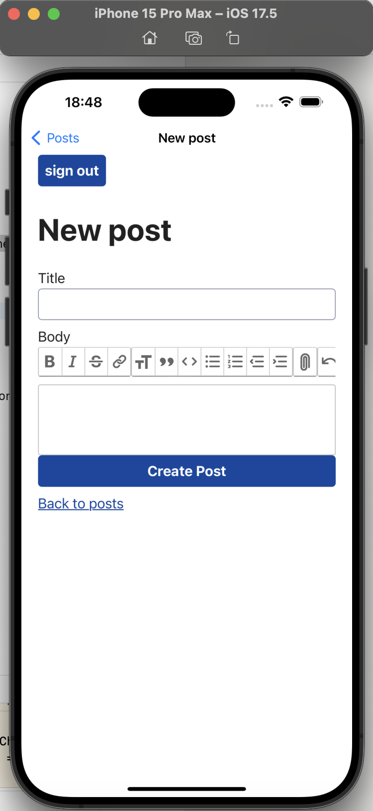
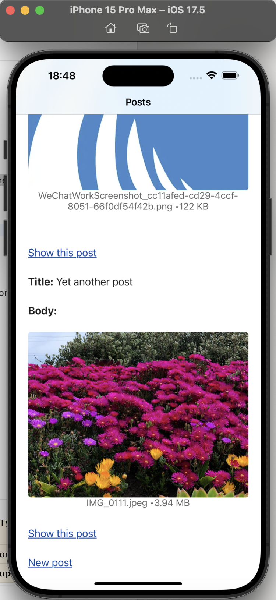

# 使用 Turbo iOS 构建 iOS APP

2024-11-25 17：00

[https://native.hotwired.dev/](https://native.hotwired.dev/)

构建 iOS 版本：

[https://native.hotwired.dev/ios/getting-started](https://native.hotwired.dev/ios/getting-started)

代码地址：

[https://github.com/memorycancel/blog](https://github.com/memorycancel/blog)

