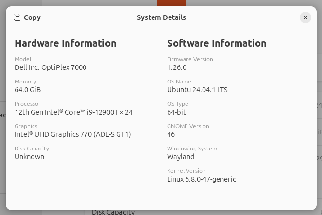
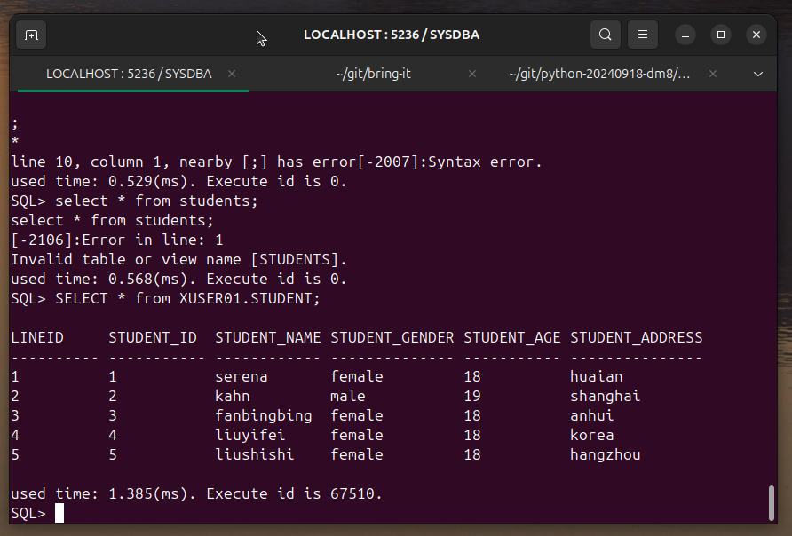

# 使用 docker 部署 dm8 达梦数据库

2024-11-24 18：00

系统信息：



```
docker 版本
Client: Docker Engine - Community
 Version:           27.3.1
 API version:       1.47
 Go version:        go1.22.7
 Git commit:        ce12230
 Built:             Fri Sep 20 11:40:59 2024
 OS/Arch:           linux/amd64
 Context:           default

Server: Docker Engine - Community
 Engine:
  Version:          27.3.1
  API version:      1.47 (minimum version 1.24)
  Go version:       go1.22.7
  Git commit:       41ca978
  Built:            Fri Sep 20 11:40:59 2024
  OS/Arch:          linux/amd64
  Experimental:     false
 containerd:
  Version:          1.7.22
  GitCommit:        7f7fdf5fed64eb6a7caf99b3e12efcf9d60e311c
 runc:
  Version:          1.1.14
  GitCommit:        v1.1.14-0-g2c9f560
 docker-init:
  Version:          0.19.0
  GitCommit:        de40ad0
```

下载镜像 [https://eco.dameng.com/download/](https://eco.dameng.com/download/)

装载并启动镜像、查看日志：

```bash
docker load -i ~/Downloads/dm8_20241022_x86_rh6_64_single.tar
docker run -d --name dm8 -p 5236:5236 -v /home/dm8:/opt/dmdbms/data dm8_single:dm8_20241022_rev244896_x86_rh6_64
docker logs -f dm8
```
很遗憾官方驱动目前只支持：Java/C++/Golang/Python，java 驱动参考：
[https://juejin.cn/post/7274895896286707746](https://juejin.cn/post/7274895896286707746)

那么进入容器使用命令行工具:

```bash
docker exec -it dm8 /bin/bash
ls /opt/dmdbms/data/DAMENG/
cd /opt/dmdbms/bin && ./disql
```

最新版本默认密码：`SYSDBA/SYSDBA001`

相关DBA操作参考：
[https://blog.csdn.net/xoofly/article/details/135749770](https://blog.csdn.net/xoofly/article/details/135749770)

```shell
#事先创建一个用户存放表空间的目录，便于下面创建表空间
mkdir /opt/dmdbms/data/xTableSpace
chown -R dmdba.dinstall /opt/dmdbms/data/xTableSpace
 
#登录达梦数据库命令行
cd /opt/dmdbms/bin
./disql    #输入账号密码，默认的是SYSDBA/SYSDBA001

#创建表空间（事先建好目录，并给目录改权限）
create tablespace "xTableSpace" datafile '/opt/dmdbms/data/xTableSpace/xTableSpace.dbf' size 128;
#注：感觉表空间有点像k8s的namespace
 
#创建用户
# 使用命令行方式创建用户 XUSER01 ，密码 “mypwd123456”，
#使用散列算法 SHA512 ，使用存储加密密钥为 “123456”，指定表空间为xTableSpace，索引表空间为 xTableSpace，
#授予 "DBA"、”PUBLIC” 和 “SOI” 权限。示例参考如下：
create user "XUSER01" identified by "mypwd123456" hash with SHA512 salt encrypt by "123456" default tablespace "xTableSpace" default index tablespace "xTableSpace";
grant "DBA","PUBLIC","SOI" to "XUSER01";

#创建数据库对象：表
CREATE TABLE XUSER01.student (student_id INT NULL, student_name VARCHAR(50) NULL,student_gender VARCHAR(50) NULL, student_age INT NULL, student_address VARCHAR(100) NULL);

#插入测试数据，并提交(在什么环境下执行的命令，就得在什么环境下commit)
INSERT INTO XUSER01.student(student_id,student_name,student_age,student_address,STUDENT_GENDER) VALUES(1,'serena',18,'huaian','female');
INSERT INTO XUSER01.student(student_id,student_name,student_age,student_address,STUDENT_GENDER) VALUES(2,'kahn',19,'shanghai','male');
INSERT INTO XUSER01.student(student_id,student_name,student_age,student_address,STUDENT_GENDER) VALUES(3,'fanbingbing',18,'anhui','female');
INSERT INTO XUSER01.student(student_id,student_name,student_age,student_address,STUDENT_GENDER) VALUES(4,'liuyifei',18,'korea','female');
INSERT INTO XUSER01.student(student_id,student_name,student_age,student_address,STUDENT_GENDER) VALUES(5,'liushishi',18,'hangzhou','female');
INSERT INTO XUSER01.student(student_id,student_name,student_age,student_address,STUDENT_GENDER) VALUES(6,'yangchaoyue',18,'suzhou','female');
commit;

#删除一条数据
DELETE XUSER01.STUDENT WHERE STUDENT_ID = 6;
commit;
 
#修改一条数据
UPDATE XUSER01.STUDENT set student_age=20 WHERE student_id = 6;
 
SELECT * from XUSER01.STUDENT;
```


