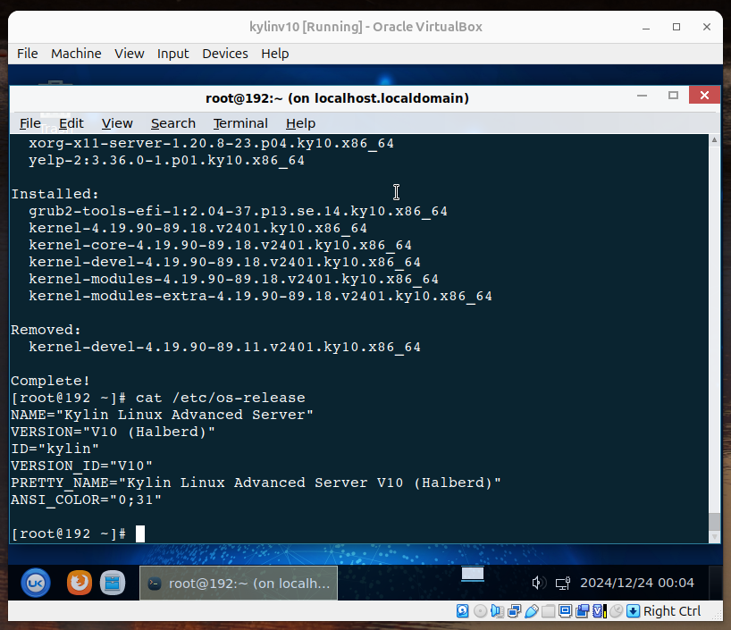
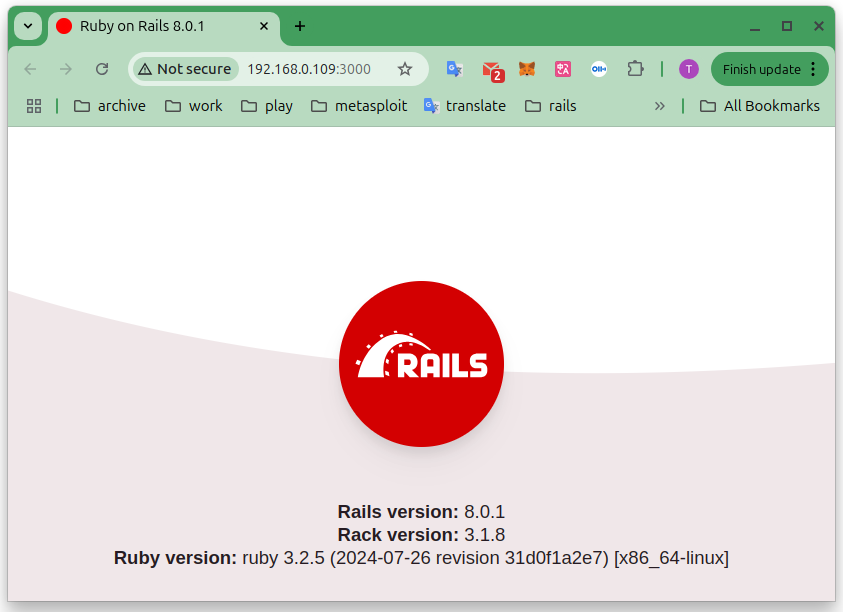
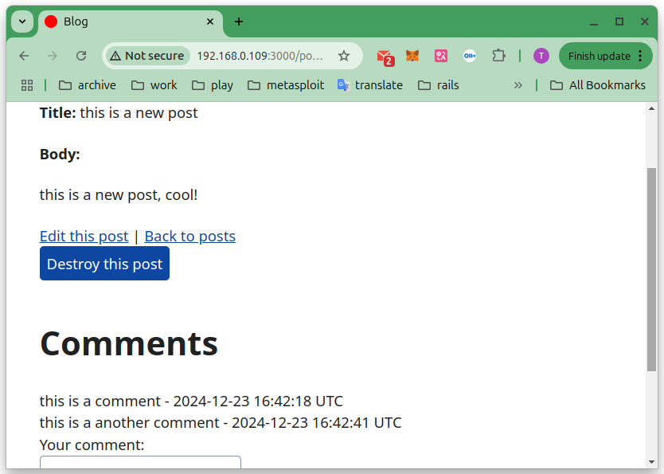

# 在麒麟V10(Kylin-Server-V10-SP3-2403-Release-20240426-x86_64)搭建 Rails 8

2024-12-23 21:00

根据 CentOS 官方公告，CentOS 7 已经于 2024 年 6 月 30日结束支持，其软件仓库也相应被上游移除。根据 Debian 官网，Debian 10 “buster” 的长期支持（LTS）已经在 2024 年 6 月 30 日结束，其软件仓库会在短期内被上游移除。用户应该考虑升级到目前受支持的版本，或者切换到 debian-elts（Debian 扩展长期支持）仓库。参考：
+ [https://mirrors.tuna.tsinghua.edu.cn/news/retire-el7-and-buster/](https://mirrors.tuna.tsinghua.edu.cn/news/retire-el7-and-buster/)
+ [https://blog.centos.org/2023/04/end-dates-are-coming-for-centos-stream-8-and-centos-linux-7/](https://blog.centos.org/2023/04/end-dates-are-coming-for-centos-stream-8-and-centos-linux-7/)


## 一、准备麒麟V10

下载并且安装 `Kylin-Server-V10-SP3-2403-Release-20240426-x86_64.iso`
[https://www.kylinos.cn/support/trial.html](https://www.kylinos.cn/support/trial.html)



设置网络为桥接。在桌面的有线连接，选择连接有线网卡。打开终端，更新并且启动 `sshd`:

```shell
su - root
yum update
systemctl start sshd
```

## 二、安装Ruby 3.2.5

进入麒麟V10:

```shell
ssh root@192.168.0.109
```

先安装 [`rvm`](https://rvm.io/)，再安装`Ruby`：
```shell
source /etc/profile.d/rvm.sh
rvm list
yum install libyaml-devel
rvm install 3.2.5
ruby -v
```

## 三、安装并测试Rails 8.0.0

```shell
gem install rails -v '8.0.0' -V
rails -v
rails new testapp
cd testapp
rails s -b 0.0.0.0
sudo firewall-cmd --permanent --add-port=3000/tcp
sudo firewall-cmd --reload
```



## 四、测试其他App

```shell
git clone https://github.com/memorycancel/blog.git
cd blog
rails db:migrate
rails db:seed
rails s -b 0.0.0.0
```


感受：包挺新的，使用起来像是CentOS 10?
