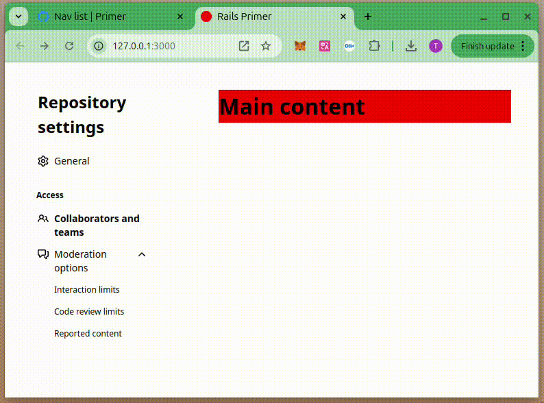

# 使用 Github Primer Design System 设计和Github风格一致的布局

2025-01-01 18:00

[primer](https://primer.style/) 是Github开源设计框架，目的是对github设计经验进行输出。
极具设计美感，且对移动端、rails生态天然友好。

先准备好环境：

```shell
node -v
# v23.5.0
ruby -v
# ruby 3.3.6 (2024-11-05 revision 75015d4c1f) [x86_64-linux]
rails -v
# Rails 8.0.1
mise -v
# 2024.10.7 linux-x64 (7d15bd5 2024-10-14)
```

创建项目。并且引入Primer，参考步骤：[https://primer.style/guides/rails](https://primer.style/guides/rails)
首先在Gemfile引入[https://rubygems.org/gems/primer_view_components](https://rubygems.org/gems/primer_view_components)：
```
gem 'primer_view_components', '~> 0.36.2'
```

执行：

```shell
bundle install -V
mise install nodejs
mise use -g node@23.5.0
npm install -g yarn
yarn init
yarn add @primer/view-components @primer/css @primer/primitives
```

在 config/application.rb 的最下方添加以下几行：

```ruby
require "view_component"
require "primer/view_components"
```

因为`rails v 8.0.0`默认使用`Propshaft`作为前端管理框架，在 config/application.rb 中添加以下内容，将 node_modules/ 目录添加到 Propshaft 的加载路径中：

```ruby
config.assets.paths << Rails.root.join("node_modules")
```

在 app/views/layouts/application.html.erb 中的 <head></head> 标记内添加以下内容。

```ruby
<%= stylesheet_link_tag "@primer/css/dist/primer.css", "data-turbo-track": "reload" %>
<%= stylesheet_link_tag "@primer/view-components/app/assets/styles/primer_view_components.css", "data-turbo-track": "reload" %>
<%= stylesheet_link_tag "@primer/primitives/dist/css/primitives.css", "data-turbo-track": "reload" %>
<%= stylesheet_link_tag "@primer/primitives/dist/css/functional/themes/light.css", "data-turbo-track": "reload" %>
<%= stylesheet_link_tag "@primer/primitives/dist/css/functional/themes/dark.css", "data-turbo-track": "reload" %>

<%= javascript_include_tag "@primer/view-components/app/assets/javascripts/primer_view_components.js", "data-turbo-track": "reload" %>
```

创建一个主页controller：
```shell
rails g controller main
```

在 `main_controller.rb` 添加 page action
```ruby
def page
end
```

创建一个页面`views/main/page.html.erb`。添加一个布局，参考[https://primer.style/components/layout/rails/alpha](https://primer.style/components/layout/rails/alpha):
```ruby
<%= render(Primer::Alpha::Layout.new(stacking_breakpoint: :md, gutter: :default, first_in_source: :main)) do |component| %>
  <% component.with_main(bg: :attention, p: 6) do %>
    <div style="background-color: red;"><h1>Main content</h1></div>
  <% end %>
  <% component.with_sidebar(bg: :accent, p: 6) do %>
    <div style="background-color: green;"><h1>Sidebar</h1></div>
  <% end %>
<% end %>
```

到这里，一个移动端兼容的响应式布局就完成了。


我们再将sidebar变成一个菜单导航列表，参考[https://primer.style/components/nav-list](https://primer.style/components/nav-list)

首先将上部分 `<div style="background-color: green;"><h1>Sidebar</h1></div>` 替换为一个`patial`:

```ruby
<%= render(Primer::Alpha::Layout.new(stacking_breakpoint: :md, gutter: :default, first_in_source: :main)) do |component| %>
  <% component.with_main(bg: :attention, p: 6) do %>
    <div style="background-color: red;"><h1>Main content</h1></div>
  <% end %>
  <% component.with_sidebar(bg: :accent, p: 6) do %>
    <%= render 'sidebar_nav' %>
  <% end %>
<% end %>
```

编辑`_sidebar_nav.html.erb`:

```ruby
<%= render(Primer::Beta::NavList.new(selected_item_id: :collaborators)) do |list| %>
  <% list.with_heading(title: "Repository settings") %>
  <% list.with_item(label: "General", href: "/general") do |item| %>
    <% item.with_leading_visual_icon(icon: :gear) %>
  <% end %>
  <% list.with_group do |group| %>
    <% group.with_heading(title: "Access") %>
    <% group.with_item(label: "Collaborators and teams", href: "/collaborators", selected_by_ids: :collaborators) do |item| %>
      <% item.with_leading_visual_icon(icon: :people) %>
    <% end %>
    <% group.with_item(label: "Moderation options") do |item| %>
      <% item.with_leading_visual_icon(icon: :"comment-discussion") %>
      <% item.with_item(label: "Interaction limits", href: "/interaction-limits", selected_by_ids: :interaction_limits) %>
      <% item.with_item(label: "Code review limits", href: "/review-limits", selected_by_ids: :code_review_limits) %>
      <% item.with_item(label: "Reported content", href: "/reported-content", selected_by_ids: :reported_content) %>
    <% end %>
  <% end %>
<% end %>
```



这样我们就可以做一个和Github风格一致的网站了，是不是很酷，嗯？