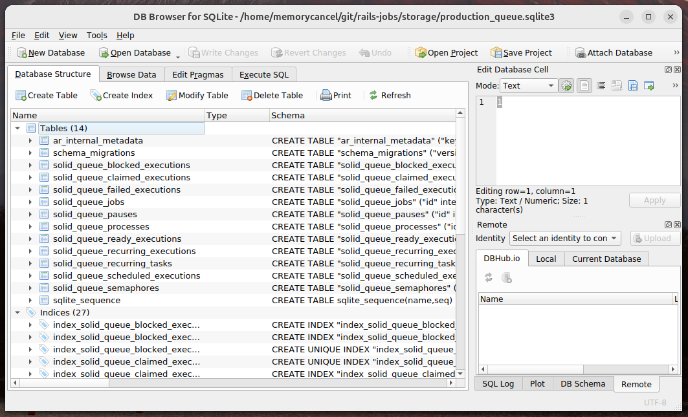
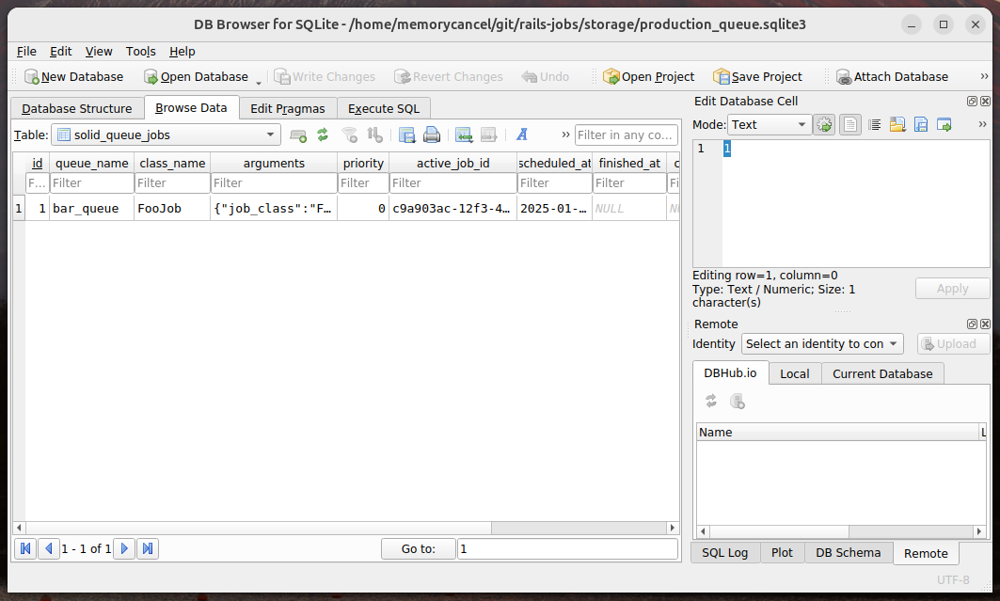
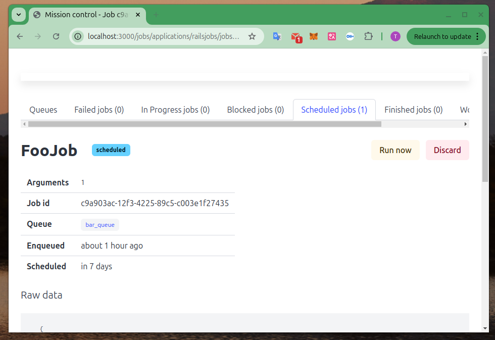

# 使用 Rails 8 提供的默认任务队列 Solid Queue

2025-01-03 18:00

## 1 Solid Queue 简介

Solid Queue 是 Active Job 的一个基于数据库的队列后端，设计时考虑到了简单性和性能。

它摒弃了`Redis`内存数据库作为任务队列的后端存储（如：`sidekiq`等）。

可与 SQL 数据库（如 MySQL、PostgreSQL 或 SQLite）一起使用，它利用 `FOR UPDATE SKIP LOCKED`子句（如果有的话）来避免轮询作业时的阻塞和锁等待。它依赖 Active Job 进行重试、丢弃、错误处理、序列化或延迟执行，并与 Ruby on Rails 的多线程兼容。

除了常规的作业排队和处理外，Solid Queue 还支持延迟作业、并发控制、重复作业、暂停队列、每个作业的数字优先级、队列顺序优先级和批量排队（ enqueue_all for Active Job's perform_all_later ）。

{: .note :}
这概念是否似曾相识，与Unix的进程控制很像？！通过在命令后加上`&`将任务传送至后台，在通过`jobs -l`查看后台任务队列，并且可以通过
`bg`和`fg`实现前后台操作。只不过在这里的Rails的Active Job 将其封装为一个线程，与操作系统的进程接口交互。

参考官方文档：[https://guides.rubyonrails.org/v8.1/active_job_basics.html](https://guides.rubyonrails.org/v8.1/active_job_basics.html)

## 2 环境安装和启动任务队列

Solid Queue 将 `:solid_queue` 适配器设置为生产环境中 Active Job 的默认适配器，并连接到 queue 数据库进行写入。在开发环境中使用生产环境变量：

```shell
export RAILS_ENV=production
# README 说这是默认的，但是事实上必须执行他才会有`bin/jobs`
# 在这里进行了讨论：https://github.com/rails/solid_queue/issues/399#issuecomment-2571538103
bin/rails solid_queue:install
rails db:prepare
bin/jobs start
```

为啥要用生产环境？因为Rails官方没有准备测试和开发环境，似乎也没有必要。执行`rails db:prepare`后会创建solid_queue需要的`migration`和创建对应的数据库表。最后启动jobs后台任务。

此时在db文件夹会看到分别的`schema`文件:
```shell
$ \ls db/
queue_schema.rb  seeds.rb
```
且`Solid Queue`对应的表在数据库中也建立起来：




## 3 创建和发布任务

### 3.1 创建作业

创建一个在特定队列(`bar_queue`)上运行的作业(`foo_job`)。

```ruby
rails generate job foo_job --queue bar_queue
```

此时会创建空的`jobs/foo_job.rb`，编辑加入任务逻辑：
```ruby
class FooJob < ApplicationJob
  queue_as :bar_queue

  def perform(*args)
    # Do something later
    sleep(args[0])
    logger.info("slept #{args[0]} seconds job!")
    return true
  end
end
```
### 3.2 让任务进入队列

```shell
rails c
FooJob.perform_now(1)
# 创建1个等待1周执行的任务
FooJob.set(wait: 1.week).perform_later(1)
```

此时观察`solid_queue_jobs`表会生成1条记录：



使用`set`方法设置等待时间：[https://api.rubyonrails.org/v8.1.1/classes/ActiveJob/Core/ClassMethods.html#method-i-set](https://api.rubyonrails.org/v8.1.1/classes/ActiveJob/Core/ClassMethods.html#method-i-set)

其他更多用法(例如：设置优先级、回调方法、批量任务入队、邮件任务等)参考官方文档：[https://guides.rubyonrails.org/v8.1/active_job_basics.html](https://guides.rubyonrails.org/v8.1/active_job_basics.html)


## 4 任务（jobs)监控

关于任务队列的监控，目前一种解决方案是通过查询queue数据库的`finished_at` 和 `scheduled_at`
字段，这将包括在队列中等待的时间。参考：[https://github.com/rails/solid_queue/issues/448](https://github.com/rails/solid_queue/issues/448)

同时对任务队列的监控也提供一个GUI：[https://github.com/rails/mission_control-jobs](https://github.com/rails/mission_control-jobs)

`routes.rb` :

```ruby
Rails.application.routes.draw do
  # ...
  mount MissionControl::Jobs::Engine, at: "/jobs"
```

```shell
gem "propshaft"
gem "mission_control-jobs"
$ bundle install
RAILS_ENV=production rails assets:precompile
RAILS_ENV=production bin/rails mission_control:jobs:authentication:configure
RAILS_ENV=production rails s
```



## 5 关于性能扩展数据库分片

任务队列的本质是不断的轮询数据库和少量写入，随着队列任务增多，数据库读的压力会骤增，简单对机器进行垂直扩展（CPU RAM）
起不到本质改变，需要水平扩展数据库分片（shard），从而提升“读”（轮询）效率。
目前Solid Queue还没完备支持。不过已经有Issue在追踪此问题，作者也将其列为高优先级。

[https://github.com/rails/solid_queue/issues/353](https://github.com/rails/solid_queue/issues/353)


本文的全部代码在：
[https://github.com/memorycancel/rails-solid-queue](https://github.com/memorycancel/rails-solid-queue)
