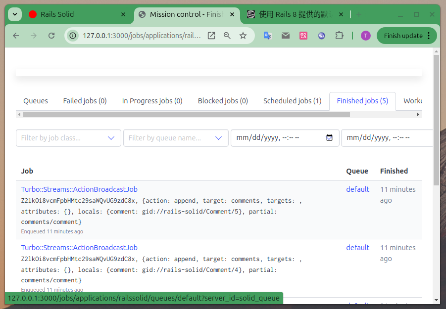

# 使用 Rails 8 提供的默认实时更新组件 Solid Cable

2025-01-05 18:00

"Rails Cable "又称 "Action Cable"，是 Ruby on Rails 中的一个内置框架，允许开发人员使用 WebSockets 在网络应用程序中轻松实现实时功能，无需刷新页面即可在客户端和服务器之间进行实时更新和通信；从本质上讲，它提供了一种在 Rails 应用程序中创建即时聊天或即时通知等交互式功能的方法。

Rails Cable依赖于队列机制，特别是 "发布-订阅"（Pub/Sub）模式，它本质上就像一个消息队列，用于管理服务器与通过 WebSockets 连接的多个客户端之间的通信；也就是说，它依赖于队列来有效分发消息。

Action Cable 并不是一个直接的队列系统，他是实现Pub/Sub模式和Websocket的接口。它的大多数实现都利用了像 `Redis` 这样的独立数据存储来管理 Pub/Sub 通道和消息传递。

但是现在`Rails 8`摒弃了`Redis`，将`SQL数据库`作为存储和轮询数据库，默认使用`Solid Cable`实现`Action Cable`。

## 1. 准备

首先创建一个项目，然后先搭建好`Solid Queue`：

[https://github.com/memorycancel/rails-solid/tree/solid-queue](https://github.com/memorycancel/rails-solid/tree/solid-queue)

以此为基础（因为`Cable`需要的`Pub/Sub`机制是依赖于`Queue`的），创建一个`solid-cable`分支：

[https://github.com/memorycancel/rails-solid/tree/solid-cable](https://github.com/memorycancel/rails-solid/tree/solid-cable)

## 2. 安装

在执行`rails new`创建项目的时候已经默认安装过了。可以`详细观察控制台的输出`。

```
export RAILS_ENV=production
bin/jobs start
```

## 3. 示例

添加官方rails start示例（blog)，参考：

+ [https://d2biiyjlsh52uh.cloudfront.net/rails/rails-8-demo.mp4](https://d2biiyjlsh52uh.cloudfront.net/rails/rails-8-demo.mp4)
+ [https://gist.github.com/memorycancel/794f247bb40591156f19e81036670256](https://gist.github.com/memorycancel/794f247bb40591156f19e81036670256)


最关键的代码，修改View在页面添加turbo_stream_from标签：
```ruby
<%= turbo_stream_from @post %>
```
修改model添加broadcasts_to：
```ruby
class Comment < ApplicationRecord
  belongs_to :post
  broadcasts_to :post
end
```

每次广播（Pub)都会在任务队列（数据库）插入一条广播任务，当广播消息被消费后，该任务就完成了。



## 4. 代码

[https://github.com/memorycancel/rails-solid/tree/solid-cable](https://gist.github.com/memorycancel/794f247bb40591156f19e81036670256)
