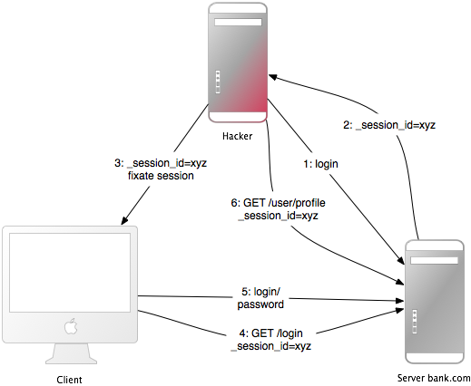

# 确保 Rails 8 应用程序的安全

2025-01-10 18:00

## 1 简介

一般来说，不存在即插即用的安全性。安全性取决于使用框架的人员，有时还取决于开发方法。
它还取决于网络应用环境的所有层面：后端存储、网络服务器和网络应用程序本身（可能还有其他中间层或应用程序）。

然而，据 Gartner 估计，75% 的攻击发生在网络应用程序层，"在 300 个接受审计的网站中，97% 
容易受到攻击"。这是因为网络应用程序相对容易受到攻击，因为它们易于理解和操作。

为了开发安全的网络应用程序，必须了解各层的最新情况，知己知彼。订阅安全邮件列表、阅读安全博客，
并养成更新和安全检查的习惯。这需要手动完成，因为这样才能发现令人讨厌的逻辑安全问题。

## 2 身份验证

身份验证通常是网络应用程序最先实现的功能之一。它是确保用户数据安全的基础，也是大多数现代网络应用程序的一部分。
从 8.0 版开始，Rails 提供了一个默认的身份验证生成器，它提供了一个坚实的起点，只允许通过验证的用户访问，
从而确保应用程序的安全。身份验证生成器添加了基本身份验证和密码重置功能所需的所有相关模型、控制器、视图、路由和迁移。
要在应用程序中使用这一功能，可以运行 `rails generate authentication` 。 以下是生成器修改的所有文件和添加的新文件：

```ruby
$ rails generate authentication
      invoke  erb
      create    app/views/passwords/new.html.erb
      create    app/views/passwords/edit.html.erb
      create    app/views/sessions/new.html.erb
      create  app/models/session.rb
      create  app/models/user.rb
      create  app/models/current.rb
      create  app/controllers/sessions_controller.rb
      create  app/controllers/concerns/authentication.rb
      create  app/controllers/passwords_controller.rb
      create  app/mailers/passwords_mailer.rb
      create  app/views/passwords_mailer/reset.html.erb
      create  app/views/passwords_mailer/reset.text.erb
      create  test/mailers/previews/passwords_mailer_preview.rb
        gsub  app/controllers/application_controller.rb
       route  resources :passwords, param: :token
       route  resource :session
        gsub  Gemfile
      bundle  install --quiet
    generate  migration CreateUsers email_address:string!:uniq password_digest:string! --force
       rails  generate migration CreateUsers email_address:string!:uniq password_digest:string! --force
      invoke  active_record
      create    db/migrate/20241010215312_create_users.rb
    generate  migration CreateSessions user:references ip_address:string user_agent:string --force
       rails  generate migration CreateSessions user:references ip_address:string user_agent:string --force
      invoke  active_record
      create    db/migrate/20241010215314_create_sessions.rb
```

如上所示，身份验证生成器会修改 Gemfile 以添加 `bcrypt` gem。生成器使用 `bcrypt` gem 创建密码的`哈希值`，
然后将其存储在数据库中（而不是纯文本密码）。由于这一过程不可逆转，因此无法从散列值返回明文密码。不过哈希算法是确定的，
因此在身份验证过程中，可以将存储的密码与用户输入密码的哈希值进行比较。

生成器会添加两个迁移文件，用于创建 user 和 session 表。下一步是运行迁移：

```ruby
bin/rails db:migrate
```

{: .important :}
运行身份验证生成器后，需要实现自己的注册流程，并添加必要的视图、路由和控制器操作。

以下是修改后的文件列表：

```ruby
On branch main
Changes not staged for commit:
  (use "git add <file>..." to update what will be committed)
  (use "git restore <file>..." to discard changes in working directory)
  modified:   Gemfile
  modified:   Gemfile.lock
  modified:   app/controllers/application_controller.rb
  modified:   config/routes.rb

Untracked files:
  (use "git add <file>..." to include in what will be committed)
  app/controllers/concerns/authentication.rb
  app/controllers/passwords_controller.rb
  app/controllers/sessions_controller.rb
  app/mailers/passwords_mailer.rb
  app/models/current.rb
  app/models/session.rb
  app/models/user.rb
  app/views/passwords/
  app/views/passwords_mailer/
  app/views/sessions/
  db/migrate/
  db/schema.rb
  test/mailers/previews/
```

### 2.1 重置密码

身份验证生成器还增加了重设密码功能。你可以在 "登录 "页面上看到一个 "忘记密码？点击该链接可导航至 /passwords/new 
路径，并进入密码控制器。 PasswordsController 类的 new 方法贯穿发送密码重置电子邮件的流程。
重置密码的邮件是由 app/mailers/password_mailer.rb 生成器设置的，并生成以下电子邮件发送给用户：

```ruby
# app/views/passwords_mailer/reset.html.erb
<p>
  You can reset your password within the next 15 minutes on
  <%= link_to "this password reset page", edit_password_url(@user.password_reset_token) %>.
</p>
```

### 2.2 实现细节

`has_secure_password` 方法被添加到 user 模型中，负责使用 bcrypt 算法存储哈希密码：

```ruby
class User < ApplicationRecord
  has_secure_password
  has_many :sessions, dependent: :destroy

  normalizes :email_address, with: -> e { e.strip.downcase }
end
```

在 SessionsController 中使用 `authenticate_by` 方法创建新会话，
以验证用户提供的凭据是否与数据库中存储的用户凭据（如密码）一致：

```ruby
class SessionsController < ApplicationController
  def create
    if user = User.authenticate_by(params.permit(:email_address, :password))
      start_new_session_for user
      redirect_to after_authentication_url
    else
      redirect_to new_session_url, alert: "Try another email address or password."
    end
  end

  # ...
end
```
如果凭证有效，就会为该用户创建一个新的 Session 会话。

围绕会话管理的核心功能在 Authentication 控制器的 concern 中实现，应用程序中的 ApplicationController 
包含了该 concern。可以在源代码中查看有关身份验证的详细信息。
Authentication concern 中值得注意的一个方法是 authenticated? ，它是视图模板中的一个辅助方法。
可以使用该方法根据用户当前是否通过身份验证有条件地显示链接/按钮。例如

```ruby
<% if authenticated? %>
  <%= button_to "Sign Out", session_path, method: :delete  %>
<% else %>
  <%= link_to "Sign In", new_session_path %>
<% end %>
```

{: .note :}
可以在 Rails 源代码中找到身份验证生成器的所有细节。

## 3 会话(Sessions)安全

### 3.1 什么是会话

{: .note :}
会话使应用程序能够在用户与应用程序交互时保持特定于用户的状态。例如，会话允许用户进行一次身份验证，
并在后续的请求中保持登录状态。

大多数应用程序都需要跟踪与应用程序交互的用户的状态。这可能是购物车，也可能是当前登录用户的用户 
ID。这种特定于用户的状态可以存储在会话中。
Rails 为访问应用程序的每个用户提供一个会话对象。如果用户已经有一个激活的会话，Rails 
就会使用现有的会话。否则，将创建一个新会话。

### 3.2 会话劫持

{: .important :}
窃取用户的会话 ID 可让攻击者以受害者的名义使用网络应用程序。

许多网络应用程序都有一个身份验证系统：用户提供用户名和密码，网络应用程序对其进行检查，并将相应的用户 ID 
保存在会话哈希值中。后续的会话就是有效的。在每次请求时，应用程序都会加载会话中的用户 ID 
所标识的用户，而无需重新进行身份验证。

{: .note :}
服务器验证了邮箱密码后,返回给浏览器一个
会话哈希值, 将其保存到浏览器的 cookie 中. 后续,浏览器携带 cookie 信息发送请求,
服务器收到请求后, 根据cookie中的会话哈希值确定登陆状态,而无需查询session ID。

因此，cookie 是网络应用程序的临时身份验证。任何人如果从别人那里攫取了
 cookie，就可以以该用户的身份使用网络应用程序，并可能造成严重后果。以下是一些劫持会话的方法和对策：


+ 在不安全的网络中嗅探 cookie。无线局域网就是这种网络的一个例子。在未加密的无线局域网中，监听所有已连接客户端的流量尤其容易。对于网络应用程序创建者来说，这意味着要通过 SSL 提供安全连接。在 Rails 3.1 及更高版本中，这可以通过在应用程序配置文件中始终强制使用 SSL 连接来实现： `config.force_ssl = true`
+ 大多数人在公共终端工作后不会清除 cookie。因此，如果上一个用户没有注销网络应用程序，你就可以以这个用户的身份使用它。在网络应用程序中为用户提供一个注销按钮，并使其醒目。
+ 许多跨站脚本 (XSS) 漏洞利用都是为了获取用户的 cookie。
+ 攻击者不是窃取未知的 cookie，而是固定攻击已知的用户会话标识符（在 cookie 中）。稍后将详细介绍所谓的会话固定。

### 3.3 会话存储

{: .note :}
Rails 使用 ActionDispatch::Session::CookieStore 作为默认的会话存储。
更多信息参考[https://guides.rubyonrails.org/action_controller_overview.html#session](https://guides.rubyonrails.org/action_controller_overview.html#session)

Rails CookieStore 会将会话哈希值保存在客户端的 cookie 中。服务器会从 cookie 中检索会话哈希值，
从而无需会话ID。(访问数据库)
这将大大提高应用程序的速度，但这是一个有争议的存储选项，你必须考虑它的安全影响和存储限制：

+ Cookie 的大小限制为 `4 KB`。Cookie 仅用于与会话相关的数据。(虽然不禁止存别的,例如:locale 或者购物车,但不建议,因为大小不允许,而且也不符合restful惯例)
+ Cookie 保存在客户端。即使 Cookie 已过期，客户端仍可保存 Cookie 内容。客户端可将 cookie 复制到其他机器。因此避免在 Cookie 中存储敏感数据。
+ 会话 Cookie 不会自行失效，可以被恶意重复使用。让应用程序通过存储的时间戳使旧的会话 Cookie 失效可能是个好主意。
+ Rails 默认对 cookie 进行加密。在不破坏加密的情况下，客户端无法读取或编辑 cookie 的内容。如果你能妥善保管你的机密，你就可以认为你的 cookie 总体上是安全的。

CookieStore 使用加密的 cookie [罐](https://api.rubyonrails.org/v8.0.1/classes/ActionDispatch/Cookies/ChainedCookieJars.html#method-i-encrypted)为会话数据提供一个安全的加密存储位置。
因此，基于 Cookie 的会话为其内容提供了完整性和保密性。加密密钥以及签名 cookie 使用的验证密钥都来自 secret_key_base 配置值。

{: .important :}
秘密必须很长，并且是随机的。使用 bin/rails secret 获取

对加密和签名 cookie 使用不同的盐值也很重要。
为不同的盐配置值使用相同的盐值可能会导致相同的派生密钥被用于不同的安全功能，这反过来又会削弱密钥的强度。
(一个密码泄露导致全局密码泄露)

在测试和开发应用程序中，会得到一个由应用程序名称派生的 secret_key_base 。
其他环境必须使用 config/credentials.yml.enc 中的随机密钥，此处显示的是解密状态：

```ruby
secret_key_base: 492f...
```

{: .important :}
如果您的应用程序的秘密可能已经暴露，请务必考虑更改它们。请注意，更改 secret_key_base 会使当前活动会话失效，并要求所有用户重新登录。除会话数据外，加密 cookie、已签名 cookie 和 Active Storage 文件也可能受到影响。

### 3.4 更换加密算法配置

当更改加密算法时,为了确保用户的cookie立马失效,以旧的配置读取他们的 
cookie，并根据新的加密算法更改重新写入。一旦用户有全部完升级他们的 cookie，就可以移除轮换功能。

例如，要将签名 cookie 使用的摘要从 SHA1 改为 SHA256，首先要分配新的配置值：

```ruby
Rails.application.config.action_dispatch.signed_cookie_digest = "SHA256"
```

现在为旧的 SHA1 摘要添加一个轮换，这样现有的 cookie 就能无缝升级到新的 SHA256 摘要。

```ruby
Rails.application.config.action_dispatch.cookies_rotations.tap do |cookies|
  cookies.rotate :signed, digest: "SHA1"
end
```

当用户没机会再写入或读取 `SHA1` 的 cookie 后就可以移除以上代码.

### 3.5 针对 CookieStore 会话的重放攻击

它是这样工作的

+ 将用户的积分余额存储在会话中（无论如何这都是个坏主意，但为了演示，我们还是这样做）。
+ 用户购买东西
+ 购买后的新积分余额值会存储在会话中。
+ 用户先将第一步中获取的 cookie（复制备份）并替换浏览器中的当前(购买后的) cookie。
+ 这样，用户就恢复了原来的积分。

在会话中加入一个 `nonce`（随机值）可以解决重放攻击。nonce 只有效一次，服务器必须跟踪所有有效的
 nonce。如果有多个应用服务器，情况就更复杂了。将 nonces 存储在数据库表中会违背 CookieStore 
 的目的（避免访问数据库）。

最好的解决方法是不将此类数据存储在会话中，而是存储在数据库中。在这种情况下，积分存储在数据库中，而 logged_in_user_id 存储在会话中。

### 3.6 会话固定

{: .note :}
除了窃取用户的 Session ID 外，攻击者还可能固定自己已知的会话 ID。这就是所谓的会话固定。



这种攻击主要是固定攻击者已知的用户会话 ID，并迫使用户的浏览器使用该 ID。因此，
攻击者无需事后窃取会话 ID。以下是这种攻击的工作原理：

+ 攻击者会创建一个有效的会话 ID：他们会加载网络应用程序的登录页面，并在其中固定会话，然后从响应的 cookie 中获取会话 ID（见图片中的 1 和 2）。
+ 通过定期访问网络应用程序来维持会话，以便让即将过期的会话继续存在。
+ 攻击者会强迫用户的浏览器使用这个会话 ID（见图片中的 3）。由于不能更改另一个域的 cookie（因为有同源策略），攻击者必须运行目标网络应用程序域的 JavaScript。通过 XSS 在应用程序中注入 JavaScript 代码就可以实现这种攻击。下面是一个示例： `<script>document.cookie="_session_id=16d5b78abb28e3d6206b60f22a03c8d9";</script> `.稍后请阅读有关 XSS 和注入的更多信息。
+ 攻击者利用 JavaScript 代码诱使受害者访问受感染的页面。通过查看该页面，受害者的浏览器会将会话 ID 更改为陷阱会话 ID。
+ 由于新的陷阱会话尚未使用，网络应用程序将要求用户进行身份验证。
+ 从现在起，受害者和攻击者将以相同的会话共同使用网络应用程序：会话变得有效，而受害者并没有注意到攻击。

{: .important :}
这个陷阱会话id是攻击者事先准备好的,通过XSS强迫用户用自己的密码登陆后与此会话id绑定.

### 3.7 会话固定的对策

{: .important :}
只需一行代码就能防止会话固定化。

最有效的对策是发布一个新的会话标识符，并在成功登录后宣布旧标识符无效。这样，
攻击者就无法使用固定的会话标识符。这也是防止会话劫持的好办法。以下是如何在 Rails 中创建新会话：

```ruby
reset_session
```

如果使用流行的 Devise gem 进行用户管理，它会在登录和注销时自动过期会话。如果自己开发，
请记住在登录操作后（创建会话时）过期会话。这会删除会话中的值，因此您必须将它们转移到新的会话中。

另一种对策是在会话中保存用户特定属性，在每次请求时对其进行验证，如果信息不匹配，则拒绝访问。
这些属性可以是远程 IP 地址或User-Agent（网络浏览器名称），但后者的用户特征性较低。在保存 IP 地址时，
必须注意有些互联网服务提供商或大型机构会将用户置于代理服务器之后。这些代理可能会在会话过程中发生变化，
因此这些用户将无法使用您的应用程序，或者只能以有限的方式使用。

### 3.8 会话过期

一种方法是用会话 ID 设置 cookie 的过期时间戳。不过，客户端可以编辑存储在网络浏览器中的 
cookie，因此在服务器上过期会话更安全。下面是一个如何在数据库表中过期会话的示例。
调用 Session.sweep(20.minutes) 过期 20 分钟前使用过的会话。

```ruby
class Session < ApplicationRecord
  def self.sweep(time = 1.hour)
    where(updated_at: ...time.ago).delete_all
  end
end
```

关于会话固定的章节介绍了保持会话的问题。攻击者每五分钟维护一次会话，就能让会话永远存在。
解决这个问题的简单方法是在会话表中添加 created_at 列。
现在，你可以删除很久以前创建的会话了。

```ruby
where(updated_at: ...time.ago).or(where(created_at: ...2.days.ago)).delete_all
```

## 4 跨站请求伪造（CSRF）

这种攻击方法的原理是在访问网络应用程序的页面中加入恶意代码或链接，
而用户被认为已对该网络应用程序进行了身份验证。如果该网络应用程序的会话没有超时，
攻击者就可以执行未经授权的命令。


在上一章中，你已经了解到大多数 Rails 应用程序都使用基于 cookie 的会话。
它们要么在 cookie 中存储会话 ID 并在服务器端设置会话哈希值，要么在客户端设置整个会话哈希值。
无论哪种情况，浏览器都会在每次请求域时自动发送 cookie，前提是它能找到该域的 
cookie。有争议的一点是，如果请求不同域的网站，浏览器也会发送 cookie。我们先来看一个例子：

+ 鲍勃浏览了一个留言板，并查看了一个黑客发布的帖子，其中有一个精心制作的 HTML 图像元素。
该元素引用了鲍勃项目管理应用程序中的一个命令，而不是一个图像文件： ``
+ 鲍勃在 www.webapp.com 的会话仍然有效，因为他几分钟前还没有注销。
+ 通过查看帖子，浏览器发现了一个图像标记。浏览器会尝试从 www.webapp.com 中加载可疑图片。如前所述，浏览器还会发送带有有效会话 ID 的 cookie。
+ www.webapp.com 的网络应用程序会验证相应会话哈希值中的用户信息，并销毁 ID 为 1 的项目。然后，它会返回一个结果页面，这对浏览器来说是一个意外的结果，因此它不会显示图片。
+ 鲍勃没有注意到这次攻击，但几天后他发现一号项目不见了。

值得注意的是，实际制作的图片或链接并不一定位于网络应用程序的域中，它可以出现在论坛、
博文或电子邮件等任何地方。
CSRF很少出现在CVE（常见漏洞和暴露）中，2006年还不到0.1%，但它确实是一个 
"沉睡的巨人"[Grossman]--CSRF 是一个重要的安全问题。

### 4.1 CSRF 对策

{: .important :}
首先，按照 W3C 的要求，适当使用 GET 和 POST。
其次，在非 GET 请求中使用安全令牌可以保护应用程序免受 CSRF 的攻击。

HTTP 协议基本上提供两种主要类型的请求--GET 和 POST（DELETE、PUT 和 PATCH 
应像 POST 一样使用）。万维网联盟（W3C）提供了一份如何安全选择 HTTP GET 或 POST 的清单.

在以下情况下使用 GET:

+ 交互更像是提问（即安全操作，如查询、读取操作或查找）。

在以下情况下使用 POST:

+ 交互更像是下订单
+ 交互以用户可感知的方式改变了资源的状态（如订阅服务）
+ 用户要对交互的结果负责(如删除)

如果您的网络应用是 RESTful 的，您可能已经习惯了额外的 HTTP 动词，如 PATCH、PUT 或 DELETE。
但是，某些传统网络浏览器不支持这些动词，只支持 GET 和 POST。Rails 使用隐藏的 `_method` 字段来处理这些情况。

POST 请求也可以自动发送。在下例中，链接 www.harmless.com 显示为浏览器状态栏中的目的地。但它实际上是动态创建了一个新表单，发送 POST 请求。

```html
<a href="http://www.harmless.com/" onclick="
  var f = document.createElement('form');
  f.style.display = 'none';
  this.parentNode.appendChild(f);
  f.method = 'POST';
  f.action = 'http://www.example.com/account/destroy';
  f.submit();
  return false;">To the harmless survey</a>
```

或者，攻击者将代码放入图片的鼠标移过事件处理程序中：

```html

```

还有许多其他可能性，例如使用 <script> 标签对带有 JSONP 或 JavaScript 响应的 URL 进行跨站请求。
响应是可执行代码，攻击者可以设法运行这些代码，从而可能提取敏感数据。
为了防止这种数据泄漏，我们必须禁止跨站 <script> 标签。然而，Ajax 请求遵守浏览器的同源
策略（只允许自己的网站发起 XmlHttpRequest ），因此我们可以安全地允许它们返回 JavaScript 响应。

{: .important :}
我们无法区分 `<script>` 标签的来源--它是你自己网站上的标签还是其他恶意网站上的标签--因此我们必须全面阻止所有 `<script>` ，即使它实际上是从你自己网站上提供的安全同源脚本。在这种情况下，明确跳过 CSRF 保护。


为了防止所有其他伪造请求，我们引入了一个我们网站知道但其他网站不知道的必要安全令牌。
我们在请求中包含安全令牌，并在服务器上进行验证。
当 config.action_controller.default_protect_from_forgery 设置为 true 时，
这将自动完成，这也是新创建 Rails 应用程序的默认设置。你也可以在应用程序控制器中手动添加以下内容：

```ruby
protect_from_forgery with: :exception
```

这将在 Rails 生成的所有表单中包含安全令牌。如果安全令牌与预期不符，就会出现异常。

使用 Turbo 提交表单时，也需要安全令牌。Turbo 会在应用程序布局的 csrf 元标记中查找令牌，
并将其添加到 X-CSRF-Token 请求头中。这些元标签是通过 csrf_meta_tags 辅助方法创建的：

```ruby
<head>
  <%= csrf_meta_tags %>
</head>
```

渲染后是:

```html
<head>
  <meta name="csrf-param" content="authenticity_token" />
  <meta name="csrf-token" content="THE-TOKEN" />
</head>
```
从 JavaScript 生成非 GET 请求时，也需要安全令牌。Rails Request.JS 是一个 JavaScript 库，
它封装了添加所需请求头的逻辑。
在使用其他库进行 Ajax 调用时，有必要自己添加安全标记作为默认标头。要从元标记中获取安全令牌，可以采取以下方法：

```javascript
document.head.querySelector("meta[name=csrf-token]")?.content
```

使用持久化 Cookie 来存储用户信息很常见，例如 cookies.permanent 。在这种情况下，cookie 将不会被清除，
开箱即用的 CSRF 保护也将失效。如果使用不同于会话的 cookie 存储来存储这些信息，则必须自行处理：

```ruby
rescue_from ActionController::InvalidAuthenticityToken do |exception|
  sign_out_user # Example method that will destroy the user cookies
end
```
上述方法可以放在 ApplicationController 中，当 CSRF 标记不存在或在非 GET 请求中不正确时，将调用该方法。

请注意，跨站脚本 (XSS) 漏洞会绕过所有 CSRF 保护。XSS 允许攻击者访问页面上的所有元素，
因此他们可以从表单中读取 CSRF 安全令牌或直接提交表单。稍后阅读有关 XSS 的更多信息。

## 5 重定向和文件

另一类安全漏洞是在网络应用程序中使用重定向和文件。

### 5.1 重定向攻击

只要允许用户传递用于重定向的 URL（部分 URL），就可能存在漏洞。最明显的攻击是将用户重定向到一个假冒的网络应用
程序，该程序的外观和感觉与原始程序一模一样。这种所谓的网络钓鱼攻击是通过向用户发送电子邮件中的可疑链接、
在网络应用程序中通过 XSS 注入链接或将链接放入外部网站来实现的。之所以说它不可疑，是因为链接以指向网络应用程
序的 URL 开头，而指向恶意网站的 URL 隐藏在重定向参数中：
`http://www.example.com/site/redirect?to=www.attacker.com`。下面是一个遗留操作的示例：

```ruby
def legacy
  redirect_to(params.update(action: "main"))
end
```

如果用户试图访问legacy action，这将把他们重定向到main action。这样做的目的是保留legacy action
的 URL 参数，并将其传递给main action。如果攻击者在 URL 中包含主机密钥，就会利用这一点：

```javascript
http://www.example.com/site/legacy?param1=xy&param2=23&host=www.attacker.com
```

如果它位于 URL 的末尾，则几乎不会被注意到，并会将用户重定向到 attacker.com 。一般来说，
将用户输入直接传递到 redirect_to 中被认为是危险的。一个简单的对策是在遗留操作中只包含预期参数
（permit params）。如果重定向到 URL，则使用允许列表或正则表达式进行检查。


### 5.2. 文件上传

最好使用允许列表方法，用一组可接受的字符检查文件名的有效性。

```ruby
def sanitize_filename(filename)
  filename.strip.tap do |name|
    # NOTE: File.basename doesn't work right with Windows paths on Unix
    # get only the filename, not the whole path
    name.sub!(/\A.*(\\|\/)/, "")
    # Finally, replace all non alphanumeric, underscore
    # or periods with underscore
    name.gsub!(/[^\w.-]/, "_")
  end
end
```

### 5.3 上传文件中的可执行代码

流行的 Apache 网络服务器有一个名为 DocumentRoot 的选项。这是网站的主目录，
网络服务器将为该目录树中的所有内容提供服务。如果有特定文件名扩展名的文件，
其中的代码将在请求时执行（可能需要设置一些选项）。例如 PHP 和 CGI 文件。
假设攻击者上传了一个包含代码的文件 "file.cgi"，当有人下载该文件时，其中的代码就会被执行。

{: .important :}
如果你的 Apache DocumentRoot 指向 Rails 的 /public 目录，请不要在其中上传文件，至少向上存储一级文件。

### 5.4 文件下载

{: .important :}
确保用户无法下载任意文件。

就像上传需要过滤文件名一样，下载也需要过滤文件名。 `send_file()` 方法将文件从服务器发送到客户端。
如果使用用户输入的文件名，而不进行过滤，那么任何文件都可以下载,对策是确保在指定的路径中

```ruby
basename = File.expand_path("../../files", __dir__)
filename = File.expand_path(File.join(basename, @file.public_filename))
raise if basename != File.expand_path(File.dirname(filename))
send_file filename, disposition: "inline"
```

## 6 用户管理


### 6.1 暴力破解

{: .important :}
对账户的暴力破解是对登录凭证的试错攻击。用更通用的错误信息(不要指明是密码错误还是邮箱错误)和验证码来抵御它们。

### 6.2 账户劫持

许多网络应用程序都能轻松劫持用户账户。

假设攻击者窃取了用户的会话 cookie，从而可以共同使用应用程序。如果更改密码很容易，
攻击者只需点击几下就能劫持账户。或者，如果更改密码表单容易受到 CSRF 的攻击，
攻击者就可以通过诱骗受害者进入一个网页来更改其密码，在该网页上有一个伪造的 IMG-tag，
可以实现 CSRF。

{: .important :}
作为对策，应使更改密码表单安全地抵御 CSRF。并要求用户在更改密码时输入旧密码。

不过，攻击者也可以通过更改电子邮件地址来接管账户。更改后，用户将进入忘记密码页面，
密码（可能是新密码）将被邮寄到攻击者的电子邮件地址。

{: .important :}
作为对策，要求用户在更改电子邮件地址时也输入密码。


在许多情况下，CSRF 和 XSS 一起应用可以实现劫持用户账户。
例如，Google 邮件中的 CSRF 漏洞。受害者会被引诱到攻击者控制的网站。
该网站上有一个精心制作的 IMG-tag，会产生 HTTP GET 请求，从而更改 Google Mail 的过滤器设置。
如果受害者登录了 Google Mail，攻击者就会更改过滤器，将所有电子邮件转发到他们的电子邮件地址。
这与劫持整个账户的危害几乎一样大。

{: .important :}
作为对策，请检查您的应用程序逻辑，消除所有 XSS 和 CSRF 漏洞。

### 6.3 验证码

{: .note :}
验证码是一种交互性测试，用于确定响应不是由计算机生成的。它通常用于保护注册表单不受攻击，保护评论表单不受自动垃圾邮件机器人的攻击，要求用户键入扭曲图像的字母。这是正面验证码，但也有反面验证码。反面验证码的目的不是让用户证明自己是人类，而是揭示机器人就是机器人。

一种流行的正面验证码 API 是 reCAPTCHA，它会显示两张扭曲的旧书单词图片。它还添加了一条倾斜的线，
而不是像早期的验证码那样在文字上添加扭曲的背景和高度变形，因为后者已经被破解了。
此外，使用 reCAPTCHA 还有助于将古书数字化。ReCAPTCHA 也是一个 Rails 插件，与 API 同名。

你将从 API 中获得两个密钥，一个公钥和一个私钥，你必须把它们放入你的 Rails 环境中。然后，你可以在视图中使用
 recaptcha_tags 方法，在控制器中使用 verify_recaptcha 方法。如果验证失败，`verify_recaptcha` 将返回 `false`。

验证码的问题在于会对用户体验产生负面影响。此外，一些视力受损的用户发现某些扭曲的验证码难以阅读。不过，
正向验证码仍然是防止各种机器人提交表单的最佳方法之一。

关于更多反面验证码参考: [https://guides.rubyonrails.org/security.html#captchas](https://guides.rubyonrails.org/security.html#captchas)

### 6.4 Logging 记录

{: .important :}
告诉 Rails 不要在日志文件中输出密码。

默认情况下，`Rails` 会记录向网络应用程序发出的所有请求。但日志文件可能包含登录凭据、信用卡号等信息，
因此会带来巨大的安全问题。在设计网络应用程序的安全概念时，还应考虑如果攻击者获得了网络服务器的（完全）
访问权限会发生什么。如果日志文件以明文形式列出数据库中的秘密和密码，那么对它们进行加密将毫无用处。
您可以在应用程序配置中将某些请求参数追加到 `config.filter_parameters` 中，从而过滤日志文件中的这些参数。
这些参数将在日志中标记为 `[FILTERED]`。

```ruby
config.filter_parameters << :password
```

{: important :}
参数将通过正则表达式过滤掉。Rails 初始化器 ( initializers/filter_parameter_logging.rb ) 中添加了一系列默认过滤器，包括 :passw 、 :secret 和 :token ，以处理 password 、 password_confirmation 和 my_token 等典型的应用程序参数。

### 6.5 正则表达式

{: .important :}
Ruby 正则表达式中的一个常见陷阱是用 ^ 和 $ 来匹配字符串的开头和结尾，而不是 \A 和 \z。

### 6.6 数据权限

使用

```ruby
@project = @current_user.projects.find(params[:id])
```

而不是

```ruby
@project = Project.find(params[:id])
```

这样没有project权限的user尝试修改id就会报错

## 7 注入

{: .note :}
注入是一类将恶意代码或参数引入网络应用程序，以便在其安全范围内运行的攻击。跨站脚本 (XSS) 和 SQL 注入是注入攻击的主要例子。使用白名单是很好的对策

### 7.1 SQL 注入

在大多数 Rails 应用程序中这几乎不是一个问题。只需要使用位置处理程序对有污点的字符串进行消毒

```ruby
Model.where(zip_code: entered_zip_code).where("quantity >= ?", entered_quantity).first
```

关于HTML CSS注入Rails 8 默认防御,具体原理参考原文

## 8 不安全的查询

由于 Active Record 解释参数的方式与 Rack 解析查询参数的方式相结合，有可能使用 IS NULL where 子句发出意外的数据库查询。
为了应对这一安全问题（CVE-2012-2660、CVE-2012-2694 和 CVE-2013-0155），
我们引入了 deep_munge 方法，作为保持 Rails 默认安全性的解决方案。

## 9 HTTP 安全头

为了提高应用程序的安全性，Rails 可以配置为返回 HTTP 安全标头。有些头信息是默认配置的，有些则需要显式配置。

默认安全头:

```ruby
config.action_dispatch.default_headers = {
  "X-Frame-Options" => "SAMEORIGIN",
  "X-XSS-Protection" => "0",
  "X-Content-Type-Options" => "nosniff",
  "X-Permitted-Cross-Domain-Policies" => "none",
  "Referrer-Policy" => "strict-origin-when-cross-origin"
}
```
您可以在 config/application.rb 中覆盖这些内容或添加额外的标头：

```ruby
config.action_dispatch.default_headers["X-Frame-Options"] = "DENY"
config.action_dispatch.default_headers["Header-Name"]     = "Value"
```


为防止 XSS 和注入攻击，建议为应用程序定义 Content-Security-Policy 响应头。Rails 提供了一个 DSL，允许您配置头。

```ruby
# config/initializers/content_security_policy.rb
Rails.application.config.content_security_policy do |policy|
  policy.default_src :self, :https
  policy.font_src    :self, :https, :data
  policy.img_src     :self, :https, :data
  policy.object_src  :none
  policy.script_src  :self, :https
  policy.style_src   :self, :https
  # Specify URI for violation reports
  policy.report_uri "/csp-violation-report-endpoint"
end
```

全局配置的策略可以按资源重写：


```ruby
class PostsController < ApplicationController
  content_security_policy do |policy|
    policy.upgrade_insecure_requests true
    policy.base_uri "https://www.example.com/content-security-policy"
  end
end
```
使用 lambdas 按请求注入值，例如多租户应用程序中的账户子域：


```ruby
class PostsController < ApplicationController
  content_security_policy do |policy|
    policy.base_uri :self, -> { "https://#{current_user.domain}.example.com" }
  end
end
```

启用 report-uri 指令可向指定的 URI 报告违规行为：

```ruby
Rails.application.config.content_security_policy do |policy|
  policy.report_uri "/csp-violation-report-endpoint"
end
```

在迁移传统内容时，您可能希望在不执行策略的情况下报告违规行为。将 Content-Security-Policy-Report-Only 响应头设置为只报告违规：

```ruby
Rails.application.config.content_security_policy_report_only = true
```

或者在控制器中覆盖它：

```ruby
class PostsController < ApplicationController
  content_security_policy_report_only only: :index
end
```

要允许或阻止使用浏览器功能，可以为应用程序定义 Feature-Policy 响应头。Rails 提供了一个 DSL，允许你配置头。

```ruby
# config/initializers/permissions_policy.rb
Rails.application.config.permissions_policy do |policy|
  policy.camera      :none
  policy.gyroscope   :none
  policy.microphone  :none
  policy.usb         :none
  policy.fullscreen  :self
  policy.payment     :self, "https://secure.example.com"
end
```
全局配置的策略可以按资源重写：

```ruby
class PagesController < ApplicationController
  permissions_policy do |policy|
    policy.geolocation "https://example.com"
  end
end
```

浏览器限制从脚本发起的跨源 HTTP 请求。如果要将 Rails 作为 API 运行，并在单独的域上运行前端应用程序，则需要启用跨源资源共享 (CORS)。
您可以使用 Rack CORS 中间件来处理 CORS。如果你使用 --api 选项生成了应用程序，那么 Rack CORS 可能已经配置好了，你可以跳过下面的步骤。
要开始使用，请在 Gemfile 中添加 rack-cors gem：

```ruby
gem "rack-cors"
```

接下来，添加一个初始化程序来配置中间件：

```ruby
# config/initializers/cors.rb
Rails.application.config.middleware.insert_before 0, Rack::Cors do
  allow do
    origins "example.com"

    resource "*",
      headers: :any,
      methods: [:get, :post, :put, :patch, :delete, :options, :head]
  end
end
```

## 10 内部网络 Admin 安全

内联网和管理应用程序面临的最大威胁是 XSS 和 CSRF。
常用的管理界面是这样工作的：它位于 `www.example.com/admin`，只有在用户模型中设置了管理标志后才能访问，
重新显示用户输入，并允许管理员删除/添加/编辑任何所需的数据。下面是对此的一些想法：

+ 考虑最坏的情况非常重要：如果真的有人掌握了你的 cookie 或用户凭据怎么办？您可以为管理界面引入角色，以限制攻击者的可能性。或者，除了用于应用程序公共部分的登录凭证外，为管理界面引入特殊登录凭证。或者为非常重要的操作设置特殊密码？
+ 管理员真的必须从世界各地访问界面吗？请考虑将登录限制在一组源 IP 地址范围内。检查 request.remote_ip，找出用户的 IP 地址。这不是防不胜防，但却是一个很好的屏障。不过要记住，可能有代理在使用。
+ 将管理界面放在一个特殊的子域上，如 admin.application.com，使其成为一个独立的应用程序，有自己的用户管理。这样就不可能从常用域 www.application.com 中窃取管理 cookie。这是因为浏览器采用了同源策略：www.application.com 上注入的 (XSS) 脚本可能无法读取 admin.application.com 的 cookie，反之亦然。

## 11 环境安全

如何确保应用程序代码和环境的安全超出了本指南的范围。不过，请确保数据库配置的安全，
例如 config/database.yml 、 credentials.yml 的主密钥以及其他未加密的机密。
您可能需要进一步限制访问权限，使用这些文件的特定环境版本以及其他可能包含敏感信息的文件。

Rails 将机密存储在 config/credentials.yml.enc 中，该文件已加密，因此无法直接编辑。
Rails 使用 config/master.key 或环境变量 ENV["RAILS_MASTER_KEY"] 来加密凭据文件。
由于凭据文件是加密的，因此可以存储在版本控制中，只要保证主密钥的安全即可。

默认情况下，凭据文件包含应用程序的 secret_key_base 。 它还可用于存储其他机密，如外部 API 的访问密钥。

要编辑凭据文件，请运行 bin/rails credentials:edit 。如果凭据文件不存在，该命令将创建该文件。
此外，如果没有定义主密钥，该命令将创建 config/master.key 。

保存在凭证文件中的秘密可通过 Rails.application.credentials 访问。
例如，使用以下经过解密的 config/credentials.yml.enc ：

```ruby
secret_key_base: 3b7cd72...
some_api_key: SOMEKEY
system:
  access_key_id: 1234AB
```

```ruby
Rails.application.credentials.some_api_key 返回 "SOMEKEY" 
Rails.application.credentials.system.access_key_id 返回 "1234AB" 。

```

如果想在某个键为空时引发异常，可以使用 bang 版本：

```ruby
# When some_api_key is blank...
Rails.application.credentials.some_api_key! # => KeyError: :some_api_key is blank
```

{: .note :}
了解有关 bin/rails credentials:help 凭证的更多信息。

## 12 依赖关系管理和 CVE

不鼓励使用新版本（包括安全问题版本）而修改依赖关系。这是因为无论我们如何努力，应用程序所有者都需要手动更新他们的 gem。

使用 `bundle update --conservative gem_name` 可以安全地更新易受攻击的依赖项。

## 13 补充资源

安全形势不断变化，保持更新非常重要，因为错过一个新的漏洞可能是灾难性的。可以在此处找到有关（Rails）安全性的其他资源：

+ [https://discuss.rubyonrails.org/c/security-announcements/9](https://discuss.rubyonrails.org/c/security-announcements/9)
+ [https://infosec.mozilla.org/guidelines/web_security.html](https://infosec.mozilla.org/guidelines/web_security.html)
+ [https://owasp.org/](https://owasp.org/)
+ [https://cheatsheetseries.owasp.org/index.html](https://cheatsheetseries.owasp.org/index.html)
+ [https://cheatsheetseries.owasp.org/cheatsheets/Cross_Site_Scripting_Prevention_Cheat_Sheet.html](https://cheatsheetseries.owasp.org/cheatsheets/Cross_Site_Scripting_Prevention_Cheat_Sheet.html)
