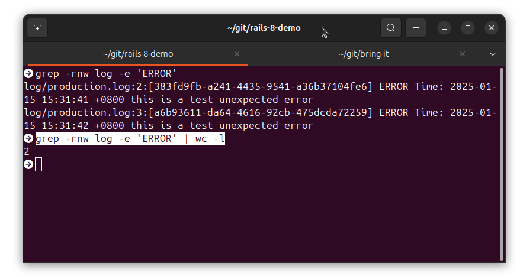

# 使用 Rails 8 错误管理

2025-01-15 15:00

## 1 错误报告

Rails 错误报告器提供了一种标准方法，用于收集应用程序中出现的错误，并将其报告给偏好的服务
（例如，您可以将错误报告给 Sentry 等监控服务）。

它的目标是取代像这样的模板式错误处理代码：

```ruby
begin
  do_something
rescue SomethingIsBroken => error
  MyErrorReportingService.notify(error)
end
```

而是使用一致接口：

```ruby
Rails.error.handle(SomethingIsBroken) do
  do_something
end
```
Rails 在错误报告器中封装了所有可执行代码（如 HTTP 请求、jobs 和 rails runner 调用），因此应用程序中出现的任何未处理错误都会通过订阅者自动报告给错误报告服务。

这意味着第三方错误报告库不再需要插入 Rack 中间件或做任何修补工作来捕获未处理的错误。使用 Active Support 的库还可以利用它来`非侵入性地`（不用修改或添加逻辑代码）报告以前会在日志中丢失的警告。

{: .note :}
使用 Rails 错误报告程序是可选的，因为其他捕获错误的方法仍然有效。例如使用传统的日志文件，然后监控日志文件，通过Grafana和Prometheus进行监控。

### 1.1 订阅报告器

要在外部服务中使用错误报告器，需要一个订阅者。订阅者可以是任何带有 report 方法的 Ruby 对象。当应用程序中出现错误或有人手动报告错误时，Rails 错误报告器将调用此方法并提供错误对象和一些选项。

{: .important :}
某些错误报告库（如 Sentry 和 Honeybadger）会自动注册一个订阅者。

也可以创建自定义订阅者。例如：

```ruby
# config/initializers/error_subscriber.rb
class ErrorSubscriber
  def report(error, handled:, severity:, context:, source: nil)
    MyErrorReportingService.report_error(error, context: context, handled: handled, level: severity)
  end
end
```

定义订阅者类后，可通过调用 [`Rails.error.subscribe`](https://api.rubyonrails.org/v8.0.1/classes/ActiveSupport/ErrorReporter.html#method-i-subscribe) 方法进行注册：

```ruby
Rails.error.subscribe(ErrorSubscriber.new)
```

也可以注册任意数量的订阅者。Rails 将按照注册的顺序调用它们。
也可以通过调用 Rails.error.unsubscribe 来取消注册订阅者。如果你想替换或删除某个依赖程序添加的订阅者，这可能会很有用。 
subscribe 和 unsubscribe 都可以接受订阅者或类，如下所示：

```ruby
subscriber = ErrorSubscriber.new
Rails.error.unsubscribe(subscriber)
# or
Rails.error.unsubscribe(ErrorSubscriber)
```

### 1.2 使用错误报告器

Rails 错误报告器有四种方法，允许以不同方式报告：

+ Rails.error.handle
+ Rails.error.record
+ Rails.error.report
+ Rails.error.unexpected

Rails.error.handle 方法会报告代码块中出现的任何错误。然后，它将吞下错误(rescue)，代码块外的其他代码将继续正常运行。

```ruby
result = Rails.error.handle do
  1 + "1" # raises TypeError
end
result # => nil
1 + 1 # This will be executed
```
如果代码块中没有出错， Rails.error.handle 将返回代码块的结果，否则将返回 nil 。可以通过提供一个 fallback 来覆盖这一结果：

```ruby
user = Rails.error.handle(fallback: -> { User.anonymous }) do
  User.find(params[:id])
end
```

Rails.error.record 方法将向所有已注册的订阅者报告错误，然后再次引发错误，这意味着代码的其余部分将无法执行。

```ruby
Rails.error.record do
  1 + "1" # raises TypeError
end
1 + 1 # This won't be executed
```
如果代码块中没有报错， Rails.error.record 将返回代码块的结果。

也可以通过调用 Rails.error.report 手动报告错误：

```ruby
begin
  # code
rescue StandardError => e
  Rails.error.report(e)
end
```
传递的任何选项都将传递给错误订阅者。

可以调用 Rails.error.unexpected 来报告任何意外错误。在生产环境中调用时，该方法将在报错后返回 nil，
代码将继续执行。在开发过程中调用时，错误将被封装在一个新的错误类中（以确保它不会被堆栈中更深的错误类救出），
并显示给开发人员进行调试。例如：

```ruby
def edit
  if published?
    Rails.error.unexpected("[BUG] Attempting to edit a published article, that shouldn't be possible")
    false
  end
  # ...
end
```
该方法旨在优雅地处理生产过程中可能出现的错误。

{: .important :}
long words in short, `handle` 和 `record` 是用于自动报告给错误服务使用于生产环境，而 `report` 和 `unexpected` 是手动报错，使用于开发环境。

### 1.3 错误报告选项

报告 API #handle 、 #record 和 #report 支持以下选项，这些选项伴随的信息会传递给所有注册用户：

+ handled ：一个 Boolean ，表示错误是否已处理。默认设置为 true 。 #record 设置为 false 。
+ severity : Symbol ，描述错误的严重程度。可选项为 :error , :warning , 和 :info 。 #handle 将其设置为 :warning ，而 #record 将其设置为 :error 。
+ context : 一个 Hash ，提供有关错误的更多信息，如请求或用户详细信息
+ source ：关于错误来源的 String 。默认来源是 "application" 。内部库报告的错误可能会设置其他来源；例如，Redis 缓存库可能会使用 "redis_cache_store.active_support" 。用户可以使用来源忽略不感兴趣的错误。

```ruby
Rails.error.handle(context: { user_id: user.id }, severity: :info) do
  # ...
end
```

通过上下文业务信息，追踪是那个用户的报错。

### 1.4 全局设置上下文

除了通过 context 选项设置上下文外，还可以使用 Rails.error.set_context 。例如：

```ruby
Rails.error.set_context(section: "checkout", user_id: @user.id)
```

以这种方式设置的任何上下文都将与 context 选项合并：

```ruby
Rails.error.set_context(a: 1)
Rails.error.handle(context: { b: 2 }) { raise }
# The reported context will be: {:a=>1, :b=>2}
Rails.error.handle(context: { b: 3 }) { raise }
# The reported context will be: {:a=>1, :b=>3}
```

### 1.5 按错误类别过滤

通过 Rails.error.handle 和 Rails.error.record ，还可以选择只报告某些类别的错误。例如：

```ruby
Rails.error.handle(IOError) do
  1 + "1" # raises TypeError
end
1 + 1 # TypeErrors are not IOErrors, so this will *not* be executed
```
在这里，Rails 错误报告器不会捕获 TypeError 。只有 IOError 及其后代的实例才会被报告。任何其他错误都会正常出现。


### 1.6 禁用通知

可以通过调用 Rails.error.disable 来阻止订阅者在整个代码块期间收到错误通知。与 subscribe 和 unsubscribe 类似，可以传入订阅者本身或类。

```ruby
Rails.error.disable(ErrorSubscriber) do
  1 + "1" # TypeError will not be reported via the ErrorSubscriber
end
```

## 2 错误报告库

错误报告库可以在 Railtie 中注册其订阅者：

```ruby
module MySdk
  class Railtie < ::Rails::Railtie
    initializer "my_sdk.error_subscribe" do
      Rails.error.subscribe(MyErrorSubscriber.new)
    end
  end
end
```

{: .note :}
如果注册了错误订阅器，但仍有其他错误机制（如 Rack 中间件），那么最终可能会多次重复报告错误。应该移除其他机制，或调整报告功能，使其跳过以前报告过的错误。

## 3 使用

如果使用自建 Sentry，那么又需要维护一个服务，这对架构来说增加了整体脆弱性，如果是云，那么可以依赖于第三方。
然而国内没有Sentry 云。所以使用传统logger文件是更为可靠的方案。

参考 [https://stackify.com/rails-logger-and-rails-logging-best-practices/](https://stackify.com/rails-logger-and-rails-logging-best-practices/)

```ruby
#app/controllers/posts_controller.rb
  def index
    begin
      @posts = Post.all.with_rich_text_content_and_embeds
      raise "this is a test unexpected error"
    rescue => e
      Rails.logger.error("ERROR Time: #{Time.now} #{e}")
    end
  end
```

```ruby
# config/environments/production.rb
# config.logger   = ActiveSupport::TaggedLogging.logger(STDOUT)
  config.logger   = ActiveSupport::TaggedLogging.logger("log/#{Rails.env}.log")
```

然后就可以在日志中定位错误：

```shell
grep -rnw '/path/to/somewhere/' -e 'pattern'
grep -rnw log -e 'ERROR' | wc -l
```



然后可以通过监控日志文件来发出相应告警。

进一步，可以封装自己的logger，将更多上下文信息包含其中，例如：代码错误，业务错误，第三方API调用错误，当前用户ID，
Controller，action等。

{: .important :}
错误的上下文信息越多定位的错误就越准。
