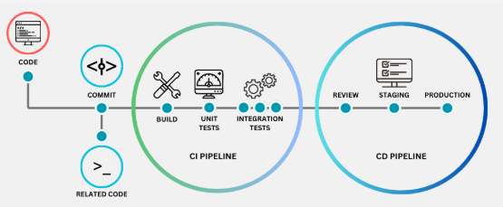
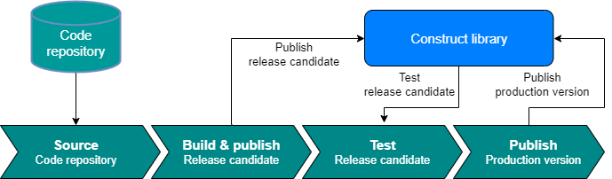

# CI / CD 持续集成和持续交付

2025-02-06 17:00

CI / CD 是指持续集成和持续交付。

{: .important :}
CI / CD 是 DevOps 哲学的支柱。它是将开发人员和运维人员凝聚在一起的黏合剂。

他既是技术创新，也是商业资产。一经引入，CI / CD 就成了IT组织的基石，因为他在先前混乱不堪的发布过程中
强行施加了`逻辑性`和`组织性`。

测试是CI / CD 的重要元素。有效的CI / CD 不是靠单个工具实现的，而是靠一组配合默契的软件来形成一个具有
内聚性的环境。

CI / CD 实际上可以细分为3部分：

+ 持续集成：在共享代码库上进行协作，将不同的代码变更合并到版本控制系统以及自动创建和构建创建的过程。
+ 持续交付：在持续集成过程完成后，自动部署到非生产环境的过程。（stage）
+ 持续部署：在没有操作人员的干预下，通过部署到服务于真实用户的工作系统来完成闭环。

{: .important :}
通过尽可能频繁的部署来减少恐惧因素，消除越来越多的问题，直到团队对测试和工具有足够的信心来实现自动化发布。

为了实现持续集成，开发人员需要在运行完本地测试后，每天至少推送一次代码变更。而实现在无人干预的情况下部署
则需要遵守以下经验法则。

## 1 经验法则

### 1.1 使用版本控制

使用 `git`代码仓库，确保仓库是单一可信数据源。凡事都不要手动管理或是不记录在案。

### 1.2 一次构建，多次部署

通过流水线构建好的制品（artifact），例如：jar/war包（java）、二进制文件（c/c++ make go build等）、脚本工程项目（ruby、python）、或者
进一步，通过packer打包好的虚拟机镜像或者是编译好的docker镜像，至少部署到1到2个尽可能接近生产的环境。

### 1.3 端到端自动化

应该在操作人员触发后以完全无人值守的方式完成构建、测试、部署。

### 1.4 构建每一次集成提交

当准备妥当时，由开发人员发起集成，集成要尽可能频繁的发生。构建失败不是丢人的事，目标在于再次进行构建。在团队中鼓励不抱怨（blame-free）的文化。

### 1.5 分担责任

在恢复开发之前，修复构建（流水线错误）是整个团队的责任。每个团队成员都应该能够访问CI\CD页面、构建dashborad和日志。

### 1.6 快速构建，快速修复

确保构建系统有足够的代理（agent），并且有充足的资源可供代理快速构建，数分钟最为理想。如果构建失败，以便开发人员快速响应。

### 1.7 审计与核实

应该保存每个发布的详细历史记录。

## 2 环境

大多数站点至少采用3种环境：

+ dev
+ stage
+ prod

管理员必须时刻警惕，保持环境同步。下游环境和生产环境匹配程度越接近，维持高可用性和顺利交付软件的概率就越高。
努力构建一个stage环境，尽量高度模拟prod环境，在多个相同的位置上都具备冗余（例如：多个Web服务器、全复制的数据库、集群系统失效备援策略）。
敏感的数据匿名化（数据脱敏）。

还有一个方法是采用特性标志（Feature Flag 简称“FF”，这个在GitLab中广泛使用）。在代码层面实现“FF”机制。
通过一个简单“开关配置”为预发布环境启用某种特性，同时在生产环境中保持禁用，直到该特性经过全面测试并可供用户使用。
如果功能有bug，很容易在不更新软件的情况下将其禁用。

## 3 流水线

CI/CD 流水线由一系列依次运行的步骤（又成为“阶段”）组成。每个阶段其实就是一个脚本，负责执行特定任务。

在最基本层面上，一条 CI/CD 流水线包括：

+ 可靠的构建和打包软件
+ 运行一系列自动化测试，以此查找bug和配置错误
+ 将代码部署到一个或多个环境，最终在生产环境结束

下面详细说明这些个过程。

### 3.1 构建过程

每条流水线在运行时，都是从构建开始，但并不是所有构建都到达生产。
一旦构建通过了测试，就变成了候选发布（release candidate）。如果候选发布部署到了生产，他就成为了发布（release）publish。

在构建阶段输出的是制品（artifact），例如：jar/war包（java）、二进制文件（c/c++ make go build等）、脚本工程项目（ruby、python）、或者
进一步，通过packer打包好的虚拟机镜像或者是编译好的docker镜像。

### 3.2 测试

CI/CD 流水线的每个阶段都要运行自动测试。测试是整个过程的关键。他让我们确信发布已经做好了部署的准备。详尽的测试使快速修改迭代更加自信。
两次构建之间改动的代码量越小，就越容易隔离问题。

考虑在CI/CD 流水线添加以下测试：

+ 静态代码分析检测。语法错误，代码重复，安全漏洞，书写风格，过度冗余等问题。
+ 单元测试，代码层面。
+ 集成测试，代码层面。
+ 验收测试，模拟浏览器Selenium等。
+ 性能测试，使用类似 JMeter、Gatling等。
+ 基础设施测试。核实云基础设施的配置正确等。

对于重要的用户使用path应该着重进行测试。包括：集成测试、浏览器测试。测试不应该交叉依赖。

{: .important :}
CI/CD 黄金原则：首要任务是修复出问题的流水线。有时候，难以测试的代码也是最可能存在缺陷的代码。仅代码覆盖率并不足以衡量代码质量。

### 3.3 部署

部署结束的标志：新版本的软件运行起来，就版本的软件被禁用。
部署软件有以下可能的方法：

+ 自制脚本。ssh登陆到每台机器，下载安装构建制品，重启服务。不具备扩展性。
+ 使用配置管理工具在一组托管系统中编排安装过程。具备扩展性和组织性。
+ 调用容器管理器 API。制品是 docker镜像，需要在平台（例如：Kubernetes、Docker Swarm、AWS ECS等）上部署。
+ 针对特定技术栈使用开源项目进行标准化部署。例如：Capistrano（Ruby on Rails), Fabric（Python）。
+ 使用共有云厂商提供的第三方部署服务。（Google Deployment Manager、AWS CodeDeploy、Heroku）。

{: .important :}
“不可变”部署规定了这样一条原则：服务器一旦初始化，就不应该再被修改（或者说“突变”）。要部署新发布，CI/CD 工具会
创建全新的服务器，在镜像中包含全新的制品。

### 3.4 零停机部署技术

+ “蓝绿部署”（blue-green）：在备用系统集群中发布新软件，运行测试，确认功能可用性。一旦测试完成就将流量从活跃系统（live system）切换到备用系统。
+ “滚动部署”（rolling）：每次修改并切换活跃系统中的一台的流量。如果应用不能接受同时运行的两个不同版本，这种部署就会导致问题。（例如有breaking change）

这两种部署技术都依赖于负载均衡代理，都可以考虑采用“金丝雀”（canary）。每次进行小规模的部署，一旦有问题只会影响一小部分用户，并回滚。当然
金丝雀系统需要精确的遥感技术（telemetry）和监控，以便精确的定位问题所在。
