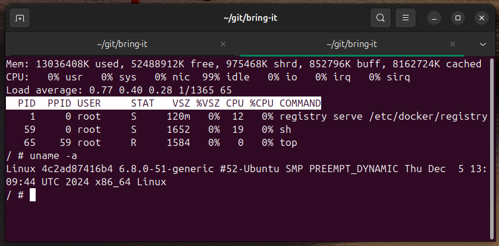
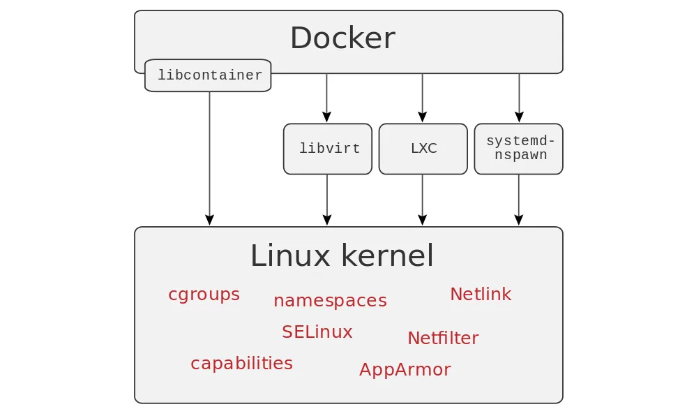
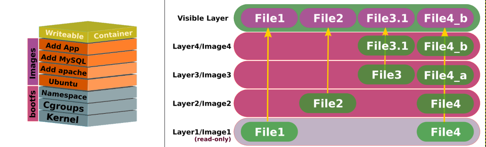
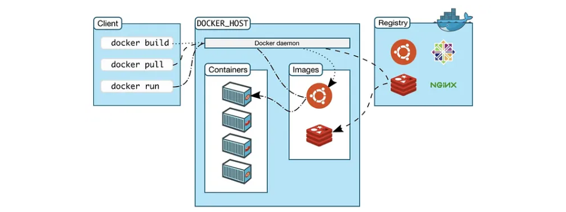
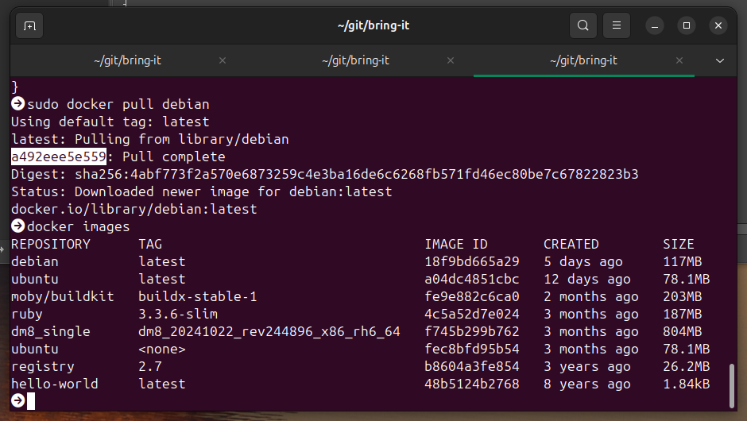
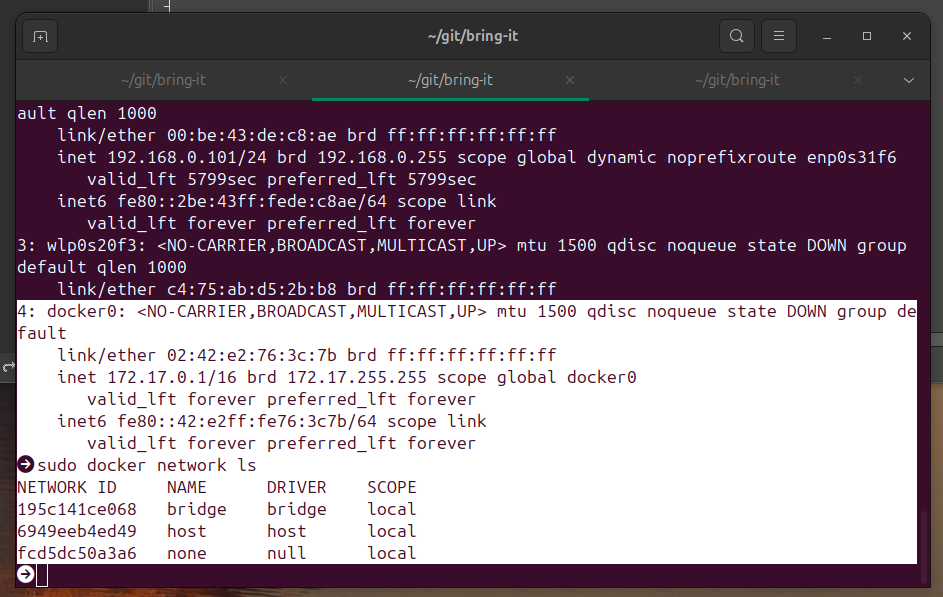
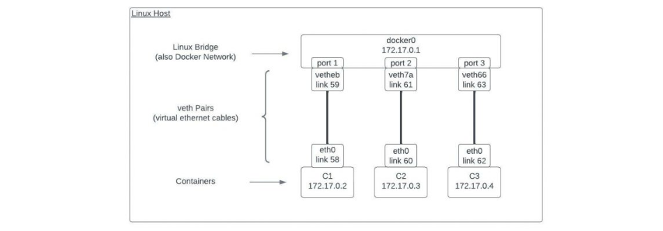
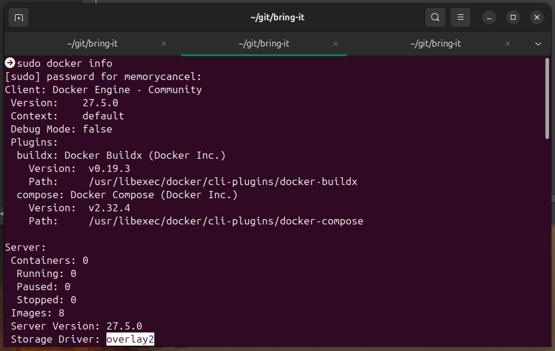

# 关于容器

2025-02-08 20:00

## 1 为什么出现容器技术

容器技术最利好于系统管理员（运维 devops），因为实现了软件打包的标准化。

一般情况下一个软件包含：

+ 实现 Web 应用业务代码
+ 库和其他依赖
+ 执行代码的解释器（Ruby/Python等）或者运行时（JRE）等
+ 本地化系统服务

现实过程中为了使软件具备良好的移植性，需要考虑操作系统，各种依赖包的版本，甚至硬件架构等。
容器镜像大大简化了这个问题。任何具有兼容容器运行时引擎的主机都可以使用镜像作为模板来创建容器。
容器之间互相隔离，同一个主机运行100个容器内部操作系统，库版本都可以不同。

这种简单易行的可移植性是容器得以流行的主要原因。

古老的容器引擎竞争中，Docker在rkt（CoreOS）和systemd-nspawn（systemd）中胜出。

## 2 什么是容器

本质上，容器是一组独立的进程，被限制在一个私有根文件系统和进程名称空间中。容器内的进程
共享宿主操作系统的内核和相关服务，默认情况下，他们无法访问所在容器外的文件或系统资源。
实际上，容器所依赖的Unix和Linux特性已经存在多年，很多源自于虚拟机的实现。

### 2.1 内核支持

容器引擎依赖操作系统内核的`进程隔离`特性。尤其是以下特性：

+ 命名空间（namespace）：通过配置命名空间，将宿主机和容器间的`文件系统`、`进程管理`、`网络`隔离。
+ 控制组（control group）：缩写为 cgroup，用于限制资源使用和进程优先级。cgroup可以防止失控容器耗尽CPU和内存。
+ 能力（capability）：允许进程内核操作和系统调用（例如修改系统时间或修改文件所有权）。

例如，进入 registry 容器：

```shell
top
uname -a
```


`top` 指令只显示了 registry 的进程，并且他的PID 是 1（宿主机的 #1 进程是 init）。
这充分说明容器内隔离了宿主机的其他进程。同时`uname -a` 返回容器的操作系统与宿主机相同，
这说明容器内的进程共享宿主操作系统的内核和相关服务。

这些特性的开发，一部分是由 Google 于 2006 年启动的 Linux 容器项目`LXC`（Linux Containers Project）推动的。
他是Docker项目的前身，Docker的发起就是为了`LXC`更易于使用。

{: .note :}
总的来说，Docker依赖：基于标准的容器运行时`libcontainer`和Linux（namespaces、cgroups、capabilities）等。



参考：[Understanding the Docker Internals](https://medium.com/@BeNitinAgarwal/understanding-the-docker-internals-7ccb052ce9fe)

### 2.2 镜像

容器是通过镜像创建的，镜像就像是容器的模板。镜像依赖于联合文件系统挂载UFM（union filesystem mount）来实现性能和移植性。UFM叠加（overlay）了多个文件系统来创建单一的、一致的层次结构。
文件的组织类似标准Linux根文件系统。

有专门的 Linux发行版开发出来作为容器镜像的基础。（例如Alpine 非常小）。

得益于`写时复制策略`，多个容器可以共享不变的基础层。提高了存储效率，降低启动时间。



下面的基础层是只读的，上面的才是可写的。一层一层网上叠加（overlay）。

### 2.3 联网

容器的网络模式有3中：none、bridge、host。默认是bridge。host模式是容器和主机共享网络，存在安全风险。

## 3 Docker：开源的容器引擎

整个Docker项目的源码不是一个整体。而是被零散的分割成了像乐高积木一样：[https://www.docker.com/community/open-source/](https://www.docker.com/community/open-source/)。使用 Go 语言开发。

### 3.1 基础架构

`docker`是一个可执行命令（docker-cli），负责处理 Docker 系统的所有管理任务。dockerd（Docker daemon）是一个持续运行的守护进程，
负责实现对容器和镜像的操作。docker-cli可以通过unix socket在本地主机与dockerd通信，也可以通过 TCP 与远程机器上的
dockerd进行通信。



dockerd就是管理这一切的守护进程，他是容器管理软件。他负责：
+ 创建虚拟网络通道
+ 维护保存容器和镜像的数据目录（默认是`/var/lib/docker`）
+ 负责系统调用
+ 设置联合文件系统
+ 启动进程创建容器

系统管理员使用docker命令（docker-cli）与dockerd交互，常见的命令有：

```shell
# IMAGES
#Build an Image from a Dockerfile
docker build -t <image_name> .
#Build an Image from a Dockerfile without the cache
docker build -t <image_name> . –no-cache
#List local images
docker images
#Delete an Image
docker rmi <image_name>
#Remove all unused images
docker image prune

# DOCKER HUB
# Login into Docker
docker login -u <username>
# Publish an image to Docker Hub
docker push <username>/<image_name>
# Search Hub for an image
docker search <image_name>
# Pull an image from a Docker Hub
docker pull <image_name>

# GENERAL COMMANDS
# Start the docker daemon
docker -d
# Get help with Docker. Can also use –help on all subcommands
docker --help
# Display system-wide information
docker info

# CONTAINERS
# Create and run a container from an image, with a custom name:
docker run --name <container_name> <image_name>
# Run a container with and publish a container’s port(s) to the host.
docker run -p <host_port>:<container_port> <image_name>
# Run a container in the background
docker run -d <image_name>
# Start or stop an existing container:
docker start|stop <container_name> (or <container-id>)
# Remove a stopped container:
docker rm <container_name>
# Open a shell inside a running container:
docker exec -it <container_name> sh
# Fetch and follow the logs of a container:
docker logs -f <container_name>
# To inspect a running container:
docker inspect <container_name> (or <container_id>)
# To list currently running containers:
docker ps
# List all docker containers (running and stopped):
docker ps --all
# View resource usage stats
docker container stats
```

参考：[https://docs.docker.com/get-started/docker_cheatsheet.pdf](https://docs.docker.com/get-started/docker_cheatsheet.pdf)

容器依赖于镜像作为执行基础，每当dockerd运行容器时，他会创建一个与源镜像分离的可写文件系统层。
容器可以读取存储在镜像中的任意文件和元数据，但写入操作都被限制在容器自己的读/写层中。

{: .important :}
registry 是集中化的镜像集合，默认是 docker hub，但是也可以自建 registry。

### 3.2 安装Docker Deamon

Docker可以运行在 Linux、MacOS、Windows、FreeBSD，但是Linux是最佳平台。

在ubuntu安装的步骤：

1. 修改 ubuntu 的软件仓库：[https://mirror.tuna.tsinghua.edu.cn/help/ubuntu/](https://mirror.tuna.tsinghua.edu.cn/help/ubuntu/)
2. 下载安装： [https://mirrors.tuna.tsinghua.edu.cn/help/docker-ce/](https://mirrors.tuna.tsinghua.edu.cn/help/docker-ce/)
3. 修改默认的 registry 配置(/etc/docker/daemon.json)为国内镜像：

```json
{
    "registry-mirrors": [
        "https://hub-mirror.c.163.com",
        "https://mirror.ccs.tencentyun.com",
        "https://05f073ad3c0010ea0f4bc00b7105ec20.mirror.swr.myhuaweicloud.com",
        "https://registry.docker-cn.com",
        "https://docker.m.daocloud.io",
        "https://docker.1panel.live",
        "https://hub.rat.dev",
        "https://dockerpull.com",
        "https://dockerproxy.cn",
        "https://docker.rainbond.cc",
        "https://docker.udayun.com",
        "https://docker.211678.top"
    ]
}
```
重启dockerd：
```shell
sudo systemctl restart docker
```


不要把用户添加到docker，而是使用sudo执行系统权限，这样可以隔离安全风险，在ubuntu安装docker时，这是默认的。
例如启动dockerd用：

```shell
sudo systemctl start docker
sudo docker info
```

### 3.3 docker-cli 客户端设置

要想连接远程 dockerd，设置`DOCKER_HOST`环境变量，默认HTTP端口为`2375`，TLS是`2376`。

```shell
export DOCKER_HOST=tcp://10.0.0.10:2376
export DOCKER_CONTENT_TRUST=1 # 该特性会认证镜像完整性和发布人信息
```

### 3.4 使用容器

```shell
sudo docker pull debian
sudo docker images
```



十六进制字符串就是联合文件系统层。如果多个镜像使用了相同的层，Docker只保存一个副本。默认下载`latest`标签。
`sudo docker images` 检查本地可用的镜像。

有了基本的镜像，运行容器就水到渠成了：

```shell
sudo docker run debian /bin/echo "hello docker!"
```

进入容器，启动交互式shell，调试容器：

```shell
sudo docker run --hostname debian -it debian /bin/bash
ls
apt-get update && apt-get -y install procps
ps aux
uname -r
exit
uname -r
```

{: .important :}
`uname -r` 的结果在容器的内外是一样的。内核是共享的。

并且文件根结构和虚拟机一模一样。有完整的根文件系统，但是进程数基本是空的，`/bin/bash`的进程号是`1`。
由于PID namespace 的划分，容器中的进程看不到系统中运行的其他进程。但是主机上的进程可以看到容器化的进程。
容器中的PID不同于主机中的PID。

容器镜像理想状况下应该尽可能小，因而也常常缺少常用的系统命令。所以有时需要手动安装：`apt-get update && apt-get -y install procps`

当容器退出时，他们仍然以休眠状态保留在系统中，随手删除他们是一个很好的习惯。

```shell
sudo docker stop debian && sudo docker rm debian
#  或者运行的时候加上 --rm 选项
#  或者列出全部容器并删除
sudo docker rm $(sudo docker ps -aq)
```

### 3.5 卷（volume）

对于数据密集型应用（如：postgresql、mysql），Docker引入了卷（volume）的概念。
卷是容器内独立的可写目录，与联合文件系统分开维护。如果删除了容器，卷内的数据仍然存在，可以从主机访问。
卷也可以在多个容器之间共享。

使用 `-v` 选项可以向容器中添加一个卷。例如：

```shell
sudo docker run -v /data --rm --hostname web --name web -d nginx
sudo docker inspect -f '{{ json .Mounts }}' web
```

Docker 也支持“绑定挂载”(bind mount)，能够同时在主机和容器中挂载卷。例如：
```shell
sudo docker -v /mnt/data:/data --rm --name web -d nginx
sudo docker volume ls
```

### 3.6 数据卷容器

使用卷的最佳实践是使用数据卷容器，这样可以将应用和存储解耦。纯数据容器（data-only container）实际上从来不会运行。

```shell
sudo docker create -v /mnt/data:/data --name nginx-data nginx
sudo docker run --volume-from nginx-data -p 80:80 --name web -d nginx
```

{: .note :}
阻抗失衡（impedance mismatch）:一旦添加了持久数据卷，容器就会和特定的服务器捆绑在一起。

### 3.7 Docker 网络

将 Docker 容器连接到网络的方式有3种：



none/bridge/host，默认是 bridge。

+ bridge: 桥接模式下，容器居于主机内的私有网络。网桥将主机网络接入容器的namespace，
`docker run -p`创建容器并映射端口时，Docker会创建iptables 规则，将主机公共网络路由到桥接网络的容器端口。
+ host: 容器和主机共享所有接口在内的网络栈。
+ none：用于自定义网络设置。

{: .note :}
网桥是Linux内核的特性。用于连接2个网段。安装时，Docker会在主机上悄悄创建一个名为`docker0`的网桥。
Docker通过计算在容器端选择一个不与主机相冲突的IP范围。但是也会有意外情况，例如主机的局域网内有其他看不见的路由，
因此可能会发生冲突。可以使用`--fixed-cidr`来解决IP冲突。

网络地址namespace依赖于虚拟接口（成对创建），其中一侧在主机的namespace中，另外一侧在容器的namespace中。
数据从一侧进，另外一侧出。



除此之外还可以叠加使用更灵活的虚拟可扩展局域网（Virtual eXtensible LAN），详情参考 Docker 联网文档。

### 3.8 存储驱动

Unix 和 Linux 提供了多种方式实现联合文件系统。Docker保持技术中立，换句话说，Docker 的存储驱动是可以配置更换的。
不过建议使用默认的配置。例如，我的Ubuntu 24.04 安装最新的 Docker版本的存储驱动是 `overlay2`：



使用 `sudo docker info` 是检查配置是否生效的好方法。

如果需要修改存储驱动，执行`sudo systemctl edit docker`：

```text
[Service]
ExecStart=
ExecStart=/usr/bin/docker daemon -D --storage-driver overlay.... 省略
```

{: .important :}
多出来的那行`ExecStart=`并不是错误。这是 systemd 风格的写法，用于清楚默认配置。编辑完后重启。

```shell
sudo systemctl restart docker
sudo systemctl status docker
```

### 3.9 构建镜像

构建镜像分3步：

1. 为应用选择基础镜像：越小越好，例如：Alpine Linux（5MB）、Ubuntu（188MB）。
2. 根据 Dockerfile 构建镜像：他是镜像的构建操作清单，其中包含一系列指令和Shell命令。`docker build`命令读取，然后按顺序执行，最后将结果提交为镜像。
3. 编写Dockerfile，build镜像。

Dockerfile 的指令列表参考：[https://docs.docker.com/reference/dockerfile/](https://docs.docker.com/reference/dockerfile/)

| Instruction                            | Description                           | 
|:-----------------------------------------|:-----------------------------------------|
|ADD	|Add local or remote files and directories.|
|ARG	|Use build-time variables.|
|CMD	|Specify default commands.|
|COPY	|Copy files and directories.|
|ENTRYPOINT	|Specify default executable.|
|ENV	|Set environment variables.|
|EXPOSE	|Describe which ports your application is listening on.|
|FROM	|Create a new build stage from a base image.|
|HEALTHCHECK	|Check a container's health on startup.|
|LABEL	|Add metadata to an image.|
|MAINTAINER	|Specify the author of an image.|
|ONBUILD	|Specify instructions for when the image is used in a build.|
|RUN	|Execute build commands.|
|SHELL	|Set the default shell of an image.|
|STOPSIGNAL	|Specify the system call signal for exiting a container.|
|USER	|Set user and group ID.|
|VOLUME	|Create volume mounts.|
|WORKDIR	|Change working directory.|

### 3.10 registry

尽管镜像的操作都是 docker 命令发起的，但实际上只有 dockerd 能够接触到 registry。
默认 registry 是 dockerhub，在中国需要配置`镜像 registry`，参考上面的安装章节。

出于性能和安全原因（例如要自建内网CI/CD），也可以自建 registry，registry项目也是开源的，
很容易作为容器运行：

```shell
sudo docker run -d -p 5000:5000 --name registry registry:2
sudo docker pull localhost:5000/debian
```

{: .note :}
默认的私有 reigistry 配置不适合大规模部署。生产用途则需要考虑：存储空间横向扩容、认证与授权、镜像清理
以及其他运维服务，这就需要定制开发。


### 3.11 容器的最佳实践

1. 不要在容器内使用 cron（或 systemd 计时器）
2. 不要在容器内运行 sshd
3. 尽可能使用环境变量配置容器，使用`-e KEY=value`或者`--env-file filename`
4. 只要合适，在单个容器内运行多个进程完全没有问题。（例如：在一个容器内运行APP+数据库）
5. 编写自动创建容器脚本，确保每次更新部署都更换容器
6. 容器出现问题时，避免维护容器，而是维护镜像，然后通过修复后的镜像重新创建容器。

### 3.12 容器日志

可以使用dockerd的`--log-driver`选项在启动时确认默认的日志驱动。或者在运行容器时通过
`docker run --logging-driver`指定日志驱动。

如果使用 json-file 或 journald，可以在命令行通过`sudo docker logs [CONTAINER_ID]`访问日志。
可选的日志驱动参考：[https://docs.docker.com/engine/logging/configure/#supported-logging-drivers](https://docs.docker.com/engine/logging/configure/#supported-logging-drivers)

| Driver                            | Description                           | 
|:-----------------------------------------|:-----------------------------------------|
|none|	No logs are available for the container and docker logs does not return any output.|
|local|	Logs are stored in a custom format designed for minimal overhead.|
|json-file|	The logs are formatted as JSON. The default logging driver for Docker.|
|syslog|	Writes logging messages to the syslog facility. The syslog daemon must be running on the host machine.|
|journald|	Writes log messages to journald. The journald daemon must be running on the host machine.|
|gelf|	Writes log messages to a Graylog Extended Log Format (GELF) endpoint such as Graylog or Logstash.|
|fluentd|	Writes log messages to fluentd (forward input). The fluentd daemon must be running on the host machine.|
|awslogs|	Writes log messages to Amazon CloudWatch Logs.|
|splunk|	Writes log messages to splunk using the HTTP Event Collector.|
|etwlogs|	Writes log messages as Event Tracing for Windows (ETW) events. Only available on Windows platforms.|
|gcplogs|	Writes log messages to Google Cloud Platform (GCP) Logging.|

### 3.13 容器安全

理论上，容器是主机的沙盒环境应该是安全的，但是存在能够让攻击者逃脱容器的漏洞（称之为“突破攻击”），非常严重，也很少见。
需要时常关注官方的漏洞列表。另外也有一些安全的最佳实践：

1. 不要将系统高权限的文件路径挂在到容器中
2. 使用 TLS
3. 编写 Dockerfile时使用指定 USER，不要使用 root 账户运行进程
4. 使用只读根文件系统（适用于不需要写入操作的无状态服务）`sudo docker run --read-only`
5. 能力限制。使用`--cap-add`和`--cap-drop`选项调整可用于容器化进程的特定能力
6. 使用安全镜像。使用通过公钥进行verify过的公网image。

### 3.14 调试与排错

1. 通过 `sudo docker logs `查看日志。
2. 通过`sudo docker exec -ti container_id /bin/bash` 进入容器调试。

Docker 不会自动清理容器或镜像，手动删除是好习惯，也可以配置cron作业进行清理：

```shell
sudo docker system prune
sudo docker image prune
```

还有就是可能出现“僵尸卷”（dangling），这种卷曾经附在某个容器上，但是该容器后来被删除了。卷独立于容器，因此卷中的文件将继续占用着磁盘空间，直到卷被销毁。
可以使用下俩命令消除孤立的卷：

```shell
sudo docker volume ls -f dangling=true
sudo docker volume rm $(docker volume ls -qf dangling=true)
```

通过 `sudo docker inspect`命令显示与容器相关联的卷：

```shell
sudo docker inspect -f '{{ .Volumes }}' [container_id]
```

{: .important :}
在基础镜像的Dockerfile中可能会有 VOLUME 指令，需要多留个心眼，避免在启动多个容器后将磁盘填满。
