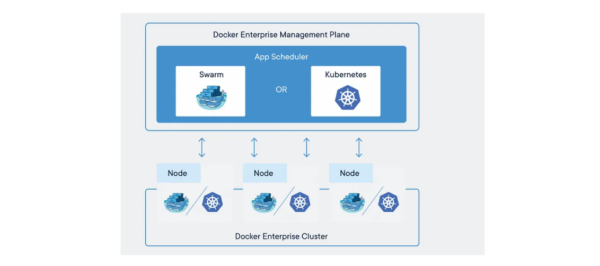

# 容器集群与管理

2025-02-09 20:00

## 1 容器编排软件出现的背景

容器化的一大承诺就是能够将众多应用聚集到相同主机上，同时避免相互之间的依赖和冲突，提高服务器的使用效率。
但是Docker引擎只负责`单个`容器，如何高可用的配置在分布式主机上运行的大量容器呢？

在Docker Swarm 和 Kubernetes 出现之前，传统的服务器集群配置管理工具（Chef、Puppet、Ansible、Salt）
都支持Docker，他们可以确保主机按照申明的配置运行一组容器，另外还支持镜像构建、registry接口、网络和卷管理，
以及其他与容器相关的杂务。这些配置实现了容器配置的集中化和标准化，但无法解决跨服务器网络部署多个容器，并
让这些容器高可用的一起协同工作的问题。

这就需要容器编排软件，也称为容器调度或容器管理软件。有一整套开源或商业工具可用于处理大批量的容器，这种工具
对于在生产环境中大规模运行容器尤为重要。

{: .important :}
容器编排软件的工作原理：不妨将网络上的服务器想象成是算力农场（a farm of compute capacity）。农场中的每个
个节点向调度器提供CPU、内存、磁盘，以及网络资源。如果调度器接到运行一个或一组容器的请求，他会自动将容器放置到
符合资源需求的节点上。因为调度器清楚容器放置的位置，因而也能帮助将网络请求路由到集群中正确的节点。管理员和容器编排系统
打交道，不处理任何单独的容器引擎。

容器管理软件（编排系统）提供了一些特性：

+ 调度算法
+ API接口，方便与CI/CD结合
+ 高可用。（m地n中心）
+ 内建容器的健康监控。
+ 易于增减算力。增减计算农场节点。
+ 负载均衡
+ 服务发现（服务器与容器的映射，动态端口）

## 2 Docker Swarm 和 Kubernetes

两个都是容器编排工具，Docker Swarm是Docker公司自己开发的，可能和Docker引擎集成得比较好，使用起来可能更简单。
而Kubernetes是Google开源的，功能更强大，但可能更复杂。

安装和配置方面，Swarm更简单，毕竟它内置于Docker中，只需要几条命令就能启动集群。
而Kubernetes的安装麻烦一些，特别是对于新手来说，可能需要用到kubeadm或者minikube之类的工具，或者云服务商的托管服务。

架构方面，Swarm的架构比较简单，有管理节点（master）和工作节点（worker），管理节点负责调度任务，工作节点运行容器。
而Kubernetes的架构更复杂，有Master节点和Node节点，Master包括API Server、Controller Manager、Scheduler、etcd等组件，Node节点有kubelet、kube-proxy，还有Pod、Service、Deployment这些概念。Kubernetes的学习曲线更陡峭。

功能上，Kubernetes支持更多的功能，比如自动伸缩、滚动更新、服务发现、存储编排、配置管理（ConfigMap和Secret），还有健康检查、自我修复机制。
而Swarm的功能相对基础，虽然也能做服务发现、滚动更新，但可能在高级功能上不如Kubernetes完善。

扩展性方面，Kubernetes可能更适合大规模和复杂的应用环境，而Swarm适合中小规模或者简单的部署场景。
比如，如果应用需要复杂的部署策略、多环境管理，Kubernetes可能更合适。而如果只是需要快速部署一个容器集群，Swarm可能更快更简单。

社区和生态方面，Kubernetes的社区更大，有更多的第三方工具和插件支持，比如Helm、Istio、Prometheus等，生态系统更丰富。
而Swarm的社区相对小一些，可能资源和支持较少，尤其是随着`Docker公司把重心转向Kubernetes，Swarm的发展可能放缓。`

使用场景的话，如果团队已经熟悉Docker，需要快速搭建一个简单的集群，Swarm是好的选择。如果是需要高度可定制化、复杂应用的管理，或者大规模生产环境，Kubernetes更合适。

网络模型。Swarm使用Docker原生的网络，而Kubernetes有自己的网络模型，要求每个Pod有独立的IP，可能需要CNI插件，比如Calico、Flannel等。

存储方面，Kubernetes提供了Persistent Volumes和Persistent Volume Claims，更灵活地管理存储资源。Swarm虽然也能挂载卷，但可能不如Kubernetes的存储系统强大。

另外，更新和回滚机制，Kubernetes的Deployment支持更复杂的滚动更新策略，可以控制更新的速度和顺序，而Swarm的滚动更新相对基础，可能配置选项少一些。

安全性方面，Kubernetes有更细粒度的权限控制，比如RBAC，而Swarm的安全机制可能较简单，主要依赖Docker的安全特性。

性能方面，可能两者在中小规模下差异不大，但Kubernetes在超大规模集群中优化更好，处理更多的节点和容器更高效。

服务发现和负载均衡。Swarm内置了DNS轮询的服务发现，而Kubernetes通过Service和Ingress来实现，功能更强大，支持更多的负载均衡策略。

### 2.1 架构与复杂性

| 对比               | Docker Swarm     | Kubernetes        |
|:--------------------|:----------------|:------------------|
|架构复杂度|架构简单采用主从结构，包含管理节点（Manager）和工作节点（Worker）。管理节点负责集群协调，工作节点运行容器。|架构复杂包含 Master 节点（API Server、Controller Manager、Scheduler、etcd）和 Node 节点（kubelet、kube-proxy），支持更细粒度的资源管理。|
|集成性|集成简单，内置于 Docker 引擎，无需额外组件，通过 docker swarm 命令即可快速搭建集群。| 集成复杂需要用到kubeadm或者minikube之类的工具，或者云服务商的托管服务。 |
|学习成本|学习曲线低：适合熟悉 Docker 的用户快速上手。|念丰富：涉及 Pod、Service、Deployment、StatefulSet 等抽象概念，学习成本较高。|
|扩展性|轻量简单|扩展性强：适合大规模、复杂应用场景。|

### 2.2 功能对比

| 功能                | Docker Swarm     | Kubernetes        |
|:--------------------|:----------------|:------------------|
|服务发现与负载均衡	     | 内置 DNS 轮询，简单易用 |	通过 Service 和 Ingress 支持多种策略|
|自动伸缩| 	需手动或第三方工具|	支持 Horizontal Pod Autoscaler (HPA)|
|滚动更新与回滚|	基础支持，配置简单	|精细化控制（如金丝雀发布、分阶段更新）|
|存储管理|	依赖 Docker 卷	|支持 Persistent Volumes (PV) 和 StorageClass|
|网络模型	|基于 Docker 原生 Overlay 网络|	灵活 CNI 插件（如 Calico、Flannel）|
|自我修复|	重启失败容器|	自动替换异常 Pod，确保副本数|
|配置管理	|依赖环境变量或外部工具|	提供 ConfigMap 和 Secret|

### 2.3 适用场景

| 场景                | Docker Swarm     | Kubernetes        |
|:--------------------|:----------------|:------------------|
|项目规模|小型/简单项目：快速搭建轻量级集群，适合 CI/CD 测试环境或小型应用。|大规模生产环境：支持数千节点，适合复杂微服务架构和长期维护的项目。|
|工程师团队|Docker 生态重度用户：与 Docker Compose 无缝集成，适合已有 Docker 工具链的团队。|k8s|
|高级需求|无高级需求|需要高级功能：如服务网格（Istio）、监控（Prometheus）、日志聚合（EFK）等扩展生态。|

### 2.4 社区与生态

| 对比                | Docker Swarm     | Kubernetes        |
|:--------------------|:----------------|:------------------|
|社区|社区较小：随着 Docker 公司转向支持 Kubernetes，Swarm 的更新频率降低。|由 CNCF 支持，拥有 Helm、Operator Framework、Istio 等丰富工具。|
|生态|工具链简单：依赖 Docker 原生工具，第三方插件较少。|行业标准：成为容器编排的事实标准，企业支持广泛。|

### 2.5 部署与运维

| 对比                | Docker Swarm     | Kubernetes        |
|:--------------------|:----------------|:------------------|
|部署|快速部署：通过 docker swarm init 和 docker stack deploy 即可启动服务。|安装复杂：需使用 kubeadm、kops 或托管服务，初期配置耗时。|
|运维|运维简单：日志和监控依赖 Docker 原生命令或第三方工具（如 Portainer）。|运维专业化：需要熟悉集群升级、网络策略、RBAC 等高级功能。|

{: .note :}
随着云原生技术的发展，Kubernetes 逐渐成为企业级应用的主流选择，而 Swarm 更适合特定轻量级场景。建议根据团队技能和项目需求综合评估。
