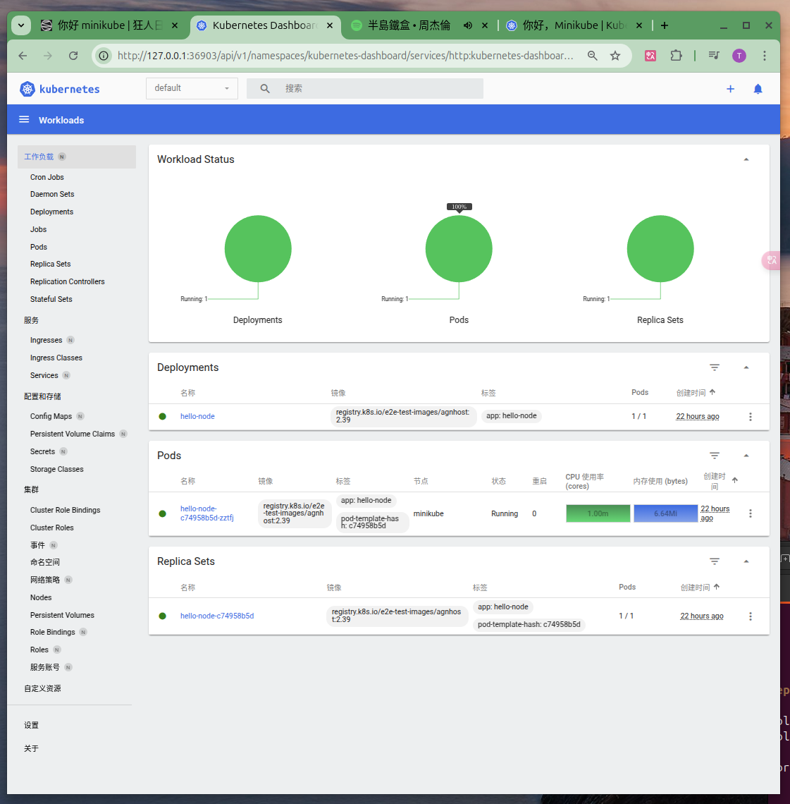

# 使用 minikube 创建 kubernetes

2025-02-19 20:00

minikube 是本地 Kubernetes，专注于让 Kubernetes 的学习和开发变得简单。只需要一个 Docker（或 podman）或一个虚拟机环境，一个命令就能使用 Kubernetes： `minikube start`。下面演示：

+ 将一个示例应用(nginx)部署到 Minikube。
+ 运行应用程序。
+ 查看应用日志。

## 1 安装 kubectl 和 minikube

```shell
# 安装 kubectl： https://kubernetes.io/docs/tasks/tools/install-kubectl-linux/
curl -LO "https://dl.k8s.io/release/$(curl -L -s https://dl.k8s.io/release/stable.txt)/bin/linux/amd64/kubectl"
curl -LO "https://dl.k8s.io/release/$(curl -L -s https://dl.k8s.io/release/stable.txt)/bin/linux/amd64/kubectl.sha256"
echo "$(cat kubectl.sha256)  kubectl" | sha256sum --check
sudo install -o root -g root -m 0755 kubectl /usr/local/bin/kubectl && rm kubectl*

# 安装 minikube：https://minikube.sigs.k8s.io/docs/start/?arch=/linux/x86-64/stable/binary+download
curl -LO https://github.com/kubernetes/minikube/releases/latest/download/minikube-linux-amd64
sudo install minikube-linux-amd64 /usr/local/bin/minikube && rm minikube-linux-amd64
```

## 2 创建 Minikube 集群

这里需要使用代理，关于配置问题参考：[使用 proxy 解决 docker 镜像的网络下载问题](2025-02-18-container-proxy)

```shell
# export HTTP_PROXY=http://127.0.0.1:10809
# export HTTPS_PROXY=http://127.0.0.1:10809
# export NO_PROXY=localhost,127.0.0.1,10.96.0.0/12,192.168.59.0/24,192.168.49.0/24,192.168.39.0/24
minikube start --vm-driver=docker \
  --docker-env HTTP_PROXY=http://192.168.0.100:10809 \
  --docker-env HTTPS_PROXY=http://192.168.0.100:10809 \
  --docker-env NO_PROXY=localhost,127.0.0.1,10.96.0.0/12,192.168.59.0/24,192.168.49.0/24,192.168.39.0/24
```

## 3 打开仪表盘 Dashboard

```shell
# 启动一个新的终端，并保持此命令运行。Ctrl+C 退出该进程。
minikube dashboard
```


## 4 创建 Deployment

Kubernetes [Pod](https://kubernetes.io/zh-cn/docs/concepts/workloads/pods/) 是由`一个或多个`为了管理和联网而绑定在一起的容器构成的组。Minikube 集群中的 Pod 只有一个容器。 Kubernetes [Deployment](https://kubernetes.io/zh-cn/docs/concepts/workloads/controllers/deployment/) 检查 Pod 的健康状况，并在 Pod 中的容器`终止的情况下重新启动新的容器`。

{: .note :}
Deployment 是管理 Pod 创建和扩展的推荐方法。

Pod 相关的 CRUD：

```shell
# deployment create
kubectl create deployment hello-node --image=registry.k8s.io/e2e-test-images/agnhost:2.39 -- /agnhost netexec --http-port=8080
# deployments index
kubectl get deployments
# pods index
kubectl get pods
# events index
kubectl get events
# config show
kubectl config view
# log show
kubectl logs hello-node-5f76cf6ccf-br9b5
```

有关 kubectl 命令的更多信息，参阅 [kubectl 概述](https://kubernetes.io/zh-cn/docs/reference/kubectl/)。

{: .important :}
通过 `deployment` 部署 `pods`，产生事件 `events`，通过 `logs` 查看日志；通过 `config` 查看配置。

## 5 创建 Service

默认情况下，Pod 只能通过 Kubernetes 集群中的内部 IP 地址访问。 要使得 hello-node 容器可以从 Kubernetes 虚拟网络的外部访问，必须将 Pod 通过 Kubernetes [Service](https://kubernetes.io/zh-cn/docs/concepts/services-networking/service/) 公开出来。

{: .important :}
agnhost 容器有一个 /shell entrypoint，对于调试很有帮助，但暴露给公共互联网很危险。 勿在面向互联网的集群或生产集群上运行它。

```shell
# 使用 kubectl expose 命令将 Pod 暴露给公网
kubectl expose deployment hello-node --type=LoadBalancer --port=8080
# 查看创建的 Service
kubectl get services
# 打开一个浏览器窗口访问服务
minikube service hello-node
```


可以观察到 hello-node 的 service TYPE 是 `LoadBalancer`，这表明 hello-node 是通过`负载均衡器`公开的，
外部客户端通过访问负载均衡器的IP来访问该服务。在 Minikube 上，LoadBalancer 使得服务可以通过命令 minikube service 访问。可以看到负载均衡器公开的地址为`http://192.168.49.2:30113`，为什么负载均衡的IP是`192.168.49.2`呢?


`ip addr`查看一下本地的网络会发现在主机上实际创建了一个网段为`192.168.49.1/24`的网桥：


## 6 启用插件 addons

```shell
# addons index
minikube addons list
# add addon
minikube addons enable metrics-server
# 查看通过安装该插件所创建的 Pod 和 Service
kubectl get pod,svc -n kube-system
# 检查 metrics-server 的输出(metrics-server 实际是实现容器内服务的 top 命令)
kubectl top pods
# 禁用 metrics-server
# minikube addons disable metrics-server
```

## 7 清理

```shell
kubectl delete service hello-node
kubectl delete deployment hello-node
minikube stop
minikube delete # 可选的
```

最后附上一张手绘生命周期图：


参考原文地址：[https://kubernetes.io/zh-cn/docs/tutorials/hello-minikube/](https://kubernetes.io/zh-cn/docs/tutorials/hello-minikube/)
