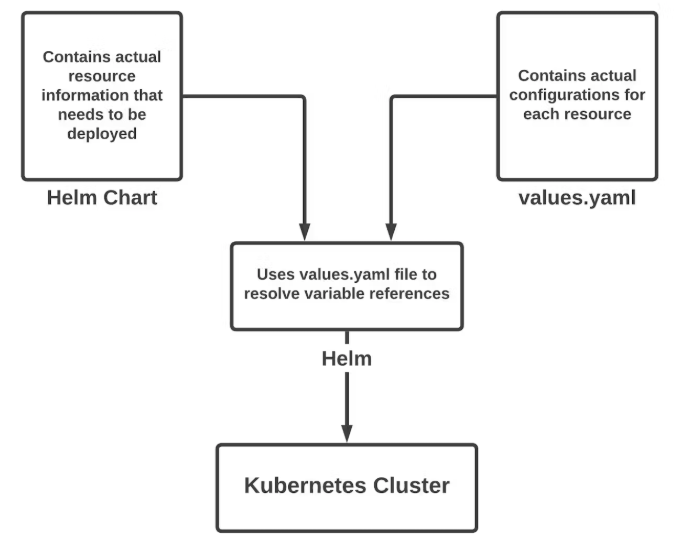
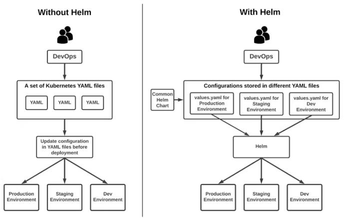

# 关于 kubectl 和 helm

2025-02-22 23:00

## 1 What

### 1.1 kubectl

Kubernetes 使用 YAML 配置文件和`kubectl`进行部署。

对于频繁更新的复杂部署来说，跟踪这些文件的所有不同版本可能会很困难。

### 1.2 helm

`helm` 是一个便捷的工具，它维护一个包含版本信息的 YAML 部署文件。通过该文件，只需几条命令就能设置和管理一个复杂的 Kubernetes 集群。

### 1.3 helm charts

`helm charts`是一个包，其中包含将应用程序部署到 Kubernetes 集群所需的所有资源。该包包含用于部署、服务、机密和配置映射的 YAML 文件，可根据需要设置应用程序。

{: .important :}
可以单独对每个 Helm charts进行版本控制（`git`）和管理，从而更轻松地维护具有不同配置的应用程序的多个版本。
Helm 从第 3 版不再使用 Tiller 服务器。现在它使用纯客户端架构的直接与 Kubernetes API 服务器交互。

## 2 When

### 2.1 不应该使用 helm 的情况

+ Helm 对于同时管理多个容器最有帮助。对于需要在服务器上部署单个容器的项目，Helm 的效果并不理想。在这种情况下，可能没有必要使用 Helm，而且还会增加过程的复杂性。
+ 只有几个 Kubernetes 应用程序，可以不使用软件包管理器，手动处理它们。使用 Helm 可能不会带来明显的好处。
+ 组织有严格的安全策略阻止使用第三方工具。如果是这样无法在的环境中使用 Helm。

### 2.2 应该使用 helm 的情况

+ 一个包含多个 Kubernetes 应用程序的项目，这些应用程序需要作为一个整体进行管理和部署。Helm 将这些应用打包成一个单一的helm chart，使管理和部署应用变得更加方便。
+ 经常更新和部署 Kubernetes 应用程序，Helm 工具可以帮助管理应用程序生命周期，包括回滚。
+ 项目有许多团队或人员共同开发 Kubernetes 应用程序，Helm 可以共享和跟踪不同版本的 chart，帮助团队协同工作，并在部署时保持一致。

## 3 关于 kubectl 和 helm 的关系

+ 参考：[https://circleci.com/blog/what-is-helm/](https://circleci.com/blog/what-is-helm/)
+ 参考：deepseek（Helm与kubectl功能对比）

### 3.1 核心概念

核心概念                        | kubectl                   | helm
:-------------------------:|:-------------------------:|:-------------------------:
核心定位| Kubernetes 的`命令行工具`，直接操作集群资源（如 Pod、Deployment、Service 等）。| Kubernetes 的`包管理器`，专注于应用级部署与管理。|
功能 | 创建、删除、更新资源，查看状态，调试集群。| 通过 Chart 打包复杂应用，支持模板化配置、版本控制、依赖管理。|
适用场景 | `细粒度的资源管理`，适合临时操作或简单应用部署。| `标准化、可复用`的应用分发，适合多组件、多环境部署。 |
抽象层次 | `底层操作`：直接处理 YAML 文件或命令，逐一生效资源。| `上层抽象`：将多个资源（如 Deployment、Service、ConfigMap）打包为 Chart，通过模板和变量动态生成配置。 |
命令示例 | kubectl apply -f deployment.yaml | helm install my-app ./my-chart --values=prod-values.yaml|

### 3.2 核心功能

核心功能                        | kubectl                   | helm
:-------------------------:|:-------------------------:|:-------------------------:
配置管理	|手动编辑多个 YAML 文件|	模板化配置（Go Template），支持变量替换|
版本控制	|需借助 Git 或外部工具|	内置版本历史，支持一键回滚（helm rollback）|
依赖管理	|无|	支持 Chart 依赖（如数据库、中间件）|
应用分发	|需共享 YAML 文件|	通过 Chart 仓库（如 Helm Hub）标准化分发|
多环境适配|	需手动复制/修改 YAML|	通过 values.yaml 区分环境（开发、生产）|

### 3.3 典型工作流程

kubectl

1. 编写 YAML 文件定义资源。
2. 执行 kubectl apply -f 部署。
3. 手动管理不同环境的配置（如复制文件并修改参数）。

Helm

1. 创建或使用现有 Chart（包含 values.yaml 和模板）。
2. 通过 helm install 或 helm upgrade 部署，动态注入配置。
3. 利用 helm rollback 回滚到历史版本。

### 3.4 协作关系

Helm 依赖 kubectl，Helm 底层通过 Kubernetes API 与集群交互（类似 kubectl），但无需直接调用 kubectl 命令。

混合使用场景：
+ 用 Helm 部署应用（如 helm install）。
+ 用 kubectl 调试资源（如 kubectl logs 或 kubectl describe）。

## 4 总结

1. kubectl 是 Kubernetes 的“瑞士军刀”，适合直接操作资源。
2. Helm 是应用管理的“自动化工具”，解决复杂部署的标准化与复用问题。
3. 组合使用：Helm 负责整体应用生命周期，kubectl 处理具体资源调试。
