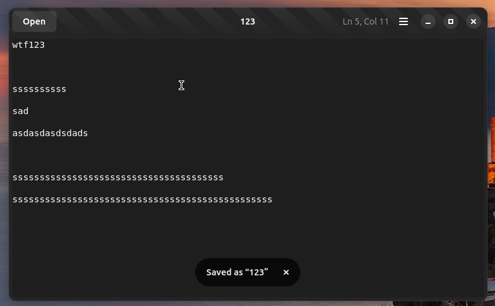
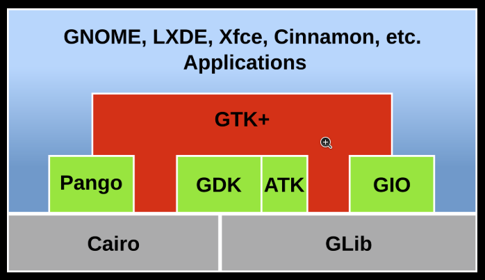

# 使用 GNOME 开发工具 - Builder 开发 Ubuntu Desktop 应用

2025-03-01 23:00

## 1 准备工作

+ 安装 GNOME Builder
+ 创建项目
+ 完成 text-viewer 项目

参考：

+ 官方教程：[https://developer.gnome.org/documentation/tutorials/beginners/getting_started.html](https://developer.gnome.org/documentation/tutorials/beginners/getting_started.html)
+ 项目代码：[https://github.com/memorycancel/text-viewer](https://github.com/memorycancel/text-viewer)

## 2 添加 Ctrl + S 保存功能

在官方教程代码基础上添加添加 Ctrl + S 原地保存功能。
官方教程只实现了 `Save as` 功能，以此代码作为参考实现 `Save` 功能。



思路：

1. 实现页面菜单和快捷键。
2. 点击 Save 按钮时触发 Save action 。
3. 实现 Save Action 主逻辑。

### 2.1 实现页面菜单和快捷键

#### 添加 `Save`菜单项

`src/text-viewer-window.ui`添加：

```xml
  	  <item>
        <attribute name="label" translatable="yes">_Save</attribute>
        <attribute name="action">win.just-save</attribute>
      </item>
```

#### 添加 `Ctrl + S` 快捷键

`src/gtk/help-overlay.ui` 添加：

```xml
            <child>
              <object class="GtkShortcutsShortcut">
                <property name="title" translatable="yes" context="shortcut window">Save</property>
                <property name="action-name">win.just-save</property>
              </object>
            </child>
```

`src/text-viewer-application.c` 添加：

```c
gtk_application_set_accels_for_action (GTK_APPLICATION (self),
                                         "win.just-save",
                                         (const char *[]) {
                                           "<Ctrl>s",
                                           NULL,
                                         });
```

### 2.2 点击 Save 按钮时触发 Save action

在 `on_open_response` 函数中进行调试：

```c
g_autofree char *path = g_file_get_path(file); // Get the real path
g_print("Real path: %s\n", path); // Print the real path
```
当打开一个桌面的文件时，文件的实际路径名为 `/run/user/1000/doc/3e948246/123`
而不是 `~/Desktop/123`。

{: .note :}
Ubuntu 桌面文件的副本之所以会出现在 /run/user/1000/doc 目录中，是因为 Flatpak 应用程序访问系统文件的方式；它们基本上是为系统创建了一个临时的、隔离的 "沙盒 "视图，包括在这个位置上的桌面文件副本，允许它们访问和修改这些文件，而不直接与实际文件系统交互。

编辑 `src/text-viewer-window.c`，在 `text_viewer_window_init` 函数中添加：

```c
  g_autoptr (GSimpleAction) just_save_action = g_simple_action_new ("just-save", NULL);
  g_signal_connect (just_save_action, "activate", G_CALLBACK (just_save_the_opened_file), self);
  g_action_map_add_action (G_ACTION_MAP (self), G_ACTION (just_save_action));
```

此时当界面点击或者敲击快捷键就会触发`just_save_action`，下面实现`just_save_the_opened_file` 主要逻辑。

### 2.3 实现 Save Action 主逻辑

主要思路是，先打开一个文件，将已打开的文件（从保存到局部变量改为）`保存到全局变量`，
在 `src/text-viewer-window.c` 的 include 语句后面声明全局变量：
```c
#include "config.h"

#include "text-viewer-window.h"

g_autoptr (GFile) opened_file = NULL;
```

编辑 `open_file` 函数和 `save_file` 函数，将局部变量 file 改为全局变量 `opened_file`。（略）

最后参考 `save_file` 函数实现 `just_save_the_opened_file`，将当前窗口文本存储到
`opened_file`：

```c
static void
just_save_the_opened_file (GAction          *action,just_save_the_opened_file (GAction *action、
                           GVariant         *param,
                           TextViewerWindow *self)
{
  if (opened_file == NULL) {
    g_printerr ("No file is currently opened to save.\n");
    return;
  }

  GtkTextBuffer *buffer = gtk_text_view_get_buffer (self->main_text_view);

  // Retrieve the iterator at the start of the buffer
  GtkTextIter start;
  gtk_text_buffer_get_start_iter (buffer, &start);

  // Retrieve the iterator at the end of the buffer
  GtkTextIter end;
  gtk_text_buffer_get_end_iter (buffer, &end);

  // Retrieve all the visible text between the two bounds
  char *text = gtk_text_buffer_get_text (buffer, &start, &end, FALSE);

  // If there is nothing to save, return early
  if (text == NULL)
    return;

  g_autoptr(GBytes) bytes = g_bytes_new_take (text, strlen (text));

  // Start the asynchronous operation to save the data into the file
  g_file_replace_contents_bytes_async (opened_file,
                                       bytes,
                                       NULL,
                                       FALSE,
                                       G_FILE_CREATE_NONE,
                                       NULL,
                                       save_file_complete,
                                       self);
}
```

## 3 总结

添加新功能大致3步：

1. 添加页面按钮或菜单，以及相应的快捷键。
2. 添加触发 action 函数。
3. 实现 action 逻辑

{: .note :}
有点类似 MVC 实现功能的顺序： view -> route -> controller （ -> model）。

## 4 关于库



GLib 是主要由 GNOME 开发的三个（以前是五个）用 C 语言编写的低级系统库。GLib 的代码从 GTK 中分离出来，因此它可以被 GNOME 以外的软件使用，并一直并行开发至今。

{: .note :}
做GNOME 开发的时候很多函数名为 `g_`开头调用的就是 `GLib` 的库函数。
