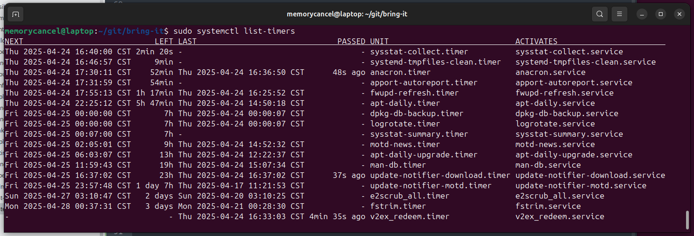
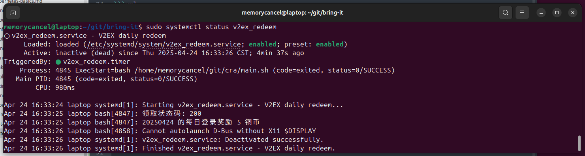

# systemd-timer

尽管 cron 是从古至今最著名的作业调度程序，但 systemd-timer 也是一种替代选择。
作为 Ubuntu 粉，自然要用系动自带的 systemd-timer。

参考[https://wiki.archlinux.org/title/Systemd/Timers](https://wiki.archlinux.org/title/Systemd/Timers)

操作系统：Ubuntu 24.04.1 LTS

## 应用场景

每天开机，习惯去 V 站签到，领取铜币，需要打开 chrome，点击领取奖励，领取，4个步骤，
遂想将其脚本化，并每次开机后自动调用脚本，领取奖励。


## 自动脚本

脚本实现见：[https://github.com/memorycancel/cra/tree/main/v2ex_redeem](https://github.com/memorycancel/cra/tree/main/v2ex_redeem)

## 定时器

定时器有两大类：

+ 实时定时器（又称挂钟定时器）Realtime timers (a.k.a. wallclock timers)根据日历事件激活，与 cronjobs 的激活方式相同。选项 OnCalendar= 用于定义它们。
+ 单调定时器在相对于不同起点的时间跨度后激活。如果计算机暂时中止或关闭，它们就会停止。有许多不同的单调计时器，但它们的形式都是一样的： OnTypeSec= .常见的单调定时器包括 OnBootSec 和 OnUnitActiveSec 。

{: .important :}
每个 .timer 文件都有一个匹配的 .service 文件（如 foo.timer 和 foo.service ）。

## 创建 Unit

参考[2024-11-12-Linux-startup-script.html](2024-11-12-Linux-startup-script.html)

```shell
sudo vi /etc/systemd/system/v2ex_redeem.service
```

```xml
[Unit]
Description=V2EX daily redeem
After=network.target

[Service]
Type=oneshot
ExecStart=/bin/bash -l -c /home/memorycancel/git/cra/main.sh

[Install]
WantedBy=default.target
```

{: .note :}
大多数使用systemd是守护进程需求，而此处是一次性脚本，所以需要设置 Type=oneshot
并且 systemd 不会载入任何环境变量 ENV 和bash上下文。

```shell
sudo systemctl daemon-reload
sudo systemctl start v2ex_redeem
sudo systemctl status v2ex_redeem
```

## 添加单调计时器 Monotonic Timer

定时器将在开机 5 分钟后启动。

```shell
sudo vi /etc/systemd/system/v2ex_redeem.timer
```

```xml
[Unit]
Description=开启领取 V2EX 奖励

[Timer]
OnBootSec=5min

[Install]
WantedBy=timers.target
```

## 管理查看定时器

```shell
sudo systemctl list-timers --all
```


```shell
sudo systemctl status v2ex_redeem
```

