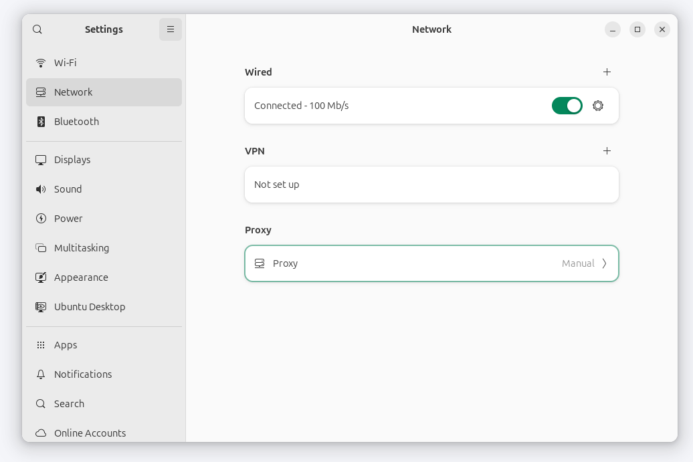
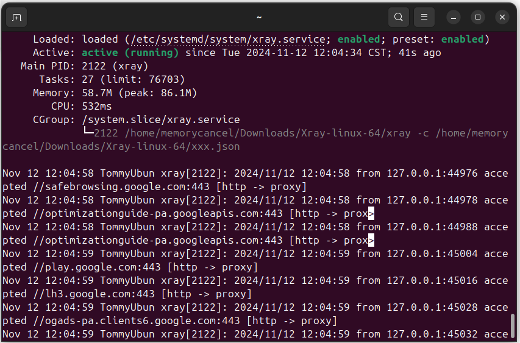

# 使用 systemd 设置开机运行脚本

2024-11-12 13:00



新装Ubuntu配置好系统proxy后，每次开机需要科学冲浪便会手动启动xray程序。需要一个一劳永逸的办法。
在Ubuntu上实现自动运行脚本有4中方法(按照系统执行顺序排列)：

+ init.d
+ rc.local
+ systemd
+ contab

init.d 是在 Ubuntu 启动时执行 Bash 脚本的一种方法。它是在`启动过程中`执行的脚本。
init.d 目录是初始化目录的简称，它位于 /etc 目录中。
在 Linux 中，init 进程负责启动和管理系统服务。系统启动时，init 进程会读取 init.d 目录中的脚本，并按照运行级别配置规定的特定顺序执行。
init.d 目录中的脚本通常分为不同的运行级别，代表不同的系统状态或模式。每个运行级别都有一组特定的脚本，在系统进入该运行级别时执行。
init.d 目录中的脚本由 init 进程使用一组标准化参数（如启动start、停止stop、重启restart和状态status）执行。即`service`命令。
它管理 Linux 系统启动的传统方法。不过，Ubuntu 等现代 Linux 发行版已过渡到使用 systemd 作为默认启动系统。虽然 systemd 仍支持执行 init.d 目录中的脚本，但它鼓励使用服务单元文件来管理系统服务。

在 Ubuntu 中，rc.local 文件是一个在`系统启动过程结束时`执行的脚本。你可以用它在启动时执行 Bash 脚本。
rc.local 文件是在 Linux 系统启动过程结束时执行的脚本。其目的是允许系统管理员在启动时运行自定义命令或脚本，而无需修改系统的默认启动程序。
rc.local 文件位于 /etc 目录中。它通常用于执行特定任务，如配`置网络设置、挂载文件系统或启动自定义服务`。
要使用 rc.local 文件，只需将希望在启动时运行的命令或脚本添加到文件中即可。每条命令或脚本都应放在单独一行，文件应以 exit 0 结尾。
值得注意的是，rc.local 文件是以根用户身份执行的，因此在向该文件添加命令或脚本时应谨慎行事。建议对命令和脚本使用绝对路径，并在脚本中加入必要的错误处理或日志记录，以确保其正确运行。

systemd 是 Ubuntu 中的一个系统和服务管理器，它提供了一种管理和控制进程的标准化方式。在 Ubuntu 中，你可以使用 systemd 在启动时执行 Bash 脚本。使用`systemctl`命令进行控制管理。类似传统的`service`命令。

在 Linux 中，你可以使用 cron 守护进程调度任务自动运行。cron 守护进程是一种基于时间的作业调度程序，它允许你在特定时间、日期或间隔运行命令或脚本。

相比较而言，`init.d`和`systemd`满足脚本开机启动，并有守护进程的需求。而`rc.local`和`contab`更适合一次性执行的脚本。
在系统安全层面，`init.d`和`rc.local`更底层，需要谨慎修改使用，对于用户自定义脚本启动更推荐使用`systemd`和`contab`。

综上，最好使用`systemd`实现开机自动启动xray守护进程。

{: .note }
1.为脚本创建一个服务单元文件。例如，在 /etc/systemd/system/ 目录下创建一个名为 xray.service 的文件：

```bash
sudo vi /etc/systemd/system/xray.service
```

{: .note }
2.在文件中添加以下内容：
```bash
[Unit]
Description=Scientifc surfing internet
After=network.target

[Service]
ExecStart=/home/memorycancel/Downloads/Xray-linux-64/xray -c /home/memorycancel/Downloads/Xray-linux-64/xxx.json

[Install]
WantedBy=default.target
```

3.保存文件并退出文本编辑器。
4.重新加载 systemd 守护进程，加载新的服务单元文件：
```bash
sudo systemctl daemon-reload
```
5.设置开机启用服务：
```bash
sudo systemctl enable xray
```
6.启动
```bash
sudo systemctl start xray
sudo systemctl status xray
```



{: .note }
参考

https://www.squash.io/executing-bash-script-at-startup-in-ubuntu-linux/