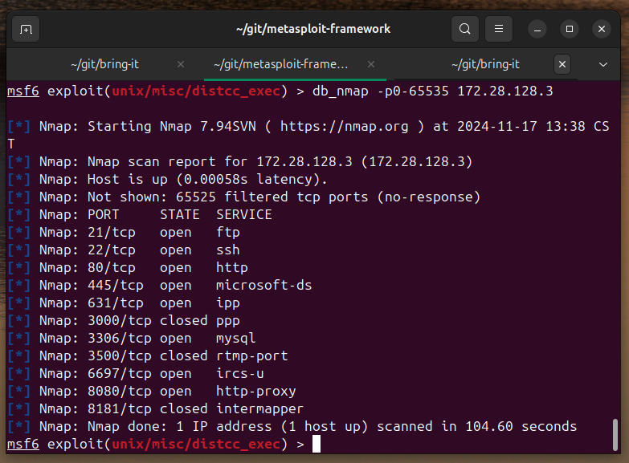
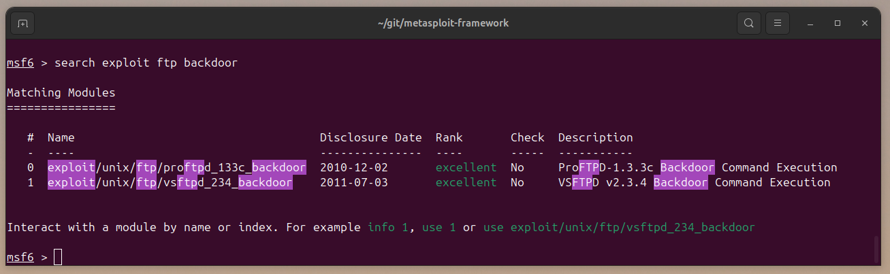
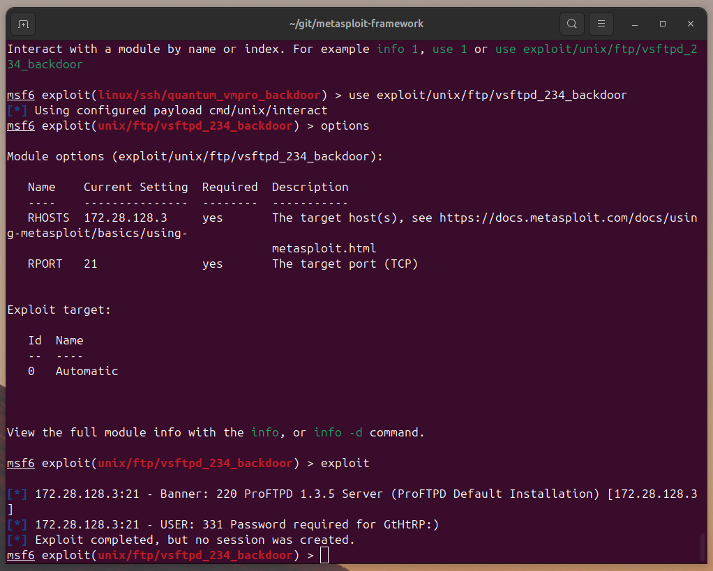
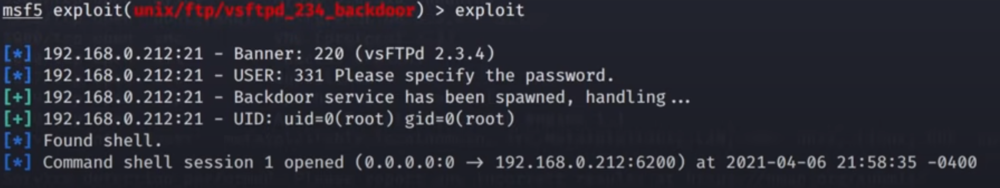

# 使用 metasploit-framework 渗透测试

2024-11-17 15:00

上篇[在 Ubuntu 上搭建 Metasploit-Framework 开发环境](2024-11-16-msf-development)已经安装好msf（metasploit-framework），接下来使用它进行渗透测试。

渗透测试的第一步就是侦察。（就像美国大片里面特警队准备攻入一个严防死守的大楼
第一步做的就是查看图纸，弄清守卫，收集大楼信息等）
这里的侦察是收集目标机器的网络开放端口和对应的服务。
```
db_nmap -p0-65535 172.28.128.3
```
`-p0-65535`是进行全端口扫描（计算机系统用16bit来存储端口号，2的16次方等于65536）
这样扫描会有些慢，也可以设置扫描的频率。默认以柔方式扫描，大概需要30分钟。



获得所有服务和端口后就可以从中找到突破口（计划从大楼的哪个突破口攻入大楼，例如经典桥段是从屋顶直升机空降，或者从地下道潜入）。
搜索关键字 `exploit` 和 `ftp` 以及最简单的进入方法 `backdoor`（后门程序）。
例如



找到2个可以利用的后门。尝试进入：



可以看到 `no session was created` 表明渗透失败，从返回信息可以看到这个FTP
服务器使用的专用版（220 ProFTPD 1.3.5 Server），已经修复后门，所以无法从后门进入。

如果使用的是`vsFTP 2.3.4`，就可以利用后门：



总结一下，渗透测试漏洞最简单直接的方法是使用后门程序，步骤是：

```shell
# 1. 侦察
db_nmap -p 0-65535 TARGET_IP
# 2. 找后门
search exploit SERVICE_NAME backdoor
# 3. 传入参数
options
# 4. 渗透
exploit
```

例如，可以遍历服务所有可能渗透的后门。
```
search exploit ftp backdoor
search exploit ssh backdoor
search exploit http backdoor
search exploit microsoft-ds backdoor
search exploit ipp backdoor
search exploit ppp backdoor
search exploit mysql backdoor
search exploit rtmp-port backdoor
search exploit ircs-u backdoor
search exploit http-proxy backdoor  
search exploit intermapper backdoor
```

后面步骤类推。
