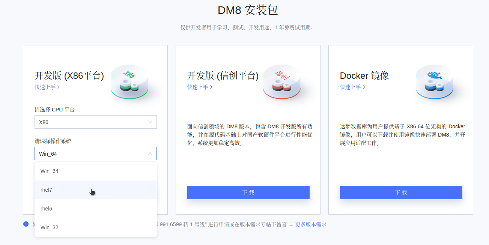
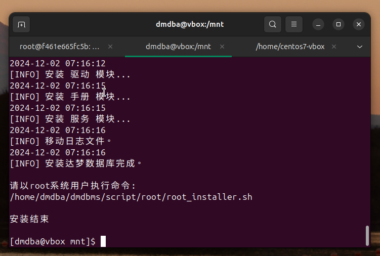
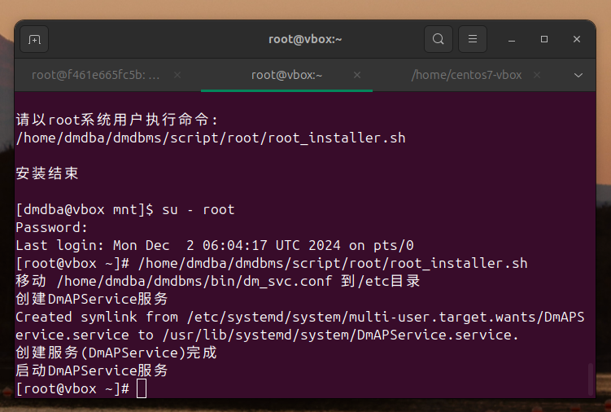
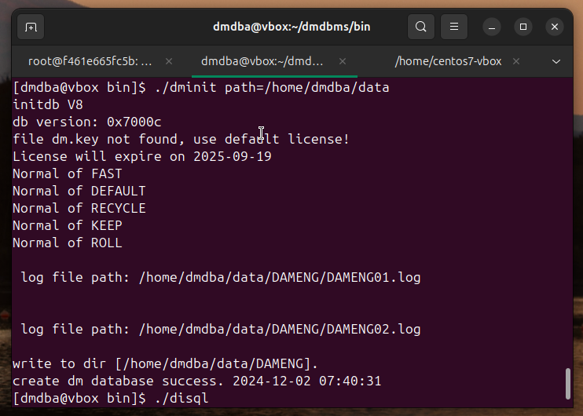
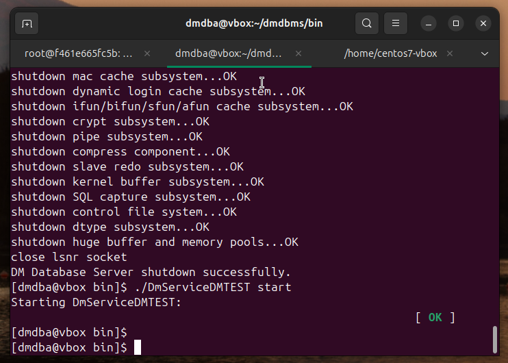

# 在 Linux(CentOS-7) 安装 DM8 数据库

2024-12-02 15:00


## 一、准备CentOS 7 

[https://portal.cloud.hashicorp.com/vagrant/discover/bento/centos-7](https://portal.cloud.hashicorp.com/vagrant/discover/bento/centos-7)


```shell
vagrant init bento/centos-7 --box-version 202404.23.0
```

Vagrantfile:

```ruby
# -*- mode: ruby -*-
# vi: set ft=ruby :
Vagrant.configure("2") do |config|
  config.vm.box = "bento/centos-7"
  config.vm.box_version = "202404.23.0"
  config.vm.network "forwarded_port", guest: 5237, host: 5237
  config.vm.network "public_network" # 桥接 使用 1 bridged network interfaces
  config.vm.synced_folder "/home/centos7-vbox", "/centos7-vbox"
end

```

```shell
vagrant up
```

## 二、准备DM8 Linux（CentOS7）镜像


```shell
mv ~/Downloads/dm8_20240920_x86_rh7_64/dm8_20240920_x86_rh7_64.iso /home/centos7-vbox
vagrant ssh
ls /centos7-vbox
```

## 三、安装

参考：[https://eco.dameng.com/document/dm/zh-cn/start/install-dm-linux-prepare.html](https://eco.dameng.com/document/dm/zh-cn/start/install-dm-linux-prepare.html)

### 3.1 准备

```shell
su - root
(vagrant)
groupadd dinstall -g 2001
useradd  -G dinstall -m -d /home/dmdba -s /bin/bash -u 2001 dmdba
passwd dmdba
vi /etc/security/limits.conf
```
在末尾加上：

```
dmdba  soft      nice       0
dmdba  hard      nice       0
dmdba  soft      as         unlimited
dmdba  hard      as         unlimited
dmdba  soft      fsize      unlimited
dmdba  hard      fsize      unlimited
dmdba  soft      nproc      65536
dmdba  hard      nproc      65536
dmdba  soft      nofile     65536
dmdba  hard      nofile     65536
dmdba  soft      core       unlimited
dmdba  hard      core       unlimited
dmdba  soft      data       unlimited
dmdba  hard      data       unlimited
```
目录规划：
```shell
##实例保存目录
##归档保存目录
##备份保存目录
mkdir -p /dmdata/data 
mkdir -p /dmdata/arch
mkdir -p /dmdata/dmbak
chown -R dmdba:dinstall /dmdata/data
chown -R dmdba:dinstall /dmdata/arch
chown -R dmdba:dinstall /dmdata/dmbak
chmod -R 755 /dmdata/data
chmod -R 755 /dmdata/arch
chmod -R 755 /dmdata/dmbak
```

### 3.2 安装

```shell
cd /centos7-vbox
su - root
mount -o loop /centos7-vbox/dm8_20240920_x86_rh7_64.iso /mnt
su - dmdba
cd /mnt
./DMInstall.bin -i
```

1,n,y,21,1,`enter`,y,y



```shell
su - root
/home/dmdba/dmdbms/script/root/root_installer.sh
```



### 3.3 配置

[https://eco.dameng.com/document/dm/zh-cn/start/dm-instance-linux](https://eco.dameng.com/document/dm/zh-cn/start/dm-instance-linux)

```shell
su - dmdba
cd /home/dmdba/dmdbms/bin
./dminit path=/dmdata/data PAGE_SIZE=32 EXTENT_SIZE=32 CASE_SENSITIVE=y CHARSET=1 DB_NAME=DMTEST INSTANCE_NAME=DBSERVER PORT_NUM=5237
```


### 3.4 注册

```shell
su - root
cd /home/dmdba/dmdbms/script/root/
./dm_service_installer.sh -t dmserver -dm_ini /dmdata/data/DMTEST/dm.ini -p DMTEST
```

### 3.5 启停

前台方式启动：

```shell
su - dmdba
cd /home/dmdba/dmdbms/bin
./dmserver /dmdata/data/DMTEST/dm.ini
```

后台方式启动：

```shell
su - dmdba
cd /home/dmdba/dmdbms/bin
./DmServiceDMTEST start
./DmServiceDMTEST stop
./DmServiceDMTEST restart
./DmServiceDMTEST status
```

