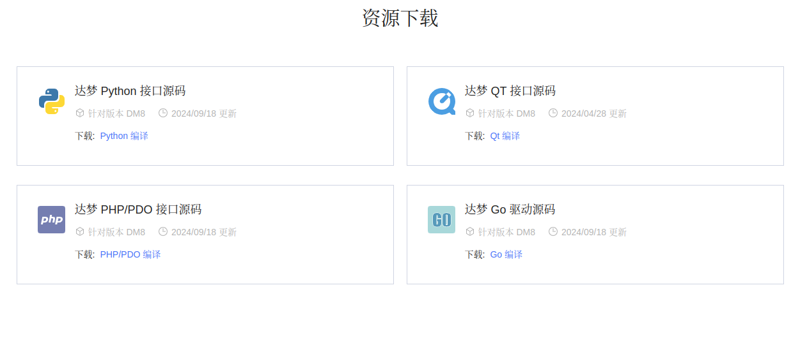
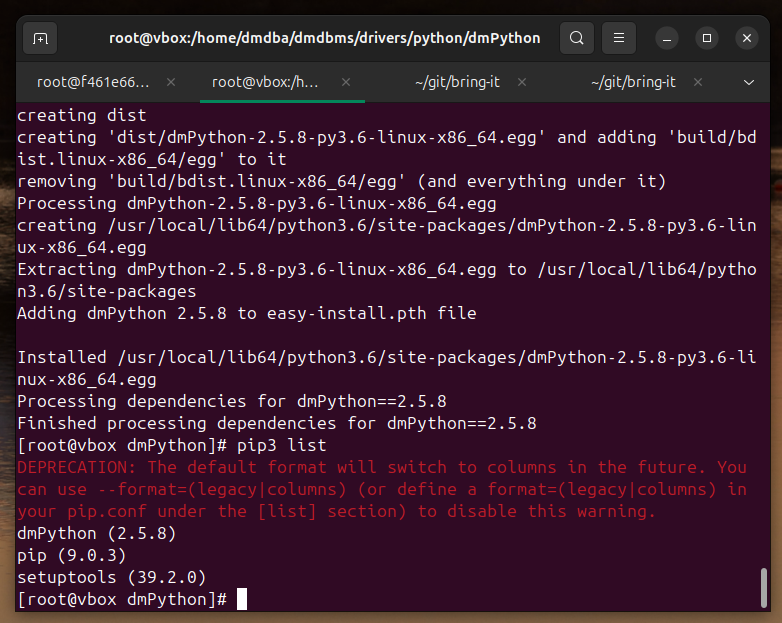
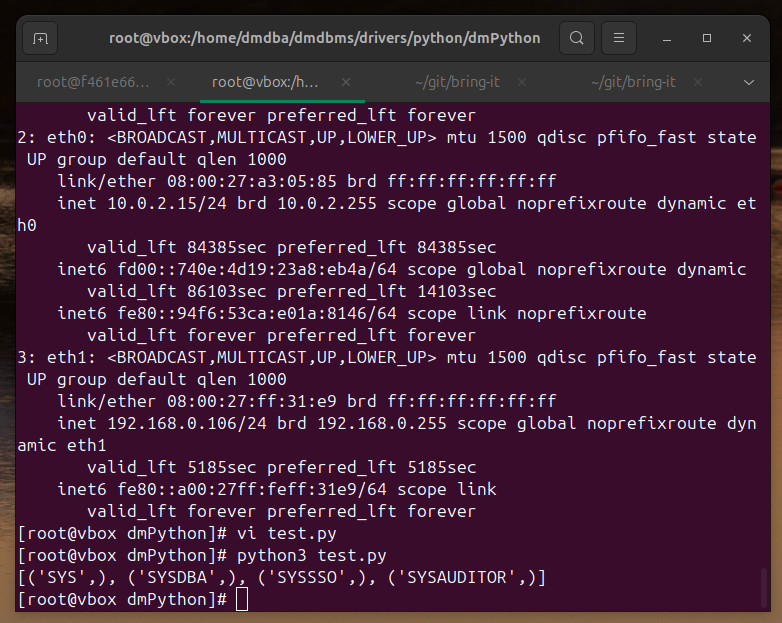
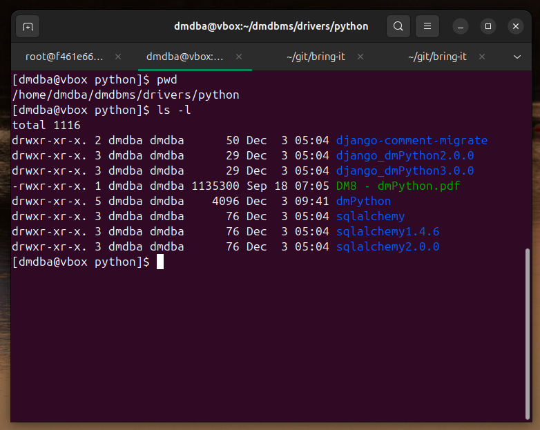

# 在 Linux(CentOS-7) 使用 dmPython（达梦 Python驱动）

2024-12-03 14:00


接上文[在 Linux(CentOS-7) 安装 DM8 数据库](2024-12-02-install-DM8-Linux)进入DM8,Linux登陆默认 `SYSDBA/SYSDBA`，Docker默认是`SYSDBA/SYSDBA001`:

```shell
su - dmdba
cd /home/dmdba/dmdbms/bin
./disql SYSDBA/SYSDBA@127.0.0.1:5237
```

## 编译安装 dmPython

### 1 下载



先查看是否存在`python`文件夹，如果不存在就手动[下载](https://eco.dameng.com/download/)然后解压放到`/home/dmdba/dmdbms/drivers/`路径。
```shell
vagrant ssh
ls /home/dmdba/dmdbms/drivers/
```

### 2 准备

参考：[https://eco.dameng.com/document/dm/zh-cn/start/python-development.html#三、Linux 环境编译安装 dmPython](https://eco.dameng.com/document/dm/zh-cn/start/python-development.html#三、Linux 环境编译安装 dmPython)

```shell
su - root
vi /root/.bash_profile
```

在`/root/.bash_profile`末尾添加：

```
export DM_HOME=/home/dmdba/dmdbms
```
然后执行：

```shell
source /root/.bash_profile
```
[CentOS 7 将 YUM 源更改为国内镜像源](https://blog.csdn.net/jsyzliuyu/article/details/142985996)，编辑`/etc/yum.repos.d/CentOS-Base.repo` 替换为 `http://mirrors.aliyun.com/repo/Centos-7.repo` 的内容。然后执行：

```shell
yum clean all
yum makecache
```
### 3 安装

```shell
yum install gcc
yum install python3-devel
cd /home/dmdba/dmdbms/drivers/python/dmPython
python3 setup.py install
pip3 list
```


在文件`/root/.bash_profile`末尾加上：
`export LD_LIBRARY_PATH=$LD_LIBRARY_PATH:/home/dmdba/dmdbms/drivers/dpi/`

```shell
source /root/.bash_profile
echo $LD_LIBRARY_PATH $DM_HOME
```

vi `test.py`

```python
import dmPython
conn=dmPython.connect(user='SYSDBA',password='SYSDBA',server= '192.168.0.106',port=5237)
cursor = conn.cursor()
cursor.execute('select username from dba_users')
values = cursor.fetchall()
print(values)
cursor.close()
conn.close()
```

```shell
python3 test.py
```



输出数据库中的用户名则表示连接数据库成功。此外
还提供了`django`和`sqlalchemy`的驱动代码，安装过程与`dmPython`一样。


