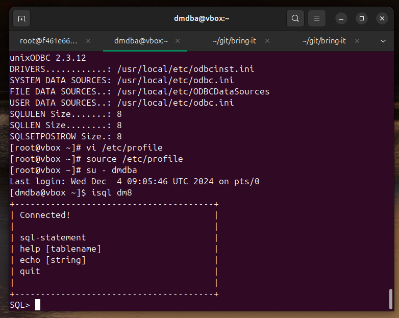
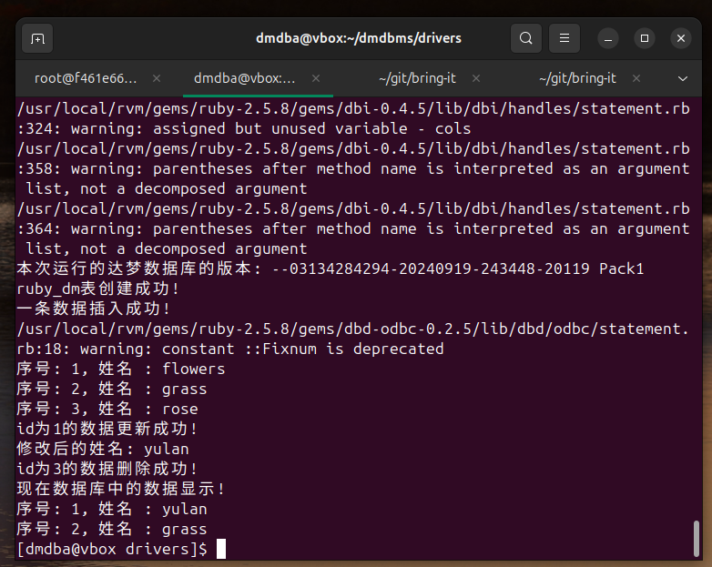

# 在 Linux(CentOS-7) 搭建 Ruby 2.5.8 达梦 dm8 开发环境

2024-12-04 18:00

```shell
yum -y update
yum install -y make gcc perl-core pcre-devel wget zlib-devel

# 安装 https://rvm.io/
source /etc/profile.d/rvm.sh
rvm install 2.5.8
ruby -v

wget https://www.unixodbc.org/unixODBC-2.3.12.tar.gz
tar -xzvf unixODBC-2.3.12.tar.gz
cd unixODBC-2.3.12
./configure --enable-gui=no
make && make install
odbc_config --version
odbcinst -j
```

`vi /usr/local/etc/odbc.ini`:

```
[dm8]
Description=DM ODBC DSND
Driver=DM8 ODBC DRIVER
SERVER=localhost
UID=SYSDBA
PWD=SYSDBA
TCP_PORT=5237
```

`vi /usr/local/etc/odbcinst.ini`:

```
[DM8 ODBC DRIVER]
Description=ODBC DRIVER FOR DM8
Driver=/home/dmdba/dmdbms/bin/libdodbc.so
```

{: .note :}
注意：上面两个`ini`配置文件千万不要加#注释，否则会将注释也当成字符串进行加载。

`/etc/profile`:

```shell
export UNIXODBC_DIR=/usr/local
export ODBCINI=$UNIXODBC_DIR/etc/odbc.ini
export ODBCSYSINI=$UNIXODBC_DIR/etc
```

```shell
source /etc/profile
su - dmdba
isql dm8
```



```shell
gem source --remove https://rubygems.org/
gem source --add https://gems.ruby-china.com/
gem source list
gem install dbd-odbc
gem install dbi
gem install ruby-odbc
```

测试代码 `test.rb`：

```ruby
#!/usr/bin/ruby -w
# -*- coding: UTF-8 -*-

require 'dbd/ODBC'

begin
    
   # 连接达梦数据库	
   dbh = DBI.connect('dbi:ODBC:dm8','SYSDBA','SYSDBA')
  
   # 获取服务器版本字符串，并显示
   row = dbh.select_one("SELECT id_code();")
   puts "本次运行的达梦数据库的版本: " + row[0]
   
   # 判断是否存在RUBY_DM表，如果存在则删除。
   dbh.do("DROP TABLE IF EXISTS SYSDBA.RUBY_DM;");
   
   # 创建表
   dbh.do("create TABLE ruby_dm(id INT,name CHAR(10));");
   puts "ruby_dm表创建成功!"
   
   # 插入数据
   dbh.do("insert into SYSDBA.RUBY_DM(RUBY_DM.ID,RUBY_DM.NAME) VALUES(1,'flowers');")
   dbh.do("insert into SYSDBA.RUBY_DM(RUBY_DM.ID,RUBY_DM.NAME) VALUES(2,'grass');")
   dbh.do("insert into SYSDBA.RUBY_DM(RUBY_DM.ID,RUBY_DM.NAME) VALUES(3,'rose');")
   dbh.commit
   puts "一条数据插入成功!"
   
   # 查询数据
   sth_s = dbh.prepare("SELECT * FROM SYSDBA.RUBY_DM WHERE RUBY_DM.ID > ?")
   sth_s.execute(0)
   # 处理数据的显示格式
   sth_s.fetch do |row|
    printf "序号: %d, 姓名 : %s\n", row[0], row[1]
   end
   sth_s.finish
   
   # 更新数据信息
   sth_up = dbh.prepare("UPDATE SYSDBA.RUBY_DM SET RUBY_DM.NAME = 'yulan' WHERE RUBY_DM.ID = 1;")
   sth_up.execute
   sth_up.finish
   dbh.commit
   puts "id为1的数据更新成功!"
   
   
   info = dbh.select_one("select * from SYSDBA.RUBY_DM WHERE RUBY_DM.ID = 1;")
   puts "修改后的姓名: " + info[1]
   
   # 删除一条数据
   sth_d = dbh.prepare("DELETE FROM SYSDBA.RUBY_DM WHERE RUBY_DM.ID = ?")
   sth_d.execute(3)
   sth_d.finish
   dbh.commit
   puts "id为3的数据删除成功!"
   
   
   puts "现在数据库中的数据显示!"
   # 查询数据
   sth_f = dbh.prepare("SELECT * FROM SYSDBA.RUBY_DM WHERE RUBY_DM.ID > ?")
   sth_f.execute(0)
   # 处理数据的显示格式
   sth_f.fetch do |row|
    printf "序号: %d, 姓名 : %s\n", row[0], row[1]
   end
   sth_f.finish
  
   
rescue DBI::DatabaseError => e
   puts "An error occurred"
   puts "Error code:  #{e.err}"
   puts "Error message: #{e.errstr}"
ensure
   dbh.disconnect if dbh
end

```


