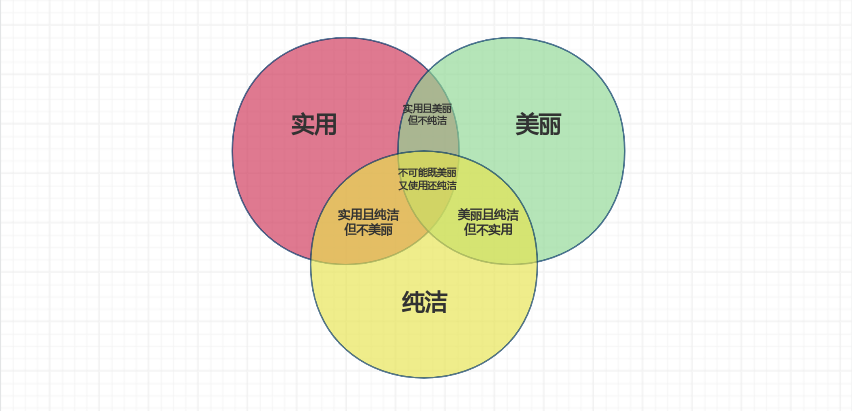

# 浅谈 Unix 设计准则

2024-12-16 17:00

关于Unix的程序设计，就像在生活中的众多方面，存在隐形的“不可能三角”：`实用`、`美丽`、`纯洁`。
实用性自不必多谈，这天然和使用者的利益息息相关，实用性越强，越受使用者的喜欢。
美丽指的是程序在CLI外观上设计，例如名称，参数（OPTIONS）-- 好记的名称和易于理解的OPTIONS。
还有就是尽可能一致的特性。（标准输入输出）。
纯洁指的是程序在功能上保持的简单性，每次只出色的完成一件事。

实际情况是，有的时候实用性战胜了美丽和纯洁性。以牺原始设计的优美与纯洁来满足现实的实用性。

随着时间推移，Unix在世界上存在了半个世纪，一个50年前写的命令（例如`cat`等）现在依然被
成千上万的人使用并运行良好。这与Unix的设计准则（哲学）有关，那就是在设计Unix程序时，
要坚决的追求纯洁和美丽，但是为了实用，也需要做一些必要的牺牲。

有一下几个哲学思想。

{: .important :}
KISS

KISS是 "Keep it simple, stupid!"的缩写，是美国海军在1960年首次提出的设计原则。KISS在1938年首次出现在美式英语中，它意味着简单应该是设计的目标。
这里的简单理解为`简约`更为贴切。

{: .important :}
Minimalism (computing)

在计算机领域，极简主义意味着设计尽可能使用最少硬件和软件资源的系统。

{: .important :}
Worse is better

Worse is better（又称新泽西风格）是理查德-P-加布里埃尔（Richard P. Gabriel）在 1989 年的一篇文章中提出的一个术语，用来描述软件接受度的动态变化。它指的是软件质量并不一定会随着功能的增加而提高：在某种意义上，就实用性和可用性而言，较少的功能（"更差"）是更可取的选择（"更好"）。
`功能有限但简单易用`的软件可能比`功能全而复杂度高`的软件更能吸引用户和市场。

{: .important :}
Everything is a file

"万物皆文件 "是 Unix 衍生界面设计的一种方法。

参考：

[https://en.wikipedia.org/wiki/Unix_philosophy](https://en.wikipedia.org/wiki/Unix_philosophy)
