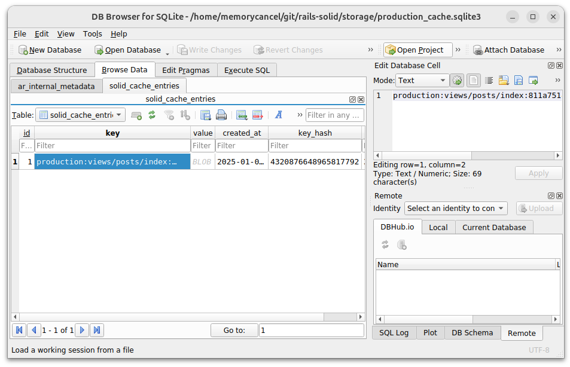
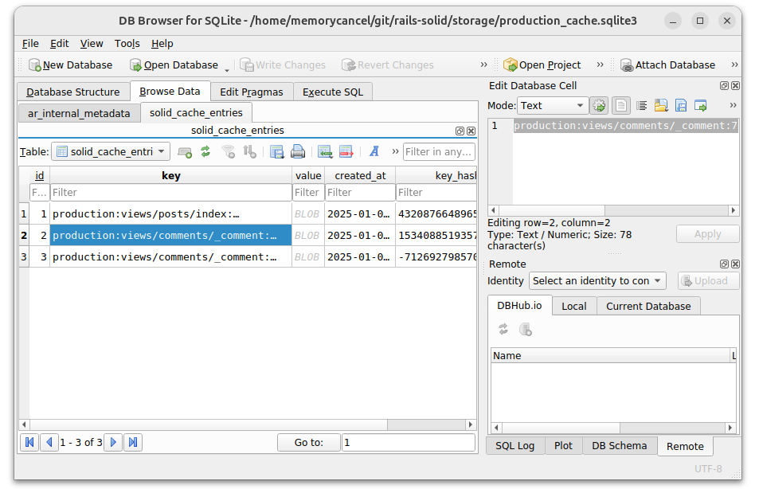

# 使用 Rails 8 提供的默认缓存 Solid Cache

2025-01-05 18:00

## 1. 什么是缓存

缓存是提高应用程序性能的最有效方法之一。它能让运行在适度基础设施上的网站（单个服务器和单个数据库）支持成千上万的并发用户。

Rails 提供了一套开箱即用的缓存功能，不仅可以缓存数据，还可以解决缓存过期、缓存依赖和缓存失效等难题。

### 1.1 什么是Solid Cache

Solid Cache 利用现代 SSD（固态硬盘Solid State Drive）的速度，以更大的存储容量和简化的基础设施提供经济高效的缓存。虽然固态硬盘的速度略低于内存，但对于大多数应用来说，两者的差距微乎其微。固态硬盘可以存储更多数据，因此无需频繁失效缓存，从而弥补了这一不足。因此，缓存平均缺失次数较少，响应时间较快。默认情况下，Action Controller 缓存仅在生产环境中启用。


### 1.2 开始使用

接上篇[使用 Rails 8 提供的默认任务队列 Solid Queue](2025-01-03-using-solid-queue-of-rails-8)
我们还是在开发环境“手动设置为生产环境”。

```shell
export RAILS_ENV=production
```
让开发环境和生产环境保持一致，不失为一种”简单“做法。

接上一篇，以`solid-cable`分支为基础，创建一个`solid-cache`分支：

[https://github.com/memorycancel/rails-solid/tree/solid-cache](https://github.com/memorycancel/rails-solid/tree/solid-cache)

## 2. 缓存种类

### 2.1 片段缓存

这里的片段，狭义上之HTML片段，将需要耗时渲染的HTML片段放进缓存，提升页面渲染速度。
例如缓存每篇post，修改`views/posts/index.html.erb`，给`<%= render post %>`包上一层`"cache"`:

```ruby
    <% cache post do %>
      <%= render post %>
    <% end %>
```

数据库中会插入一条键为`production:views/posts/index:811a75149251ed076ff1b8668f838a86/posts/1`的条目。
`key_hash`是根据HTML片段计算的摘要，当内容不发生改变，摘要相同，直接渲染value，否则更新value和key_hash。
当删除post条目时，cache数据库不会立马删除该缓存，而是根据`config/cache.yml`里的max_age配置定期清除。



如果想在特定条件下缓存片段，可以使用 cache_if 或 cache_unless ：

```ruby
<% cache_if admin?, product do %>
  <%= render product %>
<% end %>
```

### 2.2 集合缓存

在render helper增加 `cached: true`选项可以缓存集合，例如在`comments/_comments.html.erb`页面缓存`comments`集合，
将简化写法`<%= render post.comments %>`扩展为：
```ruby
<%= render partial: 'comments/comment', collection: post.comments, cached: true %>
```

目前有2条comment，那么此时 cache 数据库将添加两条comment的缓存。



另外，缓存还能配置本地化（locale）,不同的语言渲染不同的版本：

```ruby
<%= render partial: 'comments/comment',
           collection: post.comments,
           cached: ->(comment) {[I18n.locale, comment] } %>
```

### 2.3 嵌套缓存

刚刚给`comments/comment`patial添加了缓存，下面在调用此patial的地方包一层缓存：

```ruby
<% cache @post do %>
  <%= render "comments/comments", post: @post %>
<% end %>
```

此外，comment和post是从属关系，还需要添加一个 comment.rb 的选项：

```ruby
belongs_to :post, touch: true
```

当 touch 设置为 true 时，任何更改post记录 updated_at 的操作也会更改相关comment的 updated_at ，从而使缓存过期。

### 2.4 低级缓存

有时需要缓存特定值或查询结果，而不是缓存HTML片段。Rails 的缓存机制非常适合存储任何可序列化的信息。
简而言之，可以当他是 key-value 数据库。

```ruby
Rails.cache.write("greeting", "Hello, world!")
greeting = Rails.cache.read("greeting")
puts greeting # Output: Hello, world!
# Delete a value from the cache
Rails.cache.delete("greeting")

# Fetch a value with a block to set a default if it doesn’t exist
welcome_message = Rails.cache.fetch("welcome_message") { "Welcome to Rails!" }
puts welcome_message # Output: Welcome to Rails!
```

### 2.5 SQL缓存

SQL查询缓存是 Rails 的一项自动（隐式）功能，可缓存每次查询返回的结果集。如果 Rails 在该请求中再次遇到相同的查询，它将使用缓存的结果集，而不是再次对数据库运行查询。
第二次针对数据库运行相同的查询时，实际上并不会访问数据库。第一次查询返回的结果存储在查询缓存（内存中），第二次则从内存中提取。不过，每次检索仍会实例化所查询对象的新实例。

```ruby
  def index
    @posts = Post.all
    @posts2 = Post.all
  end
```
例如上面只会访问数据库一次。

## 3 管理render依赖关系

### 3.1 内部依赖

大多数模板依赖关系都可以从render 调用中推导出来。下面是一些 ActionView::Digestor 解码示例：

```ruby
render partial: "comments/comment", collection: commentable.comments
render "comments/comments"
render "comments/comments"
render("comments/comments")

render "header" # translates to render("comments/header")

render(@topic)         # translates to render("topics/topic")
render(topics)         # translates to render("topics/topic")
render(message.topics) # translates to render("topics/topic")
```

{: .important :}
为了使缓存正常工作，需要显示的声明好依赖关系。

例如，不能写：

```ruby
<%= render 'comments/comment',post.comments, cached: true %>
```

而应该写：

```ruby
<%= render partial: 'comments/comment', collection: post.comments, cached: true %>
```

### 3.2 外部依赖

如果您在缓存块中使用了helper方法，然后更新了helper方法，就必须同时更新缓存。具体方法并不重要，但模板文件的 MD5 必须更改。一种建议是在helper文件中添加注释，如：

```ruby
<%# Helper Dependency Updated: Jul 28, 2015 at 7pm %>
<%= some_helper_method(post) %>
```

## 4 数据库设置

### 4.1 基本配置位置

+ config/database.yml
+ config/environments/production.rb(`config.cache_store = :solid_cache_store`)
+ config/cache.yml 

### 4.2 缓存自动收缩任务

Solid Cache 每次写一条，id自增1。当计数器达到 "缓存 "配置中 expiry_batch_size （id条数）的 50%时，将触发一个后台任务来处理缓存过期问题。当缓存需要收缩时，这种方法可确保缓存记录的过期速度快于其写入速度。

后台任务只在有写入时运行，因此在缓存没有更新时，进程会处于空闲状态。如果希望在后台任务而不是线程中运行到期进程，请将缓存配置中的 expiry_method 设置为 :job 。

{: .important :}
生产环境必须设置expiry_method: :job 这样任务才会存进任务队列数据库，线程停止了也不会丢失任务，从而保证可靠性。

### 4.3 缓存分片

Solid Cache 支持分片 - 在多个数据库中分割缓存。这将分散负载，使缓存性能更加强大。通过配置 `database.yml`：

```yaml
production:
  cache_shard1:
    database: cache1_production
    host: cache1-db
  cache_shard2:
    database: cache2_production
    host: cache2-db
  cache_shard3:
    database: cache3_production
    host: cache3-db
```

`config/cache.yml`:

```yaml
production:
  databases: [cache_shard1, cache_shard2, cache_shard3]
```

### 4.4 加密

缓存也可以加密，配合数据库中的条目加密[https://guides.rubyonrails.org/active_record_encryption.html](https://guides.rubyonrails.org/active_record_encryption.html )：

```ruby
production:
  encrypt: true
```

关于其他的缓存数据库参考：[https://guides.rubyonrails.org/caching_with_rails.html#other-cache-stores](https://guides.rubyonrails.org/caching_with_rails.html#other-cache-stores)


## 5 自定义缓存键

```ruby
# This is a legal cache key
Rails.cache.read(site: "mysite", owners: [owner_1, owner_2])
```

## 6 使用 Etag

参考[https://guides.rubyonrails.org/caching_with_rails.html#conditional-get-support](https://guides.rubyonrails.org/caching_with_rails.html#conditional-get-support)

{: .important :}
请谨慎使用etag，因为除非强制清除浏览器缓存，否则浏览器/代理服务器无法使缓存响应失效。

## 参考

+ [https://guides.rubyonrails.org/caching_with_rails.html](https://guides.rubyonrails.org/caching_with_rails.html)
+ 本文代码： [https://github.com/memorycancel/rails-solid/tree/solid-cache](https://github.com/memorycancel/rails-solid/tree/solid-cache)
