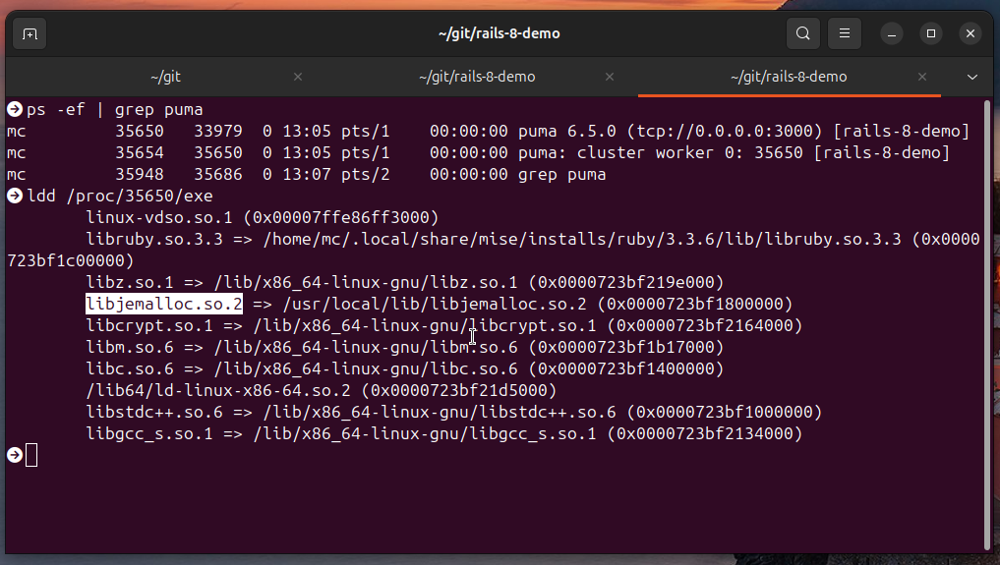

# 微调 Rails 8 部署服务器性能

2025-01-14 12:00

此处讨论范围为 Rails 应用服务器，它是大多数网络应用程序中对性能敏感主要组件。
后台作业和 WebSockets 等其他组件也可以调整（数据库组件），但本文不涉及。

有关如何配置应用程序更多信息，请参阅[《配置指南》](https://guides.rubyonrails.org/configuring.html)。

本指南假定运行是 MRI [Matz's Ruby Interpreter](https://en.wikipedia.org/wiki/Ruby_MRI) -（Ruby 典型实现，也称为 CRuby）。如果使用是 JRuby 或 TruffleRuby 等
其他 Ruby 实现，本指南大部分内容将不适用。如有需要，请查阅与 Ruby 实现相关资料。

## 1 选择应用服务器

Puma 是 Rails 默认应用服务器，也是整个社区最常用服务器。它在大多数情况下都运行良好。
在某些情况下，可能希望更换为其他服务器。

{: .note :}
不同应用服务器使用特定并发方法。例如，Unicorn 使用进程，Puma 和 Passenger 是基于进程和线程混合并发，而 Falcon 则使用纤维。

全面讨论 Ruby 并发方法超出了本文范围，但本文将介绍进程和线程之间关键权衡。
如果想使用进程和线程以外方法，则需要使用不同应用程序服务器。本文将重点介绍如何调整 Puma。

## 2 为什么要优化？

从本质上讲，调整 Ruby 网络服务器就是在内存使用率、吞吐量和延迟等多个属性之间做出权衡。
吞吐量衡量是服务器每秒能处理多少个请求，而延迟衡量是单个请求所需时间（也称为响应时间）。

{: .note :}
一些用户可能希望最大限度地提高吞吐量，以`降低托管成本`；另一些用户可能希望最大限度地减少延迟，以提供最佳用户体验；还有许多用户会在中间寻找折中方案。

{: .important :}
重要是要明白，优化一种属性通常至少会损害另一种属性。

### 2.1 理解 Ruby 并发和并行

{: .important :}
广义上，并发性是指通过在单个 CPU 内核上快速切换多个任务来管理看似同时发生多个任务能力，而并行性是指在多个 CPU 内核上同时执行多个任务，使它们真正并行运行；从本质上讲，并发性是指管理多个任务，而并行性是指在多个处理器上同时执行这些任务。

[CRuby](https://www.ruby-lang.org/en/) 有一个[全局解释器锁](https://en.wikipedia.org/wiki/Global_interpreter_lock)，通常称为 GVL 或 GIL。GVL 可以防止多个线程在单个进程中同时运行 Ruby 
代码。多个线程可以等待网络数据、数据库操作或其他非 Ruby 工作（通常称为 I/O 操作），但一次只能有一个线程运行 Ruby 代码。

这意味着基于线程并发性可以通过并发处理网络请求来提高吞吐量，但每当 I/O 
操作完成时，都可能会降低延迟。执行该操作线程可能需要等待才能继续执行 Ruby 代码。同样，Ruby 垃圾回收器是 
"stop-the-world"（停止-世界），因此当它触发时，所有线程都必须停止。

这也意味着，无论 一个 Ruby 进程无论包含多少线程，它使用 CPU 内核都不会超过一个。

因此，如果应用程序有 50% 时间在进行 I/O 操作，那么在每个进程中使用超过 2 或 3 
个线程可能会严重影响延迟，吞吐量方面收益也会迅速减少。

一般来说，一个精心设计 Rails 应用程序不会因为 SQL 查询速度慢或 N+1 问题而导致 50%以上时间用于 I/O 操作，
因此不太可能从 3 个以上线程中获益。不过，一些应用程序在内联时调用第三方 API，可能会花费很大一部分时间进行 I/O 
操作，因此可能会受益于更多线程。

{: .important :}
使用 Ruby 实现真正`并发`方法是使用多进程。代价是消耗更多内存。

只要有一个空闲 CPU 内核，Ruby 进程在 I/O 操作完成后恢复执行之前就不必互相等待。不过，进程只能通过写入时复制共享部分内存，
因此一个额外进程使用内存比一个额外线程使用内存还要多。
需要注意是，虽然线程比进程便宜，但它们不是免费，增加每个进程线程数也会增加内存使用量。

{: .important :}
因此，假如服务器有8Core，可以设置并发进程数为：`(8-2)*1.5=9`（留2Core给系统服务），每个进程线程数设置为 1。

### 2.2 “精兵简政”

希望优化吞吐量和服务器利用率用户会希望每个 CPU 内核运行一个进程，并增加每个进程线程数，直到认为对延迟影响过于重要为止。
（榨干服务器性能）

{: .note :}
有意优化延迟用户应尽量减少每个进程线程数。

为了进一步优化延迟，用户甚至可以将每个进程线程数设置为 1 ，并在每个 CPU 内核运行 1.5 或 1.3 个进程，
以考虑到进程空闲等待 I/O 操作时情况。需要注意是，有些托管解决方案可能只为每个 CPU 内核提供相对较少内存（RAM），
因此无法运行尽可能多进程来使用所有 CPU 内核。不过，大多数托管解决方案都有不同内存和 CPU 比例计划。

另一个需要考虑问题是，由于 "写入时复制"（[copy-on-write](https://en.wikipedia.org/wiki/Copy-on-write)），Ruby 内存使用得益于规模经济效益。2台32进程服务器比16台4进程服务器使用进程更少。（ 2×32 < 16x4 ）

{: .important :}
在总CPU核心数量一定情况下，应该选用单机更强（核心更多）少量服务器。`“精兵简政”`

## 3 配置

### 3.1 Puma

Puma 配置位于 config/puma.rb 文件中。两个最重要 Puma 配置是每个进程线程数和进程数，Puma 称其为 workers 。

每个进程线程数通过 thread 指令配置。在默认生成配置中，它被设置为 3 。可以通过设置 RAILS_MAX_THREADS 环境变量或直接编辑配置文件来修改它。

进程数由 workers 指令配置。如果每个进程使用多个线程，则应将其设置为服务器上可用 CPU 内核数，
如果服务器正在运行多个应用程序，则应将其设置为希望应用程序使用内核数。如果每个工作者只使用一个线程，
那么可以将其增加到每个进程一个以上，以考虑工作者空闲等待 I/O 操作时情况。

可以通过设置 WEB_CONCURRENCY 环境变量来配置 Puma Worker 数量。

根据公式，如果使用的 Linux，借助`nproc`命令：

```ruby
# config/puma.rb
threads_count = ENV.fetch("RAILS_MAX_THREADS", 1)
threads threads_count, threads_count
workers `nproc`.to_i * 1.5
```

### 3.2 YJIT

最近的 Ruby 版本带有一个名为 YJIT 的即时编译器。
无需赘述太多细节，JIT 编译器可以更快地执行代码，但会占用更多内存。除非真的无法承受额外的内存占用，否则强烈建议启用 YJIT。
对于 Rails 7.2，如果应用程序运行在 Ruby 3.3 或更高版本上，Rails 默认会自动启用 YJIT。旧版本的 Rails 或 Ruby 则需要手动启用，具体方法请参阅 [YJIT documentation](https://github.com/ruby/ruby/blob/master/doc/yjit/yjit.md) 。

如果额外的内存使用是一个问题，在完全禁用 YJIT 之前，可以尝试通过 [--yjit-exec-mem-size](https://github.com/ruby/ruby/blob/master/doc/yjit/yjit.md#decreasing---yjit-exec-mem-size) 配置来调整它，使其使用更少的内存。


### 3.3 内存分配器和配置

由于大多数 Linux 发行版的默认内存分配器的工作方式，使用多线程运行 Puma 
可能会因[内存碎片](https://en.wikipedia.org/wiki/Fragmentation_(computing))导致内存使用量意外增加。反过来，增加的内存使用量可能会导致应用程序无法充分利用服务器 CPU 内核。

{: .important :}
[内存碎片](https://en.wikipedia.org/wiki/Fragmentation_(computing))也是为什么要减少线程数的原因之一。

为了缓解这个问题，强烈建议将 Ruby 配置为使用另一种内存分配器：jemalloc。
Rails 生成的默认 Dockerfile 已预置安装和使用 jemalloc 。但如果托管解决方案不是基于 Docker 的，就应该研究如何在那里安装并启用 jemalloc。

如果出于某种原因无法做到这一点，另一种效率较低的方法是在环境中设置 MALLOC_ARENA_MAX=2 
，以减少内存碎片的方式配置默认分配器。但请注意，这可能会让 Ruby 运行得更慢，因此 jemalloc 是首选的解决方案。

安装配置`jemalloc`：

```shell
sudo apt-get -y install autoconf libxslt-dev xsltproc docbook-xsl
git clone https://github.com/jemalloc/jemalloc.git
cd jemalloc
autoconf
./configure
make dist
sudo make install
```

或者Ubuntu直接：

```shell
apt-get install --no-install-recommends -y libjemalloc2
```

重新编译 Ruby(换成`jemalloc`)：

```shell
mise uninstall ruby@3.3.6
RUBY_CONFIGURE_OPTS='--with-jemalloc' mise install ruby@3.3.6
```

启动：

```shell
LD_PRELOAD=/usr/local/lib/libjemalloc.so puma
```

验证puma服务器已经使用`jemalloc`：

```
ps -ef | grep puma
ldd /proc/35650/exe
```



去Google搜索，大多使用jemalloc的应用内存使用率节省 80% 左右。


## 4 性能测试

由于每个 Rails 应用程序都不尽相同，每个 Rails 用户可能都想针对不同的属性进行优化，因此不可能提供最适合每个人的默认配置或指南。

因此，选择应用程序设置的最佳方法是测量应用程序的性能，然后调整配置，直到达到满意为止。

这可以通过模拟生产工作负载或直接在生产中使用实时应用流量来完成。

性能测试是一门很深的学问。本指南仅提供简单的指导。

### 4.1 测量什么？

吞吐量是指应用程序每秒成功处理的请求数。（俗称RPS/TPS）任何好的负载测试程序都会测量它。吞吐量通常是以 "每秒请求数 "为单位的单一数字。

延迟是指从发送请求到成功接收响应的延迟时间，通常以毫秒为单位。每个请求都有自己的延迟时间。

百分比延迟给出的是某一部分的延迟更好。例如， P90 是90%以上的请求平均延迟。 其中只有 10% 的请求处理时间长于该值。
 P50 是一半请求的平均延迟，也称为延迟中位数。

"尾延迟 "是指高百分位数延迟。例如， P99 是指只有 1% 的请求的延迟较差。 P99 是尾部延迟。 P50 不是尾延迟。

一般来说，平均延迟并不是优化的好指标。最好关注中位延迟（ P50 ）和尾部延迟（ P95 或 P99 ）。

### 4.2 生产测试

如果生产环境包含不止一台服务器，那么在这里进行 A/B 测试是个不错的主意。例如，可以让一半的服务器每个进程使用 3 个线程，另一半服务器每个进程使用 4 个线程，然后使用应用程序性能监控服务来比较两组服务器的吞吐量和延迟。

应用程序性能监控服务有很多，有些是自托管的，有些是云解决方案，还有很多提供免费的分层计划。推荐特定的服务超出了本指南的范围。

### 4.3 负载测试仪

需要一个负载测试程序来向应用程序发出请求。这可以是某种专门的负载测试程序，或者也可以编写一个小程序来发出 HTTP 
请求并跟踪它们所需的时间。通常情况下，不应该检查 Rails 日志文件中的时间。该时间仅指 Rails 
处理请求所花费的时间。它不包括应用服务器花费的时间。

同时发送多个请求并对其进行计时可能很困难。这很容易引入微妙的测量误差。通常情况下，应该使用负载测试程序，而不是自己编写。
许多负载测试程序使用简单，而且许多优秀的负载测试程序都是免费的。

例如： loadrunner

### 4.4 可以更改的内容

可以更改测试中的线程数，以便在吞吐量和延迟之间找到最适合应用的平衡点。

拥有更多内存和 CPU 内核的大型主机需要更多进程才能达到最佳使用效果。可以改变主机提供商提供的主机的大小和类型。

增加迭代次数通常会得到更准确的答案，但需要更长的测试时间。

应该在与生产中运行的主机类型相同的主机上进行测试。在开发机器上进行测试只会告诉哪些设置最适合该开发机器。

### 4.5 热机

应用程序启动后应处理一些请求，这些请求不包括在最终测量中。这些请求称为 "预热 "请求，通常比后面的 "稳态 "请求慢得多。
负载测试程序通常支持预热请求。也可以多次运行，并丢弃第一组次数。
当增加预热请求的次数不会明显改变结果时，就有足够的预热请求了。这背后的理论可能很复杂，
但大多数常见情况都很简单：用不同的预热次数进行多次测试。看看需要进行多少次预热迭代，结果才会大致相同。
长时间预热有助于测试内存碎片和其他只有在多次请求后才会出现的问题。

### 4.6 测试哪些请求？

应用程序可能会接受许多不同的 HTTP 请求。一开始，只需对其中几种请求进行负载测试。
随着时间的推移，可以添加更多类型的请求。如果某类请求在生产应用程序中速度太慢，可以将其添加到负载测试代码中。
合成工作负载无法完全匹配应用程序的生产流量。但它仍然有助于测试配置。

### 4.7 注意事项

负载测试程序应允许检查延迟，包括百分位延迟和尾部延迟。

对于不同数量的进程和线程，或一般的不同配置，检查吞吐量和一个或多个延迟，如 P50 、 P90 和 P99 。 增加线程会在一定程度上提高吞吐量，但会使延迟恶化。

根据应用需求，在延迟和吞吐量之间做出权衡。
