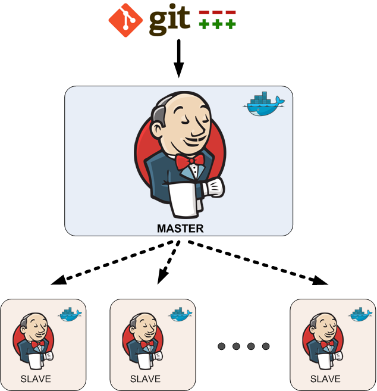
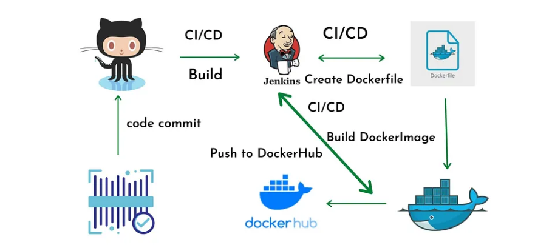

# 使用 Jenkins 和 Docker 实践 CI / CD 简介

2025-02-07 17:00

## 1 Jenkins 是什么？

Jenkins 是一个用 Java 编写的自动化服务框架。目前是用于实现 CI / CD 的最流行软件。
凭借广泛的采用丰富的插件生态系统，涵盖几乎全部用例。

只要能想到的任务，Jenkins都有对应的插件，插件赋予了Jenkins无比强大的威力。

### 1.1 基本概念

本质上，Jenkins是一个协作服务器，将一系列工具链接成链条。（或者用CI / CD的话来讲就是一条流水线）。
Jenkins是一种组织工具和推进工具（organizer and facilitator），所有的实际工作都依赖于外部服务，
例如：源码仓库、编译器、构建工具、测试工具和部署系统。

Jenkins 中有几个核心的概念：

+ job（project）
+ linked stage
+ step

每个项目或作业（job/project）都有多个阶段（stage），每个阶段都有多个步骤（step）。
每个项目都应该连接到一个源代码仓库。流水线中的每个阶段就是Jenkins项目中的一个构建步骤，
Jenkins界面给出了每个步骤的状态概貌，所以一眼就能看出流水线中发生了什么。

### 1.2 分布式构建

如果使用一台机器来解决多种应用的构建工作，那么会造成环境混乱，因为构建都是并行执行的。
解决这个问题就需要使用分布式构建。

build agent 和 build master 运行在不同的主机上，master登陆到 slave（一般是通过 SSH），
在其中启动代理进程并添加表明 slave 能力的标签（lable）。例如：Java-capable、C-capable、Ruby-capable。

使用docker将会是最佳实践，在容器集群（例如 k8s）使用 Jenkins 插件，通过容器管理系统在集群中运行 agent。



### 1.3 流水线即代码

Jenkins 流水线（Pipeline）使用一种基于（`Groovy`）的声明式领域特定语言对项目步骤进行编码。
通过提交 Jenkins 流水线代码（称为 Jenkinsfile）以及与该流水线关联的代码。
例如下面的 Jenkinsfile 演示了一个基本的“构建/测试/部署”周期。

```
pipeline {
    agent any
    stages {
        stage('Build') {
            steps {
                sh 'make'
            }
        }
        stage('Test') {
            steps {
                sh 'make test'
            }
        }
        stage('Deploy') {
            steps {
                sh 'deploy.sh'
            }
        }
    }
}
```


## 2 容器与 CI / CD

可以利用容器在多方面简化 CI / CD 环境。

+ 在容器内运行 CI / CD 系统本身
+ 在容器内构建应用
+ 使用容器镜像作为部署的构建制品

第一点是显而易见的，在容器内运行 CI / CD 软件（包括 master 和任何 agent），从而避免将系统专门用于 CI / CD 基础设施的开销。

### 2.1 容器作为构建环境

可以为各个组件（例如 postgresql redis等）使用`短期容器`，一旦完成构建就可以停止容器将其丢弃。

{: .note :}
构建容器通常要比运行期镜像大，因为它包含了例如编译器和测试工具这些额外的组件。

大多数当前的 CI / CD 工具都提供了对容器的原生支持。Jenkins的 Docker插件与流水线的集成非常好。另外可以了解一下 `Drone`，
这是一个围绕容器设计的CI / CD平台。

### 2.2 容器镜像作为构建制品

容器不仅轻量而且可移植性非常好。利用镜像 registry 在系统之间移动容器镜像既简单又快速。
使用容器镜像作为构建制品后，基本的工作流程就变成下面这样：

1. 在针对特定构建的容器（build container）中构建应用（针对使用编译型语言编写的软件）
2. 创建包含应用及其依赖的容器镜像（app image）
3. 推送镜像到 registry
4. 将该镜像（app image）部署到可使用容器（container-ready）的执行环境。



{: .important :}
容器与成熟的CI / CD流水线完美契合。容器极快的周期时间使其易于部署新代码，以及在出现问题时恢复到先前版本。
相较而言，虚拟机和配置管理系统的速度都慢了一个数量级。
