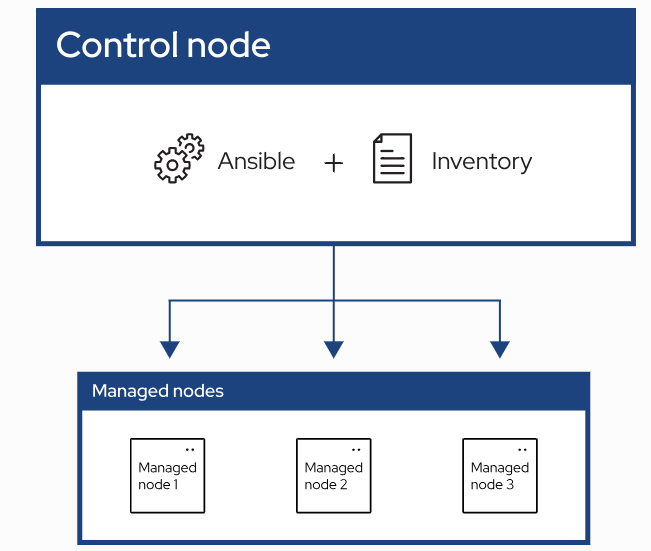
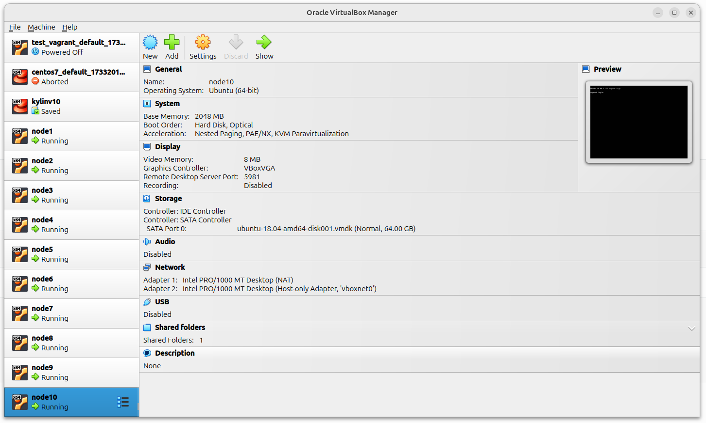

# 入门 Ansible 镜像执行环境 EE

2025-02-10 20:00

## 1 什么是 Ansible

Ansible 可自动管理远程系统并控制其所需状态。
大多数 Ansible 环境都有三个主要组件：

+ 控制节点 Control node： 安装了Ansible的系统，运行 ansible 或 ansible-inventory 等 Ansible 命令。
+ 清单 Inventory：按逻辑组织的受管节点列表。可以在控制节点上创建清单，向 Ansible 描述主机部署情况。
+ 受管节点 Managed node： 接受 Ansible 控制管理的远程系统或主机。



### 1.1 特性

Ansible 提供开源自动化，可降低复杂性并随处运行。使用 Ansible 几乎可以实现任何任务的自动化。

+ 消除重复工作，简化工作流程
+ 管理和维护系统配置
+ 持续部署复杂软件
+ 执行零停机时间滚动更新

Ansible 使用简单、人类可读的脚本（称为 playbook）来自动执行任务。在playbook中声明本地或远程系统所需的状态。Ansible 可确保系统保持该状态。

### 1.2 原则

作为自动化技术，Ansible 的设计遵循以下原则

+ 无代理架构 Agent-less architecture：避免在 IT 基础设施中安装额外软件，从而降低维护开销。
+ 简约 Simplicity：自动运行手册使用简单明了的 YAML 语法编写代码，读起来就像文档一样。Ansible 也是去中心化的，它使用 SSH 和现有的操作系统凭据来访问远程机器。
+ 可扩展性和灵活性 Scalability and flexibility：模块化设计支持多种操作系统、云平台和网络设备，可轻松快速地扩展自动化系统。
+ 惰性和可预测性 Idempotence and predictability：当系统处于你的操作步骤所描述的状态时，即使操作步骤运行多次（幂等操作），Ansible 也不会改变任何东西。

## 2 在容器中使用 Ansible： 执行环境（EE） Execution Environments

Ansible 执行环境旨在解决复杂性问题，并提供容器化带来的所有好处。EE 可以在三个主要方面降低复杂性：

+ software dependencies  软件依赖性
+ portability  便携性
+ content separation  内容分离

### 2.1 设置EE

确保在系统上安装了以下软件包：

+ docker（或者~~podman~~ 不稳定 不推荐）
+ python3
+ python3-pip

```shell
mise use -g python@3.11
```
{: .note :}
此处尽量安装最新版本的python3，否则安装ansible-navigator时，ansible-builder默认版本为1.x.x，与yml文件的 version：3 冲突报错。

安装docker，参考[2025-02-08-about-container#32-安装docker-deamon](2025-02-08-about-container#32-安装docker-deamon)

安装 ansible-navigator ：

```shell
pip3 install ansible-navigator
ansible-navigator --version
ansible-builder --version
```
安装 ansible-navigator 可让你在命令行上运行 EE。它包括用于构建 EE 的 ansible-builder 软件包。

### 2.2 构建EE

构建一个 EE，它代表一个 Ansible 控制节点，除了 Ansible 集合（ community.postgresql ）及其依赖关系（ psycopg2-binary Python 连接器）之外，还包含 ansible-core 和 Python 等标准软件包。

构建EE文件夹：

```shell
mkdir my_first_ee && cd my_first_ee
```
创建一个 execution-environment.yml 文件，指定镜像中应包含的依赖项。

```yaml
version: 3

images:
  base_image:
    name: quay.io/fedora/fedora:39

dependencies:
  ansible_core:
    package_pip: ansible-core
  ansible_runner:
    package_pip: ansible-runner
  system:
  - openssh-clients
  - sshpass
  galaxy:
    collections:
    - name: community.postgresql

```

{: .note :}
psycopg2-binary Python 软件包已包含在集合的 requirements.txt 文件中。对于不包含 requirements.txt 文件的集合，需要明确指定 Python 依赖项。有关详情，参阅 [Ansible Builder 文档](https://ansible-builder.readthedocs.io/en/stable/definition/)。

构建名为 postgresql_ee 的 EE 容器镜像。(ansible-builder 默认使用的是 podman。。。)，如果使用 docker，添加 --container-runtime docker 参数。

```shell
ansible-builder build -v --tag postgresql_ee --container-runtime docker
# 实际转换为 docker的命令（这里构建镜像需要几分钟，卡住不动实际在下载，缓解焦虑不妨直接执行洗面命令）： 
# docker build -f context/Dockerfile --progress=plain -t postgresql_ee context
```

### 2.3 运行EE

在命令行上对 localhost 或使用 ansible-navigator 的操作远程目标运行 EE。

{: .note :}
除了 ansible-navigator 之外，还可以使用其他工具运行 EE。

创建 test_localhost.yml。

```yaml
- name: Gather and print local facts
  hosts: localhost
  become: true
  gather_facts: true
  tasks:

   - name: Print facts
     ansible.builtin.debug:
      var: ansible_facts
```

在 postgresql_ee EE 中运行 playbook。

```shell
ansible-navigator run test_localhost.yml --execution-environment-image postgresql_ee --mode stdout --pull-policy missing --container-options='--user=0'
```

可以看到收集到的事实是关于容器的，而不是开发机器的。这是因为 ansible playbook 是在容器内运行的。

### 2.4 远程目标运行EE

先使用 vagrant 创建 10台 ubuntu 虚拟机。安装 VirtualBox 和 Vagrant 参考：[2024-11-21-regain-vagrant](2024-11-21-regain-vagrant)

生成SSH密钥对:

```shell
ssh-keygen -t rsa -b 4096 -f ~/.ssh/vagrant_key
```

`mkdir vagrant-cluster && cd vagrant-cluster`，创建Vagrantfile:

```ruby
Vagrant.configure("2") do |config|
  # 这里的 bionic64镜像实际上是 Ubuntu 18.04 LTS 64
  config.vm.box = "hashicorp/bionic64"

  # 禁用自动插入新密钥，使用固定密钥
  config.ssh.insert_key = false

  # 循环创建10台虚拟机
  (1..10).each do |i|
    config.vm.define "node#{i}" do |node|
      node.vm.hostname = "node#{i}"
      ip = "172.28.128.#{9 + i}" # IP范围：192.168.0.10 ~ 192.168.0.19
      node.vm.network "private_network", ip: ip

      # VirtualBox自定义设置
      node.vm.provider "virtualbox" do |vb|
        vb.name = "node#{i}"
        vb.memory = "2048"
        vb.cpus = 1
      end

      # 将主机公钥添加到虚拟机（替换YOUR_PUB_KEY）
      node.vm.provision "shell", inline: <<-SHELL
        # 解决报错: dpkg-preconfigure: unable to re-open stdin: No such file or directory
        export DEBIAN_FRONTEND=noninteractive
        # 加入 ssh pub key
        echo "ssh-rsa AAAAB3NzaC1yc2EAAAADAQABAAACAQDYgAOBXNnyhZdy25vl3B3jWgDw57j2BKq7kpDEXyWbGUlo9lcFnBf4ZBKGi1bU1T+59mWbMPQNykj0xcB3Tw+ZM/VYBf9OX1CQAM29F8QQZHBh2Y4VpEGIfXGIGJSkMBc1LVIQXYyfVbCNNRM9hZIRzbtq78D9Uu1fenuDk9IwtgJ1abjvl1tSHTcr3E2S3GXFDgCBZp00VRrtiVRz/bV0fb8HKdngQh1AsL7AKUv3cShN2ubXcsxk1R679fOVfuRo/AaomgA+vavVfFpqwr6ULCjX5n0dbqKiyGusRhbk8GthIIhN1ewbW/9/piASGNeZRViy87tJM/7dy4O+1Zjv5MsSwK0lWLu8Hf6Fl42GmlKIhGdWU1dBf8od0PI/7VcR4j9fiENmxh6E+4xc/Gt6YGWgJvtXoDsjj5FWELNBUiuDhRrHKuR9ziDck3lbHUR95GLIj89zWBkP9ZflsdEflxus0Gtjb6E8U1b6qu7mikI9LzMsuVe8d+viCdxYtd+kayXqdZrVkX9sqOcTyqYUHIrJT3LqiOQWj0rV2/vrQ5RKec9iJWF2j9yO1pcI0BcIlHaDMB9l0tG1hjg2n86lkM0HYcqlED3uhbXUBrm6iLds3nK26AHGFlVJYI3E9sJ4yANm8AcO6VP3F6DUj6vENHf/r1HHG2Ac3ZfoIpGJTw== memorycancel@TommyUbun" >> /home/vagrant/.ssh/authorized_keys
        chmod 600 /home/vagrant/.ssh/authorized_keys
        # 安装 python3.11.11
        apt-get update -y && apt-get upgrade -y 
        add-apt-repository ppa:deadsnakes/ppa -y
        apt-get update
        apt-get install -y software-properties-common wget build-essential
        wget https://www.python.org/ftp/python/3.11.1/Python-3.11.1.tar.xz
        tar -xf Python-3.11.1.tar.xz
        cd Python-3.11.1
        ./configure --enable-optimizations
        make altinstall
        rm /usr/bin/python3
        cp /usr/local/bin/python3.11 /usr/bin/python3
      SHELL
    end
  end
end
```

```shell
vagrant plugin update
vagrant up
ssh vagrant@192.168.56.10 # 连接第1台
ssh vagrant@192.168.56.19 # 连接第10台
```



`mkdir inventory` 在 inventory 目录下创建 hosts.yml 清单文件。

```yaml
all:
  hosts:
    172.28.128.10
    172.28.128.11
    172.28.128.12
    172.28.128.13
    172.28.128.14
    172.28.128.15
    172.28.128.16
    172.28.128.17
    172.28.128.18
    172.28.128.19
```

创建 test_remote.yml playbook:

```yaml
- name: Gather and print facts
  hosts: all
  become: true
  gather_facts: true
  tasks:

   - name: Print facts
     ansible.builtin.debug:
      var: ansible_facts
```

在 postgresql_ee EE 内运行playbook。


```shell
ansible-navigator run test_remote.yml -i inventory --execution-environment-image postgresql_ee:latest --mode stdout --pull-policy missing --enable-prompts -u vagrant -k -K
```

{: .note :}
总结：使用ansible-builder 根据 execution-environment.yml 文件构建 Ansible 运行环境 EE（镜像）。
使用ansible-navigator 在Ansible 运行环境 EE（镜像） 内执行 playbook。
