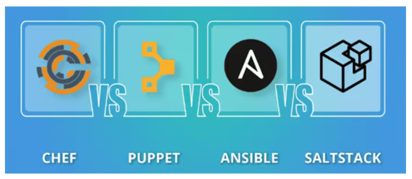

# 比较 chef puppet ansible saltstack

2025-02-11 20:00

为单台服务器配置所需软件是一项相当简单的任务。但是，如果需要在众多服务器上安装相同或类似的软件和配置，
则需要耗费大量工时才能完成，这将耗尽本已紧张的资源。如果没有某种形式的自动化，这项任务几乎无法完成。
考虑到这一任务，大聪明们开发了新的配置管理工具，以满足使用预制配置和更新部署新服务器的需求，从而实现更顺畅、
更易于管理的自动化流程。为了让这些服务器保持同步，并在数据中心或云环境中管理广泛的主机更新，Puppet、SaltStack、Chef 和 Ansible 等自动化工具满足了这一需求。

那么如何选择”合脚“的自动化工具呢？？？

下面回答来自 [deepseek](https://chat.deepseek.com/)，准不准自己品吧，我看挺准！

## 1 架构

| 工具                | 架构模式          | 通信协议            |    是否需要代理     |
|:--------------------|:----------------|:------------------|:------------------|
|Chef|	客户端-服务器 (C/S)|	HTTPS|	是（Chef Client）|
|Puppet|	客户端-服务器 (C/S)|	HTTPS|	是（Puppet Agent）|
|Ansible|	无代理（SSH）|	SSH|	否|
|SaltStack|	支持C/S和无代理|	ZeroMQ/SSH|	可选（默认Minion）|

{: .note :}
Ansible 和 SaltStack（SSH模式） 无需安装代理，适合快速部署。
SaltStack 默认使用ZeroMQ的C/S架构，性能更高，适合大规模集群。
Chef和Puppet都是基于C/S（客户端-服务器）架构，需要一个中央服务器来管理节点。而Ansible和SaltStack则采用无代理架构，
通过SSH或Salt自己的协议进行通信。不过，SaltStack其实也支持C/S模式，但默认使用ZeroMQ。

## 2 配置语言

| 工具                | 配置语言          | 学习曲线            |    灵活性          |
|:--------------------|:----------------|:------------------|:------------------|
|Chef|	Ruby DSL |	较陡（需Ruby）|	高（代码驱动）|
|Puppet|	声明式自定义语言|	中等|	中（强调声明式）|
|Ansible|	YAML + Jinja2模板	|	低|	中（易读易写）|
|SaltStack|	YAML + Jinja2模板    |	中等|	高（支持复杂逻辑）|

{: .note :}
配置语言方面，Chef使用Ruby为基础的DSL，可能需要用户有一定的Ruby知识。Puppet有自己的声明式语言，语法相对独特，学习曲线可能较陡。
Ansible使用YAML格式的playbook，结构清晰，易于理解和编写，对新手友好。SaltStack也使用YAML，但它的状态文件可能结合了Jinja模板，提供了更多的灵活性。

## 3 易用性和部署

| 工具                | 初始配置复杂度     | 执行模式            |   典型用例         |
|:--------------------|:----------------|:------------------|:------------------|
| Chef| 	高| 	拉取（客户端定期同步）| 	复杂环境，需严格一致性|
| Puppet| 	中等	| 拉取| 	企业级配置管理|
| Ansible| 	低| 	推送（按需执行）| 	快速任务编排、临时变更|
| SaltStack| 	中等| 	推送/拉取| 	大规模实时任务执行|

{: .note :}
易用性方面，Ansible因为不需要在节点上安装代理，且YAML语法简单，通常被认为是最容易上手的。
Chef和Puppet因为需要维护客户端和服务器，可能设置起来更复杂。SaltStack在设置上可能比Ansible稍复杂，但比Chef和Puppet简单些。

## 4 性能与扩展性

| 工具                | 大规模支持         | 性能优化            |   扩展机制         |
|:--------------------|:----------------|:------------------|:------------------|
| Chef	    |中（依赖服务器性能）	|	中等	|	Ruby插件 |
| Puppet	|	中高（需Master集群）	|	高（缓存优化）	|	Puppet模块 |
| Ansible	|	中（SSH瓶颈）	|	低（线性执行）	|	Python模块 |
| SaltStack	|	高（异步通信）	|	高（ZeroMQ）	|	Python插件 |

{: .note :}
SaltStack使用ZeroMQ进行通信，可能在处理大量节点时有更好的性能。Ansible依赖SSH，虽然简化了架构，但在大规模环境中可能效率较低，
但可通过优化（如管道或Mitogen插件）缓解。
Chef和Puppet的性能可能取决于服务器和客户端的配置，不过它们都有较成熟的生态系统来处理大规模部署。

## 5 社区与生态

| 工具                | 社区活跃度         |企业支持            |   云/容器集成       |
|:--------------------|:----------------|:------------------|:------------------|
| Chef	|成熟但增长放缓	|	Chef Software	|	良好	|
| Puppet	|	成熟，企业用户多	|	Puppet Inc.	|	良好	|
| Ansible	|	极活跃（Red Hat）	|	Red Hat	|	优秀（AWS、K8s）	|
| SaltStack	|	活跃（VMware）	|	VMware	|	优秀（多云支持）	|

{: .note :}
社区和支持方面，Ansible由Red Hat支持，社区活跃，文档齐全。Chef和Puppet历史更久，社区成熟，但近年来可能被Ansible和SaltStack赶超。
SaltStack现在属于VMware，也有一定的企业支持。Ansible 的Ansible Galaxy提供海量预定义角色，适合快速集成。
Ansible 和 SaltStack 在云原生场景（如Kubernetes）中都有深度支持。

## 6 安全性与可靠性

| 工具                | 认证机制          |数据加密             |   容错能力         |
|:--------------------|:----------------|:------------------|:------------------|
|Chef	|	SSL/TLS	|	支持	|	依赖Master HA	|
|Puppet	|	SSL/TLS	|	支持	|	Master集群支持	|
|Ansible	|	SSH密钥	|	依赖SSH配置	|	无中心单点故障	|
|SaltStack	|	AES加密	|	支持	|	Master冗余支持	|

{: .note :}
Puppet和Chef可能更强调状态的一致性，定期检查并修正配置偏离。Ansible是推送模式，按需执行，可能需要额外工具来持续监控状态。SaltStack也有状态管理，同时支持实时执行命令。
基于SSH的Ansible可以利用现有的SSH安全机制，但需管理密钥。而C/S架构的工具需要确保客户端与服务器之间的通信安全，比如使用SSL/TLS，依赖证书管理。

## 7 总结与适用场景

+ Ansible：适合中小规模、快速部署、无需代理的场景，如临时任务编排、DevOps初学者。
+ SaltStack：适合大规模、高性能需求，尤其是实时操作和复杂状态管理，如云计算环境。
+ Chef：适合有Ruby背景、需要严格配置合规性的企业，如金融行业。
+ Puppet：适合强调声明式配置和审计需求的传统IT运维，如大型企业基础设施。政务机构。

## 8 选择建议

+ 快速上手/简单任务 → Ansible
+ 超大规模/实时操作 → SaltStack
+ 合规性/复杂配置 → Chef或Puppet
+ 云原生/容器化 → Ansible或SaltStack

{: .note :}
如果用户需要快速自动化而不想安装代理，Ansible是首选。如果需要处理大规模服务器并需要高执行效率，可能选SaltStack。如果企业已经有Ruby团队，可能倾向于Chef。Puppet可能在需要严格的策略执行和报告功能的场景下更适合。
Ansible有大量的云模块，SaltStack也有良好的云支持。对Docker、Kubernetes天然友好。