# 学习 Kubernetes 基础知识

2025-02-20 20:00

上一篇[你好 minikube](2025-02-19-hello-minikube)介绍了如何使用 Minikube 在本地搭建一个单机版的 Kubernetes ，本文在此基础上介绍 Kubernetes 集群编排系统的基础知识。

## 0 何为 Kubernetes ?

现代的 Web 服务，用户希望应用程序能够 24/7 全天候使用，而开发人员希望每天可以多次发布部署新版本的应用程序。理论上这两个需求是相悖的。
而容器化可以帮助达成这些目标，使应用程序能够以简单快速的方式发布和更新，而无需停机。
Kubernetes 确保这些容器化的应用程序在确定的时间和服务器节点运行。Kubernetes 是一个可用于生产的开源平台，根据 Google 容器集群方面积累的经验以及来自社区的最佳实践而设计。

Kubernetes 有以下几个模块：

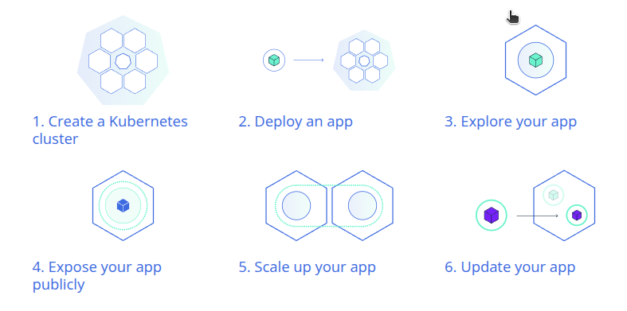

本文比上一篇多 2 个步骤，横向扩展（scale）和更新（update）。

## 1 创建集群

使用 Minikube 启动一个 Kubernetes 集群具体步骤参考上一篇：[你好 minikube](2025-02-19-hello-minikube)

Kubernetes 协调一个高可用计算机集群，每个计算机作为独立单元互相连接工作。
Kubernetes 以更高效的方式跨集群自动分发和调度应用容器。

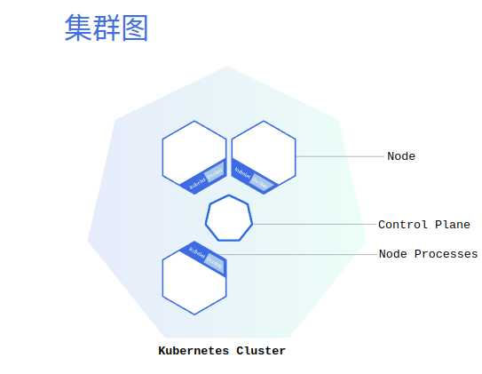

Kubernetes 集群有2个角色：

+ 控制面板（control panel）：负责管理整个集群。
+ 节点（node）：负责托管正在运行的应用。

每个节点都是是一个虚拟机或者物理机。节点（node）使用控制面（control panel）暴露的 Kubernetes API 与控制面通信。

{: .important :}
“一生二，二生三，三生万物。” - - 处理`生产级流量`的 Kubernetes 集群至少应具有三个节点，因为如果只有一个节点，出现故障时其对应的 etcd 成员和控制面实例都会丢失， 并且冗余会受到影响。可以通过添加更多控制面节点来降低这种风险。

## 2 部署应用

一旦有了一个正在运行的 Kubernetes 集群，就可以在上面部署容器化应用了。为此，需要创建一个 Kubernetes 部署（Deployment）。部署会指示 Kubernetes 如何创建和更新应用程序的实例。创建部署后，Kubernetes 控制平面会调度部署中的应用实例在集群中的各个节点上运行。

创建应用实例后，Kubernetes 部署控制器会持续监控这些实例。如果托管实例的节点宕机或被删除，部署控制器会用群集中另一个节点上的实例替换该实例。

{: .note :}
这就提供了一种`自愈机制`（self-healing mechanism），以解决机器故障或维护问题。

在传统部署世界里，安装脚本通常用于启动应用程序，但无法从机器故障中恢复。Kubernetes 部署既能创建应用实例，又能让它们跨节点运行，解决机器故障或维护问题。

```shell
kubectl create deployment kubernetes-bootcamp --image=gcr.io/google-samples/kubernetes-bootcamp:v1
kubectl get deployments
# NAME                  READY   UP-TO-DATE   AVAILABLE   AGE
# kubernetes-bootcamp   1/1     1            1           18m
# 看到有 1 个 Deployment 运行应用的单个实例。这个实例运行在节点上的一个容器内。
```

这个过程中执行了以下一些操作：

+ 搜索应用实例可以运行的合适节点（我们只有一个可用的节点）
+ 调度应用在此节点上运行
+ 配置集群在需要时将实例重新调度到新的节点上

在 Kubernetes 内运行的 Pod 运行在一个`私有的、隔离的`网络上。 默认这些 Pod 可以从同一 Kubernetes 集群内的其他 Pod 和服务看到，但超出这个网络后则看不到。 当使用 kubectl 时，实际是通过 API 端点交互与应用进行通信。

## 2.1 Kubernetes 集群 API 代理

```shell
kubectl proxy
```
通过上述命令可以在主机（终端）和 Kubernetes 集群之间有一个连接。此代理能够从这些终端直接访问 API。
你可以看到通过代理端点托管的所有 API。

可以运行以下命令通过代理的 API 访问 Pod：

```shell
export POD_NAME=$(kubectl get pods -o go-template --template '{{range .items}}{{.metadata.name}}{{"\n"}}{{end}}')
echo Name of the Pod: $POD_NAME
curl http://localhost:8001/api/v1/namespaces/default/pods/$POD_NAME/
```

## 3 了解应用（pod 和 node）

应用由 pod 组成，而 pod 由 container 组成，pod 运行在 node 上。

### 3.1 什么是 pod

创建 Deployment 时, Kubernetes 创建了一个 Pod 来托管应用实例。Pod 是 Kubernetes 抽象出来的， 表示一组一个或多个应用容器（如 Docker），以及这些容器的一些共享资源。这些资源包括：

+ 共享存储(卷 volume)
+ 网络，作为唯一的集群 IP 地址
+ 有关每个容器如何运行的信息，例如容器镜像版本或要使用的特定端口

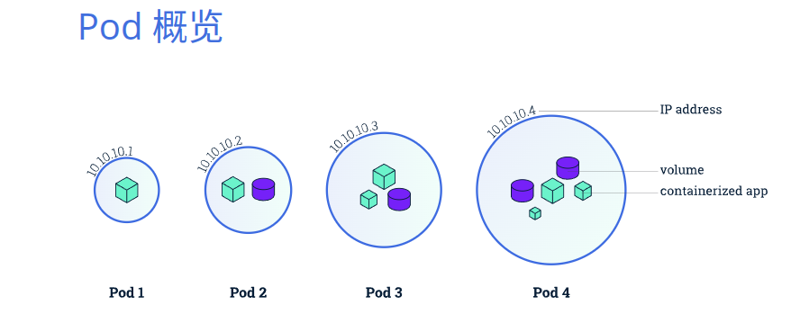

{: .important :}
Pod 是 Kubernetes 平台上的原子单元。当在 Kubernetes 上创建 Deployment 时， 该 Deployment 会在其中创建包含容器的 Pod（而不是直接创建容器）。 每个 Pod 都与调度它的节点绑定，并保持在那里直到终止（根据重启策略）或删除。 如果节点发生故障，则会在集群中的其他可用节点上调度相同的 Pod。

### 3.2 什么是 node

Pod 总是运行在节点上。节点是 Kubernetes 中参与计算的机器，`可以是虚拟机或物理计算机`，具体取决于集群。 每个节点由控制面板（control panel）管理。节点可以有多个 Pod，Kubernetes 控制面会自动处理在集群中的节点上调度 Pod。 控制面的自动调度考量了每个节点上的可用资源（如 CPU 内存）。

每个 Kubernetes 节点至少运行：

+ Kubelet（相当于传统概念中的 `agent`）：负责 Kubernetes 控制面和节点之间通信的进程；它管理机器上运行的 Pod 和容器。
+ 容器运行时（如 Docker）：负责从镜像仓库中提取容器镜像、解压缩容器以及运行应用。

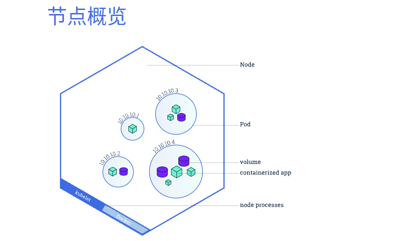

### 3.3 使用 kubectl 进行故障排除

使用：

+ kubectl get - 列出资源
+ kubectl describe - 显示有关资源的详细信息
+ kubectl logs - 打印 Pod 中容器的日志
+ kubectl exec - 在 Pod 中的容器上（`注意： 与 docker区别是此处不是直接在容器上`）执行命令

排除 Kubernetes 应用故障。

```shell
kubectl get pods
kubectl describe pods
# 重开一个终端运行： kubectl proxy
export POD_NAME="$(kubectl get pods -o go-template --template '{{range .items}}{{.metadata.name}}{{"\n"}}{{end}}')"
echo Name of the Pod: $POD_NAME
curl http://localhost:8001/api/v1/namespaces/default/pods/$POD_NAME:8080/proxy/
kubectl logs "$POD_NAME"
# 注意此处 kubectl exec 与 docker exec 的区别是命令中多了两个横杠： `--`
kubectl exec "$POD_NAME" -- env
kubectl exec -ti $POD_NAME -- bash
cat server.js
curl http://localhost:8080
exit
```

## 4 暴露应用

当一个工作节点挂掉后, 在节点上运行的 Pod 也会消亡。Kubernetes 集群中的每个 Pod 都有一个唯一的 IP 地址，即使是在同一个 Node 上的 Pod 也是如此， 因此需要一种方法来自动协调 Pod 之间的变化（例如重启新建Pod，IP可能会变化），以便应用保持运行。这个方法就是Kubernetes 的 Service。

### 4.1 什么是 Service

Kubernetes 的 Service 是一个抽象层，它定义了一组 Pod 的逻辑集，并为这些 Pod 支持外露流量暴露、负载均衡和服务发现。Service 使从属 Pod 之间的松耦合成为可能。 和所有 Kubernetes 对象清单一样, Service 用 YAML 或者 JSON 来定义。 Service 下的一组 Pod 通常由一个 `标签选择算符` 来标记。

尽管每个 Pod 都有一个唯一的 IP 地址，但是如果没有 Service，这些 IP 不会被公开到集群外部。 Service 允许应用接收流量。 通过设置 Service 的 spec 中的 type，可以用不同的方式公开 Service：

+ ClusterIP（默认）- 在集群的内部 IP 上公开 Service。这种类型使得 Service 只能从集群内访问。
+ NodePort - 使用 NAT 在集群中每个选定 Node 的相同端口上公开 Service 。使用<NodeIP>:<NodePort> 从集群外部访问 Service。是 ClusterIP 的超集。
+ LoadBalancer - 在当前云中创建一个外部负载均衡器（如果支持的话），并为 Service 分配一个固定的外部IP。是 NodePort 的超集。
+ ExternalName - 将 Service 映射到 externalName 字段的内容（例如 foo.bar.example.com），通过返回带有该名称的 CNAME 记录实现。不设置任何类型的代理。这种类型需要 kube-dns 的 v1.7 或更高版本，或者 CoreDNS 的 0.8 或更高版本。

### 4.2 Service 和 Label

Service 为一组 Pod 提供流量路由。Service 是一种抽象，`允许 Kubernetes 中的 Pod 死亡和复制，而不会影响应用`。

{: .note :}
在相互依赖的 Pod（如应用中的前端和后端组件）之间进行服务发现和路由是由 Kubernetes Service 处理的。

Service 通过`Label`和`selector`来匹配一组 Pod， 它们是允许对 Kubernetes 中的对象进行逻辑操作的一种分组原语。 标签是附加在对象上的键/值对，可以以多种方式使用：

+ 指定用于开发、测试和生产的对象
+ 嵌入版本标记
+ 使用标记将对象分类

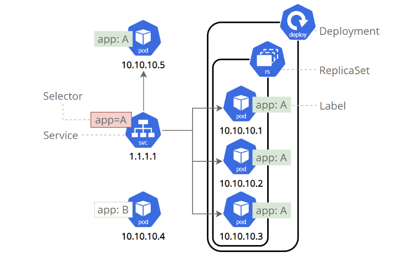

标签可以在对象创建时或之后附加到对象上。它们可以随时被修改。现在使用 Service 发布应用并添加一些标签。

第一步：创建新 Service
```shell
kubectl get pods
kubectl get services
kubectl expose deployment/kubernetes-bootcamp --type="NodePort" --port 8080
kubectl get services
kubectl describe services/kubernetes-bootcamp
export NODE_PORT="$(kubectl get services/kubernetes-bootcamp -o go-template='{{(index .spec.ports 0).nodePort}}')"
echo "NODE_PORT=$NODE_PORT"
curl http://"$(minikube ip):$NODE_PORT"
# minikube ip -> 192.168.49.2 这是通过节点的方式暴露服务
```

第二步：使用标签 Label

```shell
kubectl describe deployment
# -l 是 label 的意思
kubectl get pods -l app=kubernetes-bootcamp
export POD_NAME="$(kubectl get pods -o go-template --template '{{range .items}}{{.metadata.name}}{{"\n"}}{{end}}')"
echo "Name of the Pod: $POD_NAME"
# 使用 label 子命令，接着是对象类型、对象名称和新的标签
kubectl label pods "$POD_NAME" version=v1
kubectl describe pods "$POD_NAME"
kubectl get pods -l version=v1
```

第三步：删除一个 Service

```shell
kubectl delete service -l app=kubernetes-bootcamp
kubectl get services
```

最后，要确认路由已经不再被公开，可以 curl 之前公开的 IP 和端口，这证明了集群外部已经不再可以访问应用。 可以通过在 Pod 内部运行 curl 确认应用仍在运行。

```shell
curl http://"$(minikube ip):$NODE_PORT"
kubectl exec -ti $POD_NAME -- curl http://localhost:8080
```

## 5 扩缩应用

上一章节创建了一个 Deployment， 然后通过 Service 让其可以公开访问。 Deployment 仅创建了一个 Pod 用于运行这个应用。当流量增加时，则需要扩容应用满足用户需求。

### 5.1 负载均衡器 LoadBalancer

上一节使用的`NodePort`的方式暴露应用，实际上可以理解他为单点服务，那么要是要使用横向扩容，则需要`负载均衡`（`LoadBalancer`）：

```shell
kubectl delete deployment kubernetes-bootcamp
kubectl create deployment kubernetes-bootcamp --image=gcr.io/google-samples/kubernetes-bootcamp:v1
kubectl expose deployment/kubernetes-bootcamp --type="LoadBalancer" --port 8080
```

单点             |  扩容后
:-------------------------:|:-------------------------:
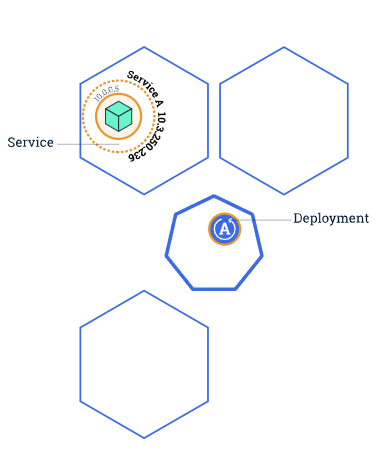  |  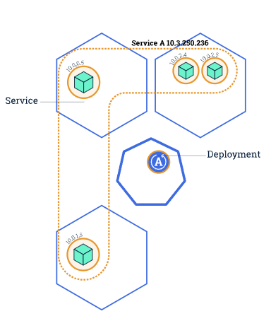

Service 有一个集成的负载均衡器（LoadBalancer）， 将网络流量分配到一个可公开访问的 Deployment 的所有 Pod 上。 Service 将会一直通过端点来监视 Pod 的运行，保证流量只分配到可用的 Pod 上。
一旦有了多个应用实例，就可以进行滚动更新而无需停机。在下一节介绍这些。 现在进入终端扩缩应用。

### 5.2 扩容 Deployment

扩容：

```shell
kubectl get deploy # deployments
# NAME                  READY   UP-TO-DATE   AVAILABLE   AGE
# kubernetes-bootcamp   1/1     1            1           11m
# NAME 列出 Deployment 在集群中的名称。
# READY 显示当前/预期（CURRENT/DESIRED）副本数的比例。
# UP-TO-DATE 显示为了达到预期状态，而被更新的副本的数量。
# AVAILABLE 显示应用有多少个副本对你的用户可用。
# AGE 显示应用的运行时间。
kubectl get rs # ReplicaSet
# 扩容 Deployment 到 4 个副本
kubectl scale deployments/kubernetes-bootcamp --replicas=4
kubectl get deployments
kubectl get pods -o wide
kubectl describe deployments/kubernetes-bootcamp

export NODE_PORT="$(kubectl get services/kubernetes-bootcamp -o go-template='{{(index .spec.ports 0).nodePort}}')"

echo NODE_PORT=$NODE_PORT
for _ in {1..4}; do curl http://"$(minikube ip):$NODE_PORT"; done
# Hello Kubernetes bootcamp! | Running on: kubernetes-bootcamp-9bc58d867-j7852 | v=1
# Hello Kubernetes bootcamp! | Running on: kubernetes-bootcamp-9bc58d867-7zgz6 | v=1
# Hello Kubernetes bootcamp! | Running on: kubernetes-bootcamp-9bc58d867-j7852 | v=1
# Hello Kubernetes bootcamp! | Running on: kubernetes-bootcamp-9bc58d867-zmrqq | v=1
# 每个请求都命中了不同的 Pod，这证明负载均衡正在工作。
```

缩容：

```shell
kubectl scale deployments/kubernetes-bootcamp --replicas=2
kubectl get deployments
kubectl get pods -o wide
```

## 6 滚动更新

用户希望应用程序始终可用，而开发人员则需要每天多次部署它们的新版本。 

### 6.1 什么是 rolling update

在 Kubernetes 中，这些是通过滚动更新（Rolling Updates）完成的。 滚动更新 允许通过使用新的实例逐步更新 Pod 实例，实现零停机的 Deployment 更新。 新的 Pod 将被调度到具有可用资源的节点上。

默认情况下，更新期间不可用的 pod 的最大值和可以创建的新 pod 数都是 1。这两个选项都可以配置数字或百分比。 在 Kubernetes 中，更新是经过版本 version 控制的，任何 Deployment 更新都可以恢复到以前的（稳定）版本。

原始状态             |  更新 1 个 pod
:-------------------------:|:-------------------------:
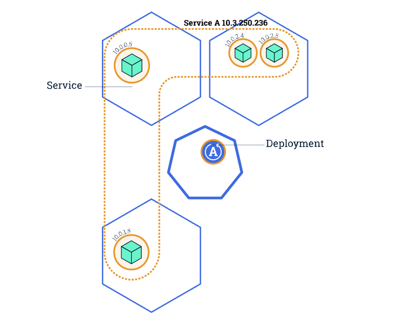  |  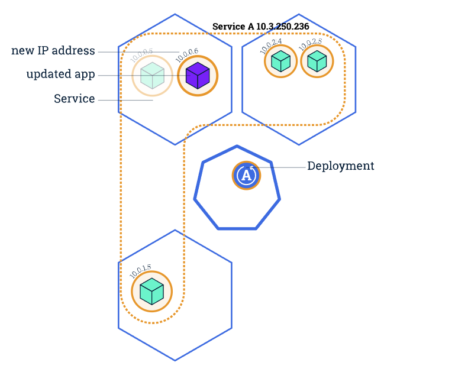
更新 2 个 pod              | 直到更新全部 pods
:-------------------------:|:-------------------------:
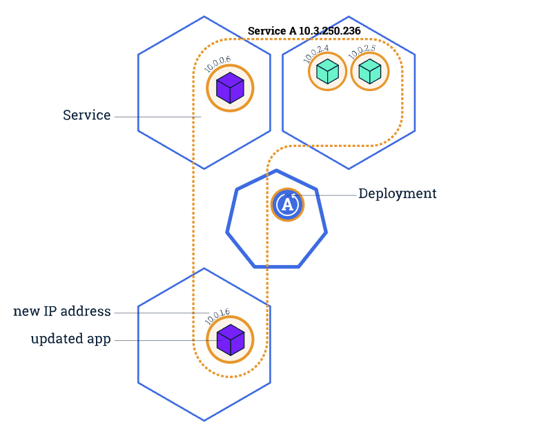  |  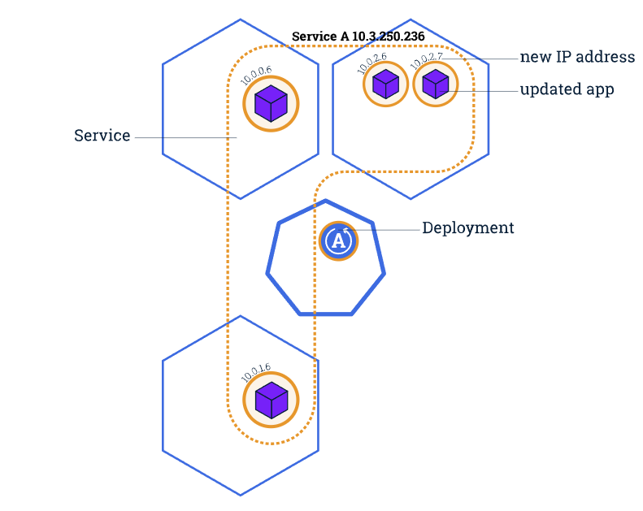

Service 在更新期间仅将流量负载均衡到可用的 Pod。 可用的 Pod 是指应用程序对于用户可用的实例。

滚动更新允许以下操作：

+ 将应用程序从一个环境升级到另一个环境（通过容器镜像更新）
+ 回滚到以前的版本
+ 持续集成和持续交付应用程序（CI/CD），无需停机

## 6.2 为应用执行滚动更新

第一步：更新应用的版本

```shell
kubectl get deployments
kubectl get pods
kubectl describe pods
# 此命令通知 Deployment 为应用程序使用不同的镜像（v2），并启动滚动更新。 
kubectl set image deployments/kubernetes-bootcamp kubernetes-bootcamp=jocatalin/kubernetes-bootcamp:v2
kubectl get pods
```

第二步：验证更新

```shell
kubectl describe services/kubernetes-bootcamp
export NODE_PORT="$(kubectl get services/kubernetes-bootcamp -o go-template='{{(index .spec.ports 0).nodePort}}')"
echo "NODE_PORT=$NODE_PORT"
curl http://"$(minikube ip):$NODE_PORT"
# 通过运行 rollout status 来确认此次更新
kubectl rollout status deployments/kubernetes-bootcamp
# 确认正在运行最新的版本（v2）
kubectl describe pods
```

（可选）：回滚更新

```shell
# 执行另一次更新，并尝试部署一个标记为 v10 的镜像（实际上 v10 不存在），因此会更新失败
kubectl set image deployments/kubernetes-bootcamp kubernetes-bootcamp=gcr.io/google-samples/kubernetes-bootcamp:v10
kubectl get deployments
kubectl describe pods
# 要回滚 Deployment 到上一个可以工作的版本，使用 rollout undo 子命令：
kubectl rollout undo deployments/kubernetes-bootcamp
kubectl get pods
```

（可选）：清除集群

```shell
# 可以把要删除的 deployments 和 services 写到一行里
kubectl delete deployments/kubernetes-bootcamp services/kubernetes-bootcamp
```
