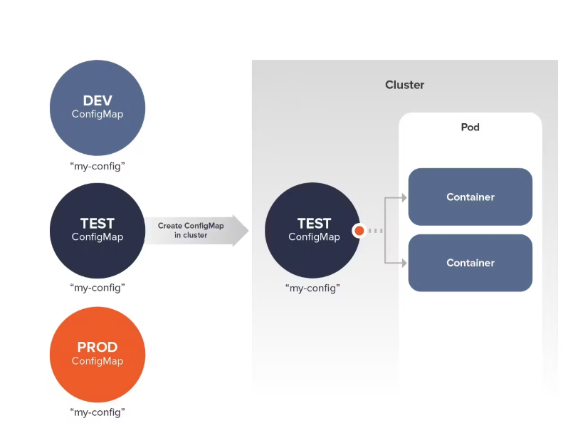
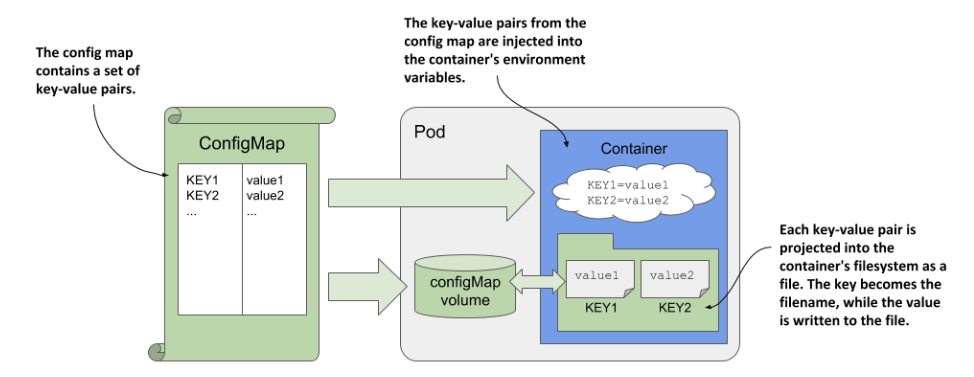

# 使用 ConfigMap 更新 Kubernetes Pod 的配置

2025-02-21 20:00

很多应用在其初始化或运行期间要依赖一些配置信息。ConfigMap 是 Kubernetes 的一种机制，可让配置数据注入到应用的 Pod 内部。

ConfigMap 概念允许配置与镜像分离，以保持容器化的应用程序的可移植性。 例如，可以下载并运行相同的镜像来启动容器， 用于本地开发、系统测试或运行生产环境的应用。(例如 `RAILS_ENV=production` 或 `RAILS_ENV=test`)



以 alpine 和 nginx 镜像为例。假设已经安装好 minikube 并创建了 kubernetes。

ConfigMap 分为 5 个典型的应用场景：

+ 1 通过将 ConfigMap 存储到卷（volume）容器中的方式更新配置
+ 2 通过将 ConfigMap 作为容器环境变量的方式更新配置
+ 3 在多容器 Pod 中通过 ConfigMap 更新配置
+ 4 在包含边车（sidecar）容器的 Pod 中通过 ConfigMap 更新配置
+ 5 通过将 ConfigMap 存储到`不可变`卷（volume）容器中的方式更新配置



所有场景都是通过 3 种方式来存储和传递 ConfigMap 的：

1. volume 卷容器（为 pod 单独挂载一个 ConfigMap 卷容器用于存储配置）
2. 作为环境变量（直接作为容器的 envvar 环境变量存储配置）
3. 写死到 immutable-configmap.yaml 文件（容器读取此文件作为 metadata 不可变配置）

## 1 通过将 ConfigMap 存储到卷（volume）容器中的方式更新配置

相当于，给 pod 挂载一个 ConfigMap 的卷 volume，配置数据存储到卷里，然后pod读取卷里的配置。更新卷里配置，就相当
于更新 pod 里应用的配置。（这里用到了第一种方式）


```shell
# 使用 kubectl create configmap 命令基于字面值创建一个 ConfigMap：
kubectl create configmap sport --from-literal=sport=football
kubectl apply -f https://k8s.io/examples/deployments/deployment-with-configmap-as-volume.yaml
# --------------------------------------------------------------------------------------------
# deployment-with-configmap-as-volume.yaml
# apiVersion: apps/v1
# kind: Deployment
# metadata:
#   name: configmap-volume
#   labels:
#     app.kubernetes.io/name: configmap-volume
# spec:
#   replicas: 3
#   selector:
#     matchLabels:
#       app.kubernetes.io/name: configmap-volume
#   template:
#     metadata:
#       labels:
#         app.kubernetes.io/name: configmap-volume
#     spec:
#       containers:
#         - name: alpine
#           image: alpine:3
#           command:
#             - /bin/sh
#             - -c
#             - while true; do echo "$(date) My preferred sport is $(cat /etc/config/sport)";
#               sleep 10; done;
#           ports:
#             - containerPort: 80
#           volumeMounts:
#             - name: config-volume
#               mountPath: /etc/config
#       volumes:
#         - name: config-volume
#           configMap:
#             name: sport
# --------------------------------------------------------------------------------------------
# 可以观察到上面 volume 的configMap 的 name 为 sport，与命令`kubectl create configmap` 对应。
kubectl get pods --selector=app.kubernetes.io/name=configmap-volume
# 在运行这些 Pod 之一的每个节点上，kubelet 获取该 ConfigMap 的数据，并将其转换为本地卷中的文件。
# 然后，kubelet 按照 Pod 模板中指定的方式将该卷挂载到容器中。 在该容器中运行的代码从文件中加载。
# 可以通过查看该 Deployment 中其中一个 Pod 的日志来检查此报告：
kubectl logs deployments/configmap-volume
kubectl edit configmap sport
# 将 football 改为 dota2
kubectl logs deployments/configmap-volume --follow
```

{: .note :}
当有一个 ConfigMap 通过 configMap 卷或 projected 卷映射到运行中的 Pod， 并且更新了该 ConfigMap 时，运行中的 Pod 几乎会立即更新。从更新 ConfigMap 的那一刻到将新的键投射到 Pod 的那一刻，整个延迟可能与 kubelet 同步周期相同。

## 2 通过将 ConfigMap 作为容器环境变量的方式更新配置

```shell
kubectl create configmap fruits --from-literal=fruits=apples
kubectl apply -f https://k8s.io/examples/deployments/deployment-with-configmap-as-envvar.yaml
# --------------------------------------------------------------------------------------------
# deployment-with-configmap-as-envvar.yaml
# apiVersion: apps/v1
# kind: Deployment
# metadata:
#   name: configmap-env-var
#   labels:
#     app.kubernetes.io/name: configmap-env-var
# spec:
#   replicas: 3
#   selector:
#     matchLabels:
#       app.kubernetes.io/name: configmap-env-var
#   template:
#     metadata:
#       labels:
#         app.kubernetes.io/name: configmap-env-var
#     spec:
#       containers:
#         - name: alpine
#           image: alpine:3
#           env:
#             - name: FRUITS
#               valueFrom:
#                 configMapKeyRef:
#                   key: fruits
#                   name: fruits
#           command:
#             - /bin/sh
#             - -c
#             - while true; do echo "$(date) The basket is full of $FRUITS";
#                 sleep 10; done;
#           ports:
#             - containerPort: 80
# --------------------------------------------------------------------------------------------
# 上面可以看到 fruits 配置是通 containers 里的 env 传递的。
kubectl get pods --selector=app.kubernetes.io/name=configmap-env-var
kubectl logs deployment/configmap-env-var
kubectl edit configmap fruits
# 将 fruits 改为 banana
kubectl logs deployments/configmap-env-var --follow
```

{: .important :}
尽管 ConfigMap 中的键的取值已经变更，Pod 中的环境变量仍然显示先前的值。 这是因为当源数据变更时，在 Pod 内运行的进程的环境变量不会被更新； 如果想强制更新，需要让 Kubernetes 替换现有的 Pod。新 Pod 将使用更新的配置来运行。

```shell
# 可以触发该替换。使用 kubectl rollout 为 Deployment 执行上线操作
kubectl rollout restart deployment configmap-env-var
# 等待上线操作完成
kubectl rollout status deployment configmap-env-var --watch=true
kubectl get deployment configmap-env-var
kubectl get pods --selector=app.kubernetes.io/name=configmap-env-var
kubectl logs deployments/configmap-env-var --follow
```

## 3 在多容器 Pod 中通过 ConfigMap 更新配置

下面 Deployment 管理一组 Pod，每个 Pod 有两个容器。 这两个容器`共享`一个 emptyDir 卷并使用此卷进行通信。第一个容器运行 Web 服务器（nginx）。 在 Web 服务器容器中共享卷的挂载路径是 /usr/share/nginx/html。 第二个辅助容器基于 alpine，对于这个容器，emptyDir 卷被挂载在 /pod-data。 辅助容器生成一个 HTML 文件，其内容基于 ConfigMap。Web 服务器容器通过 HTTP 提供此 HTML 文件。

```yaml
# deployment-with-configmap-two-containers.yaml
apiVersion: apps/v1
kind: Deployment
metadata:
  name: configmap-two-containers
  labels:
    app.kubernetes.io/name: configmap-two-containers
spec:
  replicas: 3
  selector:
    matchLabels:
      app.kubernetes.io/name: configmap-two-containers
  template:
    metadata:
      labels:
        app.kubernetes.io/name: configmap-two-containers
    spec:
      volumes:
        - name: shared-data
          emptyDir: {}
        - name: config-volume
          configMap:
            name: color
      containers:
        - name: nginx
          image: nginx
          volumeMounts:
            - name: shared-data
              mountPath: /usr/share/nginx/html
        - name: alpine
          image: alpine:3
          volumeMounts:
            - name: shared-data
              mountPath: /pod-data
            - name: config-volume
              mountPath: /etc/config
          command:
            - /bin/sh
            - -c
            - while true; do echo "$(date) My preferred color is $(cat /etc/config/color)" > /pod-data/index.html;
              sleep 10; done;
```

```shell
kubectl create configmap color --from-literal=color=red
kubectl apply -f https://k8s.io/examples/deployments/deployment-with-configmap-two-containers.yaml
kubectl get pods --selector=app.kubernetes.io/name=configmap-two-containers
kubectl expose deployment configmap-two-containers --name=configmap-service --port=8080 --target-port=80
kubectl port-forward service/configmap-service 8080:8080 &
curl http://localhost:8080
kubectl edit configmap color
# color 改为 green
while true; do curl --connect-timeout 7.5 http://localhost:8080; sleep 2; done
```

{: .note :}
这也是通过卷改的，所以只需要等待论询周期就好了，不需要重启上线pod。

## 4 在包含边车（sidecar）容器的 Pod 中通过 ConfigMap 更新配置

接着改进上一个例子，可以使用边车容器作为辅助容器来写入 HTML 文件。
边车容器在概念上是一个 Init 容器，因此保证会在主要 Web 服务器容器启动之前启动。
这确保了当 Web 服务器准备好提供服务时，HTML 文件始终可用。

以下是 Deployment：管理一组 Pod，每个 Pod 有一个主容器和一个边车容器。 这两个容器共享一个 emptyDir 卷并使用此卷来通信。主容器运行 Web 服务器（NGINX）。 在 Web 服务器容器中共享卷的挂载路径是 /usr/share/nginx/html。 第二个容器是基于 Alpine Linux 作为辅助容器的边车容器。对于这个辅助容器，emptyDir 卷被挂载在 /pod-data。 边车容器写入一个 HTML 文件，其内容基于 ConfigMap。Web 服务器容器通过 HTTP 提供此 HTML 文件。

```yaml
# deployment-with-configmap-and-sidecar-container.yaml
apiVersion: apps/v1
kind: Deployment
metadata:
  name: configmap-sidecar-container
  labels:
    app.kubernetes.io/name: configmap-sidecar-container
spec:
  replicas: 3
  selector:
    matchLabels:
      app.kubernetes.io/name: configmap-sidecar-container
  template:
    metadata:
      labels:
        app.kubernetes.io/name: configmap-sidecar-container
    spec:
      volumes:
        - name: shared-data
          emptyDir: {}
        - name: config-volume
          configMap:
            name: color
      containers:
        - name: nginx
          image: nginx
          volumeMounts:
            - name: shared-data
              mountPath: /usr/share/nginx/html
      initContainers:
        - name: alpine
          image: alpine:3
          restartPolicy: Always
          volumeMounts:
            - name: shared-data
              mountPath: /pod-data
            - name: config-volume
              mountPath: /etc/config
          command:
            - /bin/sh
            - -c
            - while true; do echo "$(date) My preferred color is $(cat /etc/config/color)" > /pod-data/index.html;
              sleep 10; done;
```

```shell
# kubectl create configmap color --from-literal=color=blue
kubectl apply -f https://k8s.io/examples/deployments/deployment-with-configmap-and-sidecar-container.yaml
kubectl get pods --selector=app.kubernetes.io/name=configmap-sidecar-container
kubectl expose deployment configmap-sidecar-container --name=configmap-sidecar-service --port=8081 --target-port=80
kubectl port-forward service/configmap-sidecar-service 8081:8081 &
kubectl edit configmap color
# 这次改为 pink
while true; do curl --connect-timeout 7.5 http://localhost:8081; sleep 1; done
```
## 5 通过将 ConfigMap 存储到`不可变`卷（volume）容器中的方式更新配置

{: .important :}
不可变 ConfigMap 专门用于恒定且预期不会随时间变化的配置。 将 ConfigMap 标记为不可变可以提高性能，因为 kubelet 不会监视变更。

如果确实需要进行变更，应计划：
+ 变更 ConfigMap 的名称，并转而运行引用新名称的 Pod
+ 替换集群中之前运行使用旧值的 Pod 的所有节点
+ 在任何之前加载过旧 ConfigMap 的节点上重新启动 kubelet

以下是一个不可变 ConfigMap的示例:

```yaml
# configmap/immutable-configmap.yaml
apiVersion: v1
data:
  company_name: "ACME, Inc." # 虚构的公司名称
kind: ConfigMap
immutable: true
metadata:
  name: company-name-20150801
```
创建不可变 ConfigMap：

```shell
kubectl apply -f https://k8s.io/examples/configmap/immutable-configmap.yaml
```

下面 Deployment 将不可变 ConfigMap company-name-20150801 作为卷挂载到 Pod 的唯一容器中。

```yaml
# deployment-with-immutable-configmap-as-volume.yaml
apiVersion: apps/v1
kind: Deployment
metadata:
  name: immutable-configmap-volume
  labels:
    app.kubernetes.io/name: immutable-configmap-volume
spec:
  replicas: 3
  selector:
    matchLabels:
      app.kubernetes.io/name: immutable-configmap-volume
  template:
    metadata:
      labels:
        app.kubernetes.io/name: immutable-configmap-volume
    spec:
      containers:
        - name: alpine
          image: alpine:3
          command:
            - /bin/sh
            - -c
            - while true; do echo "$(date) The name of the company is $(cat /etc/config/company_name)";
              sleep 10; done;
          ports:
            - containerPort: 80
          volumeMounts:
            - name: config-volume
              mountPath: /etc/config
      volumes:
        - name: config-volume
          configMap:
            name: company-name-20150801
```

```shell
kubectl apply -f https://k8s.io/examples/deployments/deployment-with-immutable-configmap-as-volume.yaml
kubectl get pods --selector=app.kubernetes.io/name=immutable-configmap-volume
kubectl logs deployments/immutable-configmap-volume
```

{: .important :}
一旦 ConfigMap 被标记为不可变，就无法撤销此变更，也无法修改 data 或 binaryData 字段的内容。
为了修改使用此配置的 Pod 的行为，需要创建一个新的不可变 ConfigMap，并编辑 Deployment 以定义一个稍有不同的 Pod 模板，引用新的 ConfigMap。

```shell
# configmap/new-immutable-configmap.yaml
# apiVersion: v1
# data:
#   company_name: "Fiktivesunternehmen GmbH" # 虚构的公司名称
# kind: ConfigMap
# immutable: true
# metadata:
#   name: company-name-20240312
kubectl apply -f https://k8s.io/examples/configmap/new-immutable-configmap.yaml
kubectl get configmap
kubectl edit deployment immutable-configmap-volume
# 在出现的编辑器中，更新现有的卷定义以使用新的 ConfigMap。
# volumes:
# - configMap:
#     defaultMode: 420
#     name: company-name-20240312 # 更新此字段
#   name: config-volume
kubectl get pods --selector=app.kubernetes.io/name=immutable-configmap-volume
kubectl logs deployment/immutable-configmap-volume
# 一旦所有 Deployment 都迁移到使用新的不可变 ConfigMap，删除旧的 ConfigMap。
kubectl delete configmap company-name-20150801
```

{: .important :}
总结：1 在 Pod 上作为卷挂载的 ConfigMap 所发生的变更将在后续的 kubelet 同步后无缝生效。
2 配置为 Pod 环境变量的 ConfigMap 所发生变更将在后续的 Pod 上线操作后生效。
3 一旦 ConfigMap 被标记为不可变，就无法撤销此变更（不能将不可变的 ConfigMap 改为可变）， 并且也不能对 data 或 binaryData 字段的内容进行任何变更。可以删除并重新创建 ConfigMap， 或者可以创建一个新的不同的 ConfigMap。当删除 ConfigMap 时， 运行中的容器及其 Pod 将保持对引用了现有 ConfigMap 的任何卷的挂载点。

## 清理

```shell
kubectl delete deployment configmap-volume configmap-env-var configmap-two-containers configmap-sidecar-container immutable-configmap-volume
kubectl delete service configmap-service configmap-sidecar-service
kubectl delete configmap sport fruits color company-name-20240312
kubectl delete configmap company-name-20150801
```