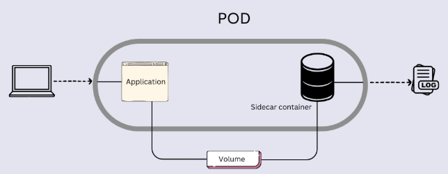

# 使用 Kubernetes ConfigMap 的真实案例

2025-02-22 20:00

## 1 使用 ConfigMap 来配置 Redis

```shell
cat <<EOF >./example-redis-config.yaml
apiVersion: v1
kind: ConfigMap
metadata:
  name: example-redis-config
data:
  redis-config: ""
EOF

kubectl apply -f example-redis-config.yaml
kubectl apply -f https://raw.githubusercontent.com/kubernetes/website/main/content/en/examples/pods/config/redis-pod.yaml
# --------------------------------------------------------------------------------------------
# apiVersion: v1
# kind: Pod
# metadata:
#   name: redis
# spec:
#   containers:
#   - name: redis
#     image: redis:5.0.4
#     command:
#       - redis-server
#       - "/redis-master/redis.conf"
#     env:
#     - name: MASTER
#       value: "true"
#     ports:
#     - containerPort: 6379
#     resources:
#       limits:
#         cpu: "0.1"
#     volumeMounts:
#     - mountPath: /redis-master-data
#       name: data
#     - mountPath: /redis-master
#       name: config
#   volumes:
#     - name: data
#       emptyDir: {}
#     - name: config
#       configMap:
#         name: example-redis-config
#         items:
#         - key: redis-config
#           path: redis.conf
# --------------------------------------------------------------------------------------------
kubectl get pod/redis configmap/example-redis-config 
kubectl describe configmap/example-redis-config
kubectl exec -it redis -- redis-cli
CONFIG GET maxmemory
CONFIG GET maxmemory-policy
# 向 example-redis-config ConfigMap 添加一些配置：
# apiVersion: v1
# kind: ConfigMap
# metadata:
#   name: example-redis-config
# data:
#   redis-config: |
#     maxmemory 2mb
#     maxmemory-policy allkeys-lru    
kubectl apply -f example-redis-config.yaml
kubectl describe configmap/example-redis-config
# 需要重新启动 Pod 才能从关联的 ConfigMap 中获取更新的值。 让我们删除并重新创建 Pod
kubectl delete pod redis
kubectl apply -f https://raw.githubusercontent.com/kubernetes/website/main/content/en/examples/pods/config/redis-pod.yaml
kubectl exec -it redis -- redis-cli
CONFIG GET maxmemory
CONFIG GET maxmemory-policy
# 清理
kubectl delete pod/redis configmap/example-redis-config
```

{: .note :}
可以看出，这实际类似于上一篇提到的第5种方式[通过将-configmap-存储到不可变卷volume容器中的方式更新配置](2025-02-21-using-configmap-to-config-pod#5-通过将-configmap-存储到不可变卷volume容器中的方式更新配置)
容器读取此文件作为 metadata 配置。每次修改了配置文件需要删除原 pod，重建新 pod 才能使配置生效。

## 2 使用边车容器采集应用日志

### 2.1 何为边车容器

边车容器是与主应用容器在同一个 Pod 中运行的辅助容器。 这些容器通过提供额外的服务或功能（如日志记录、监控、安全性或数据同步）来增强或扩展主应用容器的功能， 而无需直接修改主应用代码。

边车容器在 Kubernetes v1.29 [beta] 以上版本默认启用。
Kubernetes 将边车容器作为 Init 容器的一个特例来实现， Pod 启动后，边车容器仍保持运行状态。

### 2.2 边车容器与应用容器的区别

边车容器与同一 Pod 中的应用容器并行运行。不过边车容器不执行主应用逻辑，而是为主应用提供支持功能。

{: .important :}
边车容器具有独立的生命周期。它们可以独立于应用容器启动、停止和重启。 这意味着可以更新、扩展或维护边车容器，而不影响主应用。

### 2.3 边车容器与Init 容器的区别

边车容器与主容器并行工作，扩展其功能并提供附加服务。

边车容器与主应用容器同时运行。它们在整个 Pod 的生命周期中都处于活动状态，并且可以独立于主容器启动和停止。 与 Init 容器不同， 边车容器支持探针来控制其生命周期。

{: .important :}
边车容器可以直接与主应用容器交互，因为与 Init 容器一样， 它们总是与应用容器共享相同的网络，并且还可以选择共享卷（文件系统）。
Init 容器在主容器启动之前停止，因此 Init 容器无法与 Pod 中的应用容器交换消息。 所有数据传递都是单向的（例如，Init 容器可以将信息放入 emptyDir 卷中）。

变更边车容器的镜像不会导致 Pod 重启，但会触发容器重启。

### 2.4 边车容器的实例

下面分别演示的是边车容器在 deployment 和 job 中的应用。



+ deployment
+ job

deployment：

```yaml
# application/deployment-sidecar.yaml
apiVersion: apps/v1
kind: Deployment
metadata:
  name: myapp
  labels:
    app: myapp
spec:
  replicas: 1
  selector:
    matchLabels:
      app: myapp
  template:
    metadata:
      labels:
        app: myapp
    spec:
      containers:
        - name: myapp
          image: alpine:latest
          command: ['sh', '-c', 'while true; do echo "logging" >> /opt/logs.txt; sleep 1; done']
          volumeMounts:
            - name: data
              mountPath: /opt
      initContainers:
        - name: logshipper
          image: alpine:latest
          restartPolicy: Always
          command: ['sh', '-c', 'tail -F /opt/logs.txt']
          volumeMounts:
            - name: data
              mountPath: /opt
      volumes:
        - name: data
          emptyDir: {}
```

注意到 job 的`restartPolicy: Never`，表示只执行一次。

```yaml
# application/job/job-sidecar.yaml
apiVersion: batch/v1
kind: Job
metadata:
  name: myjob
spec:
  template:
    spec:
      containers:
        - name: myjob
          image: alpine:latest
          command: ['sh', '-c', 'echo "logging" > /opt/logs.txt']
          volumeMounts:
            - name: data
              mountPath: /opt
      initContainers:
        - name: logshipper
          image: alpine:latest
          restartPolicy: Always
          command: ['sh', '-c', 'tail -F /opt/logs.txt']
          volumeMounts:
            - name: data
              mountPath: /opt
      restartPolicy: Never
      volumes:
        - name: data
          emptyDir: {}
```
