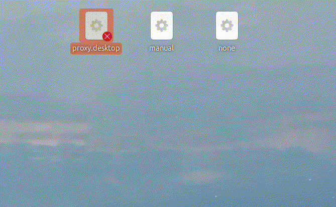

# 把 shell 脚本变成 Ubuntu 桌面应用（通过双击执行）

2025-03-03 23:00

接 [把 shell 脚本变成 Ubuntu 桌面应用
](http://127.0.0.1:4000/2024-11-12-Linux-startup-script) 。

## 1 创建脚本

{: .note :}
想达到效果是通过双击图标运行脚本，所以需要通过写`[Desktop Entry]` 而不是 `#! bin/sh`

manual.desktop
```ini
[Desktop Entry]
Type=Application
Name=manual
Exec=/home/memorycancel/Desktop/switch.sh
Terminal=False
```

`switch.sh`:

```shell
#!/bin/bash

gsettings set org.gnome.system.proxy mode manual
gsettings set org.gnome.system.proxy.http port 10809
gsettings set org.gnome.system.proxy.https port 10809
gsettings set org.gnome.system.proxy.socks port 10808
```

{: .note :}
添加switch.sh脚本为了完成一键对代理的切换：`xray`/`clash-verge`

none.desktop
```ini
[Desktop Entry]
Type=Application
Name=none
Exec=gsettings set org.gnome.system.proxy mode none
Terminal=False
```

proxy.desktop
```ini
[Desktop Entry]
Type=Application
Name=proxy
Exec=/home/memorycancel/Documents/Xray-linux-64/xray -c /home/memorycancel/Documents/Xray-linux-64/xxx.json
Terminal=true

```

{: .note :}
通过 `gsettings` 命令可以修改 GNOME 系统带有界面的配置。


## 2 开通执行权限（Allow Launching）


