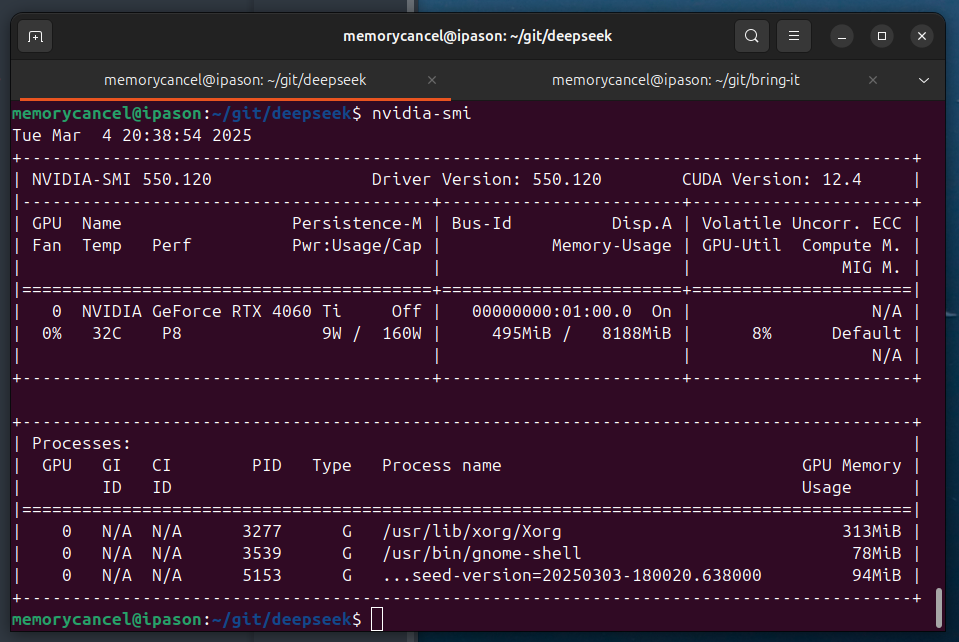
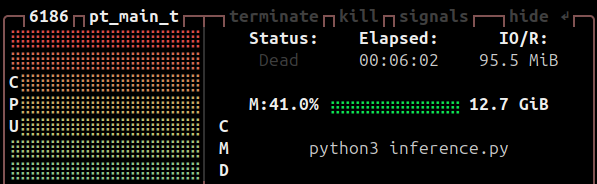
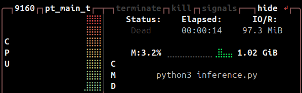

# 优化本地部署 deepseek-coder-6.7b-instruct infer 性能

2025-03-04 23：00

## 1 测试环境

`nvidia-smi`：NVIDIA GeForce RTX 4060 Ti （8GB 显存）




## 2 测试性能

原始 infer 代码：[2025-03-04-deploy-deepseek-locally#14-编写推理代码](2025-03-04-deploy-deepseek-locally#14-编写推理代码)

执行 `infer` 资源耗费：




## 3 优化性能

### 3.1 优化内存（显存和内存）

+ 使用bitsandbytes库将模型权重量化为8位或4位，显著降低显存占用。
+ 使用accelerate库将部分模型层卸载到CPU内存。

```python
from transformers import AutoTokenizer, AutoModelForCausalLM
from transformers import BitsAndBytesConfig
import torch

tokenizer = AutoTokenizer.from_pretrained("./deepseek-coder-6.7b-instruct", trust_remote_code=True)

# model = AutoModelForCausalLM.from_pretrained("deepseek-coder-6.7b-instruct", trust_remote_code=True, torch_dtype=torch.bfloat16).cuda()
# model = AutoModelForCausalLM.from_pretrained("deepseek-coder-6.7b-instruct", trust_remote_code=True, torch_dtype=torch.bfloat16).cpu()

model = AutoModelForCausalLM.from_pretrained(
    "./deepseek-coder-6.7b-instruct",
    # 优化1：auto 自动分配 gpu 和 cpu 资源
    device_map="auto",
    torch_dtype=torch.float16,
    # 优化2：用4-bit量化，将模型权重量化为8位或4位，显著降低显存占用
    quantization_config=BitsAndBytesConfig(
        load_in_4bit=True,
        bnb_4bit_compute_dtype=torch.float16,
        bnb_4bit_quant_type="nf4"
    )
)

messages=[
    { 'role': 'user', 'content': "用 ruby 编写堆排序算法"}
]

inputs = tokenizer.apply_chat_template(messages, add_generation_prompt=True, return_tensors="pt").to(model.device)
# tokenizer.eos_token_id is the id of <|EOT|> token

outputs = model.generate(inputs, max_new_tokens=512, do_sample=False, top_k=50, top_p=0.95, num_return_sequences=1, eos_token_id=tokenizer.eos_token_id)

print(tokenizer.decode(outputs[0][len(inputs[0]):], skip_special_tokens=True))
```



{: .important :}
内存优化能显著提升性能。
测试结果：内存占用从 12GB 降低到 1GB（降低10倍），infer 时间从6分钟降低到14秒（20倍）。总体上性能提升20倍。

### 3.2 计算加速

### Flash Attention

安装支持Flash Attention的库（如flash-attn），替换原始注意力层：

```bash
pip install flash-attn --no-build-isolation
```
确保模型代码中启用use_flash_attention_2：

```python
model = AutoModelForCausalLM.from_pretrained(..., use_flash_attention_2=True)
```
### 内核优化
使用CUDA Graphs或PyTorch 2.x编译（torch.compile）加速计算图执行：

```python
model = torch.compile(model, mode="max-autotune")
```

{: .note :}
代码层面开启计算加速只能提升微小性能，跟问题难度和硬件有关。

### 3.3 其他优化

其他还有：

+ 推理优化：依赖专用推理框架（vLLM 或 TGI）
+ 硬件优化：GPU 驱动更新，启动硬件加速（Ampere+架构）
+ 模型剪枝和模型蒸馏：调整算法，需要重新训练小模型（如1.3B参数）模仿原模型行为。

## 4 总结


优化方法|	显存节省|	速度提升|	兼容性
------:|:-----:|:-----:|:-----
4-bit量化|	70-80%|	10x|	所有GPU|
Flash Attention|	-|	2-3x|	Ampere+架构
vLLM|	20-30%|	3-5x|	需模型支持

### 注意事项

+ 量化可能导致精度损失，需测试生成质量。
+ RTX 4060 Ti的PCIe 4.0 x8接口可能限制多卡扩展。
+ 若使用Windows系统，建议通过WSL2启用完整CUDA支持。(直接用 Linux是最优解)

通过组合上述方法，可在RTX 4060 Ti上实现实时响应（如20-40 tokens/秒）的代码生成体验。建议从量化+Flash Attention开始，逐步尝试更复杂的优化。
