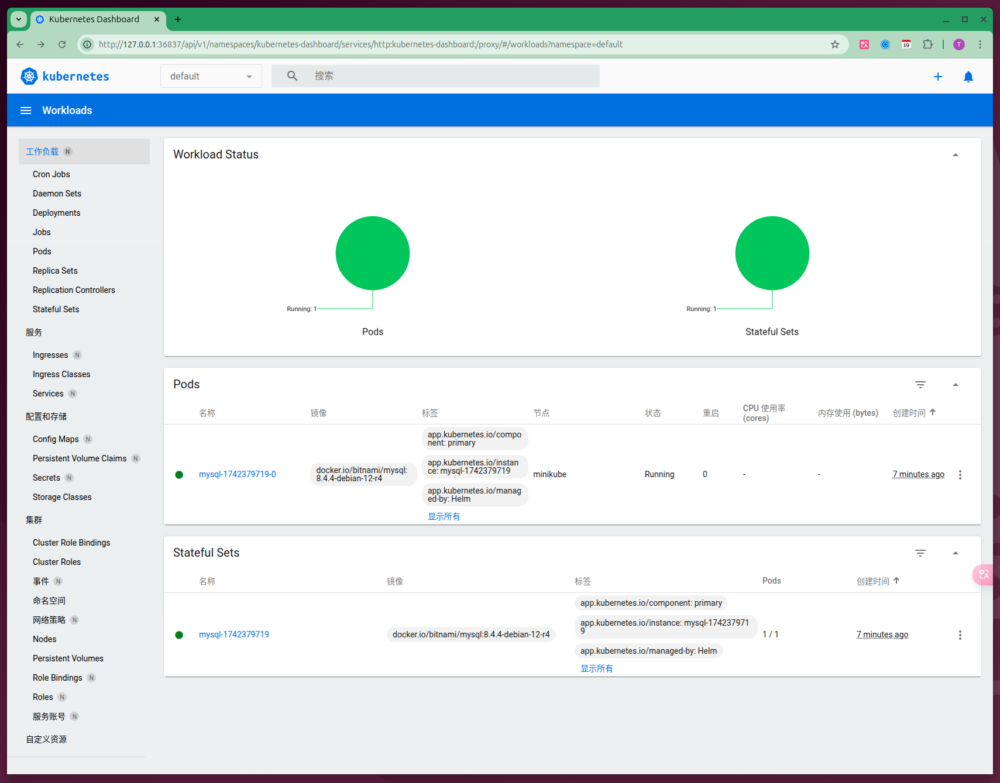

# Helm 快速入门

2025-03-19 18:00


## 1 安装

1. 一个 Kubernetes 集群
2. 确定你安装版本的安全配置
3. 安装和配置Helm
4. 本地的 kubectl

安装 kubernetes 参考：[2025-02-19-hello-minikube](2025-02-19-hello-minikube)

参考 [https://helm.sh/zh/docs/intro/install](https://helm.sh/zh/docs/intro/install/#%E4%BD%BF%E7%94%A8%E8%84%9A%E6%9C%AC%E5%AE%89%E8%A3%85):

```shell
curl https://raw.githubusercontent.com/helm/helm/main/scripts/get-helm-3 | bash
```

## 2 初始化

安装好了Helm之后，您以添加一个chart 仓库。从 [Artifact Hub](https://artifacthub.io/packages/search?kind=0)中查找Helm chart仓库。

```shell
helm repo add bitnami https://charts.bitnami.com/bitnami
```

当添加完成，查看charts仓库中的可供安装的charts列表：

```shell
helm search repo bitnami
```

## 3 安装 charts

```shell
# 确定我们可以拿到最新的charts列表
helm repo update
helm install bitnami/mysql --generate-name
helm show chart bitnami/mysql
helm show all bitnami/mysql
helm list # helm ls
helm status mysql-1742379719
```



```shell
helm uninstall mysql-1742379422
```
