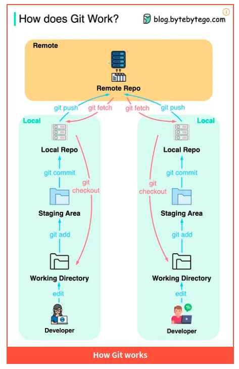

# 测试 ruby 封装的 libgit2 库 rugged

2025-03-25 18:00


[https://github.com/libgit2/rugged](https://github.com/libgit2/rugged) 是 ruby 封装的 libgit2 库，用于实现对 git 的各种操作。

{: .note :}
`gitlab` 和 `github` 的实现都依赖于此库。



下面使用 ruby 脚本调用 rugged 库演示上述过程。

## 1 创建项目

step1_create_project_dir.rb
```ruby
exec("rm -rf my_project && mkdir my_project")

```

## 2 初始化 git 仓库

step2_init_git_repo_of_my_project.rb
```ruby
require 'rugged'

repo_path = 'project'
repo = Rugged::Repository.init_at(repo_path)

puts "Repository initialized at #{repo_path}"

```

## 3 创建一个文件并 commit 到 git repo

step3_commit_add_new_file_to_repo.rb
```ruby
require 'rugged'

repo_path = 'project'
repo = Rugged::Repository.new(repo_path)

# Create a new file in the repository
file_path = File.join(repo_path, 'README.md')
File.write(file_path, "# My New Repository\n")

# Stage the new file
index = repo.index
index.add(path: 'README.md', oid: Rugged::Blob.from_workdir(repo, 'README.md'), mode: 0100644)
index.write

# Create a new commit
author = { email: "author@example.com", name: 'Author Name', time: Time.now }
commit_tree = index.write_tree(repo)
Rugged::Commit.create(repo,
  author: author,
  committer: author,
  message: "Initial commit",
  parents: [],
  tree: commit_tree,
  update_ref: 'HEAD'
)

puts "File committed to the repository"
```

## 4 更新文件并 commit 到 git repo

step4_commit_update_file_to_repo.rb.rb
```ruby
require 'rugged'

# Open the repository
repo_path = 'project'
repo = Rugged::Repository.new(repo_path)

# Path to the file you want to update
file_path = File.join(repo_path, 'README.md')

# Update the file
File.open(file_path, 'a') do |file|
  file.puts "\nAdditional content added to README.md"
end

# Stage the updated file
index = repo.index
index.add(path: 'README.md', oid: Rugged::Blob.from_workdir(repo, 'README.md'), mode: 0100644)
index.write

# Create a new commit
author = { email: "author@example.com", name: 'Author Name', time: Time.now }
commit_tree = index.write_tree(repo)
Rugged::Commit.create(repo,
  author: author,
  committer: author,
  message: "Update README.md",
  parents: [repo.head.target],  # Make sure there's at least one parent commit
  tree: commit_tree,
  update_ref: 'HEAD'
)

puts "README.md updated and committed to the repository"
```

## 5 打印所有的 commits log

step5_print_commits.rb
```ruby
require 'rugged'

# Open the repository
repo_path = 'project'
repo = Rugged::Repository.new(repo_path)

# Print all commits
walker = Rugged::Walker.new(repo)
walker.push(repo.head.target)

walker.each do |commit|
  puts "Commit: #{commit.oid}"
  puts "Author: #{commit.author[:name]} <#{commit.author[:email]}>"
  puts "Date: #{commit.time}"
  puts "Message: #{commit.message}"
  puts "-" * 40
end
```

```text
Commit: 699766fa45dfbe5bbc28db2c4511f9751e0f49cc
Author: Author Name <author@example.com>
Date: 2025-03-25 15:39:10 +0800
Message: Update README.md
----------------------------------------
Commit: b42e5d5d08a61b8de3ad0d587daa2e62bd864c81
Author: Author Name <author@example.com>
Date: 2025-03-25 15:39:08 +0800
Message: Initial commit
----------------------------------------
```

## 6 打印一个 commit 与上一个 commit 的 diff

step6_print_a_diff_of_commit.rb
```ruby
require 'rugged'

# Open the repository
repo_path = 'project'
repo = Rugged::Repository.new(repo_path)

# Specify the commit SHA you want to diff
commit_sha = '28154fc187571fa8b2ab47ac389e9fac4930dd30'
commit = repo.lookup(commit_sha)

# Check if the commit has parents
if commit.parents.empty?
  puts "This is the initial commit and has no parent to compare with."
else
  # Get the diff for the commit
  diff = commit.parents[0].diff(commit)

  # Print the diff
  diff.each_patch do |patch|
    puts "File: #{patch.delta.new_file[:path]}"
    puts patch.to_s
  end
end

```

```text
File: README.md
diff --git a/README.md b/README.md
index 6ea9f72..6f55f60 100644
--- a/README.md
+++ b/README.md
@@ -1 +1,3 @@
 # My New Repository
+
+Additional content added to README.md
```

## 7 打印 repo 的文件树

step7_list_all_files_and_dirs_of_repo.rb
```ruby
require 'rugged'

# Open the repository
repo_path = 'project'
repo = Rugged::Repository.new(repo_path)

# Get the HEAD commit
head_commit = repo.head.target

# Get the tree of the HEAD commit
tree = head_commit.tree

# Recursive function to list all files and directories
def list_tree_entries(tree, path = "")
  tree.each_blob do |blob|
    puts "#{path}/#{blob[:name]}"
  end

  tree.each_tree do |subtree|
    puts "#{path}/#{subtree[:name]}/"
    list_tree_entries(subtree[:tree], "#{path}/#{subtree[:name]}")
  end
end

# List all files and directories starting from the root tree
list_tree_entries(tree)
```
