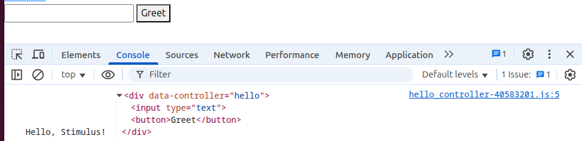

# 使用 Rails 8 默认 JavaScript 框架 Stimulus 基础

Stimulus 是一款目标不高的 JavaScript 框架。它并不打算接管你的整个前端，事实上，它根本不关心 HTML 的呈现。相反，它的目的是`用足够多的 action 来增强 HTML，使静态的 HTML 变得生动起来`。

{: .important :}
Stimulus 与 Turbo 完美搭配，只需最小的工作量，就可以为快速、引人注目的应用程序提供了完整的解决方案。

## 0. 发明 Stimulus 的起源和目的

在介绍我们新的适度 JavaScript 框架 Stimulus 之前，请允许我回顾一下 Turbo 的主张。

Turbo 源自 GitHub 开发的一种名为 pjax 的方法。其基本概念保持不变。全页面刷新之所以经常感觉缓慢，并不是因为浏览器必须处理服务器发送的大量 HTML。浏览器在这方面做得非常好，速度也非常快。而且在大多数情况下，HTML 有效载荷往往比 JSON 有效载荷大这一事实也并不重要（尤其是在压缩的情况下）。

{: .important :}
因为 CSS 和 JavaScript 是在浏览器（客户端）进行计算渲染的，如果 CSS 和 JavaScript 数量较多，处理速度会非常慢。

为了避免这种重新初始化，Turbo 维护了一个持久进程，就像单页面应用程序一样。但在很大程度上是隐形的。它通过 Ajax 拦截链接并加载新页面。服务器仍会返回格式完整的 HTML 文档。

仅这一策略就能让大多数应用程序中的大多数操作感觉非常快（如果它们能在 100-200 毫秒内返回服务器响应，而这在缓存中是完全可能实现的）。

但 Turbo 本身只是故事的一半。还有一些功能必须在浏览器端完成。这些功能包括：
+ 显示和隐藏元素
+ 将内容复制到剪贴板
+ 在列表中添加新的待办事项，
+ 以及与现代网络应用相关的所有其他交互。

在使用 Stimulus 之前，Basecamp 尝试了许多方法实现这些功能。有些代码使用了少量的 jQuery，有些代码使用了同样大小的 JavaScript，还有些代码使用了更大的面向对象子系统（react/vue）。它们通常都是通过挂在 data-behavior 属性上的显式事件处理来工作的。

{: .important :}
虽然像这样添加新代码很容易，但这并不是一个全面的解决方案，我们有太多的内部风格和模式并存。这就很难重复使用代码，也很难让新开发人员学到一致的方法。

## 1. Stimulus 的三个核心概念

Stimulus 将这些模式的精华整合到一个适中的小型框架中，并围绕三个主要概念展开：

+ controllers
+ actions
+ targets

当你查看它所处理的 HTML 时，它被设计为一种渐进式增强。这样只需查看一个模板，就能知道是哪种行为在起作用。下面是一个例子：

```html
<div data-controller="clipboard">
  PIN: <input data-clipboard-target="source" type="text" value="1234" readonly>
  <button data-action="clipboard#copy">Copy to Clipboard</button>
</div>
```

读完后就能很清楚地知道发生了什么。即使对 Stimulus 毫无了解，也不用查看控制器代码本身。这几乎就像是伪代码。这与阅读外部 JavaScript 文件应用事件处理程序的 HTML 片段截然不同。此外，Stimulus 还保持了关注点的分离，而这一点在许多当代 JavaScript 框架中已经丧失。

Stimulus 本身并不创建 HTML。相反，它将自己附加到现有的 HTML 文档中。在大多数情况下，HTML 会在页面加载时（首次点击或通过 Turbo）或通过改变 DOM 的 Ajax 请求在服务器上呈现。

Stimulus 关注的是对现有 HTML 文档的操作。有时，这意味着添加一个 CSS 类，以隐藏某个元素、使其动画化或突出显示。有时，这意味着重新排列元素分组。有时，这意味着对元素的内容进行操作，比如将可缓存的 UTC 时间转换为可显示的本地时间。

{: .note :}
在某些情况下，你会希望 Stimulus 能创建新的 DOM 元素，而你也完全可以这么做。我们甚至可能在未来添加一些语法糖，使其更容易实现。但这只是少数用例。我们的重点是操作，而不是创建元素。

Stimulus 是一个目标不高的 JavaScript 框架。与其他前端框架不同，Stimulus 旨在通过使用简单的注解将 JavaScript 对象与页面上的元素连接起来，从而增强静态或服务器渲染的 HTML（即 "您已有的 HTML"）。

这些 JavaScript 对象被称为控制器（controllers），Stimulus 会持续监控页面，等待 HTML `data-controller` 属性的出现。对于每个属性，Stimulus 都会查看属性值，找到相应的 controller 类，创建该类的新实例，并将其连接到 Dom 元素。

{: .important :}
可以这样理解：就像 class 属性是连接 HTML 和 CSS 的桥梁一样，Stimulus 的 data-controller 属性也是连接 HTML 和 JavaScript 的桥梁。

除控制器外，其他三个主要的 Stimulus 概念是：
+ action： 使用 data-action 属性将控制器方法与 DOM 事件连接起来
+ target： 用于定位控制器中的重要元素
+ value： 用于读取、写入和观察控制器元素上的数据属性

{: .important :}
Stimulus 对数据属性的使用有助于将内容与行为区分开来，就像 CSS 将内容与表现形式区分开来一样。此外，Stimulus 的惯例自然而然地鼓励您按名称进行分组。反过来，Stimulus 还能帮助您构建小型、可重复使用的控制器，为代码提供足够的解耦，使代码不至于变成 "JavaScript 大杂烩"。


## 2. Stimulus 与主流 JavaScript 框架的不同之处

这使得 Stimulus 与大多数当代 JavaScript 框架截然不同。几乎所有框架都专注于通过某种模板语言将 JSON 转化为 DOM 元素。许多框架都会使用这些模板来创建一个空页面，然后只用通过 JSON 到模板的渲染来创建的元素来填充该页面。（Vue.js）

在状态问题上，Stimulus 也各不相同。大多数框架都能在 JavaScript 对象中维护状态，然后根据该状态呈现 HTML。`而 Stimulus 恰恰相反`。状态存储在 HTML 中，因此控制器可以在页面更改时被丢弃，但当缓存的 HTML 再次出现时，控制器仍会重新初始化。

这确实是一种截然不同的模式。我相信许多习惯于使用当代框架的资深 JavaScript 开发人员会对此嗤之以鼻。嘿，尽管嘲笑吧。如果您对在 React + Redux 等框架的漩涡中维护应用程序的复杂性和工作量感到满意，那么 Turbo + Stimulus 不会吸引您。

另一方面，如果您觉得您正在研究的东西并不值得如此复杂，也不值得分离应用这些当代技术，那么您很可能会在我们的方法中找到慰藉。

事实上，这种感觉就像我们在 Basecamp 开发 Ruby on Rails 时的秘诀一样。

{: .note :}
我们感到当代的主流方法过于复杂，而我们可以用更少的资源做得更多、更快。最重要的是，它是一个工具包，适合那些希望在保真度和覆盖范围上与使用更费力的主流方法的大型团队竞争的小型团队。

## 3. How Stimulus？

### 3.1 这东西打开了吗？

一种方法是在 connect() 方法中加入日志语句，每次 controller 连接到 DOM 时，Stimulus 都会调用该方法。

```html
<div data-controller="hello">
  <input type="text">
  <button>Greet</button>
</div>
```

```javascript
// src/controllers/hello_controller.js
import { Controller } from "@hotwired/stimulus"

export default class extends Controller {
  connect() {
    console.log("Hello, Stimulus!", this.element)
  }
}
```
刷新页面，F12 打开 chrome 控制台会看到：


### 3.2 操作响应 DOM 事件

现在让我们看看如何修改代码，以便在点击 "Greet" 按钮时显示日志信息。
首先将 connect() 重命名为 greet() ：

```javascript
// src/controllers/hello_controller.js
import { Controller } from "@hotwired/stimulus"

export default class extends Controller {
  greet() {
    console.log("Hello, Stimulus!", this.element)
  }
}
```
我们希望在触发按钮的 click 事件时调用 greet() 方法。在 Stimulus 中，处理事件的控制器方法称为`action`方法。

```html
<div data-controller="hello">
  <input type="text">
  <button data-action="click->hello#greet">Greet</button>
</div>
```
`data-action` 值 `click->hello#greet` 被称为操作描述符。这个特殊的描述符表示：
+ click 是事件名称
+ hello 是控制器标识符
+ greet 是要调用的方法名称

在浏览器中加载页面并打开开发人员控制台。点击 "Greet（问候）"按钮后，应该会出现日志信息。

### 3.3 targets 将重要元素映射到控制器属性

在练习的最后，我们将改变我们的action，向我们在文本字段中输入的任何名字说 "你好"。
为此，我们首先需要在控制器中引用 input 元素。然后，我们可以读取 value 属性来获取其内容。

Stimulus 允许我们将重要元素标记为目标，这样我们就可以在控制器中通过相应属性轻松引用它们。为输入元素添加 data-hello-target 属性：

```html
<div data-controller="hello">
  <input data-hello-target="name" type="text">
  <button data-action="click->hello#greet">Greet</button>
</div>
```

接下来，我们将通过在 controller 的 targets 定义列表中添加 name 来为目标创建一个属性。Stimulus 会自动创建一个 this.nameTarget 属性，返回`第一个`匹配的 target 元素 element。我们可以使用该属性读取元素的 value 并创建问候语字符串。

```javascript
// src/controllers/hello_controller.js
import { Controller } from "@hotwired/stimulus"

export default class extends Controller {
  static targets = [ "name" ]

  greet() {
    const element = this.nameTarget
    const name = element.value
    console.log(`Hello, ${name}!`)
  }
}
```

### 3.4 通过重构简化 controller

我们已经看到，Stimulus 控制器是 JavaScript 类的实例，其方法可以作为事件处理程序。
这意味着我们可以使用大量的标准 javascript 重构技术。例如，可以通过提取 name 获取器来清理 greet() 方法：

```javascript
// src/controllers/hello_controller.js
import { Controller } from "@hotwired/stimulus"

export default class extends Controller {
  static targets = [ "name" ]

  greet() {
    console.log(`Hello, ${this.name}!`)
  }

  get name() {
    return this.nameTarget.value
  }
}
```

{: .important :}
这里涉及一个小细节，在命名 controller 名称时，我们喜欢按照 ruby 惯例：`reset_form_controller.js` 使用下划线(`_`)连接单词，但是在 HTML 中注解属性 data-action 时需要使用(`-`)。例如：`action: "turbo:submit-end->reset-form#reset"`