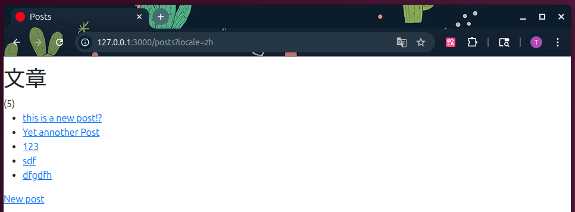
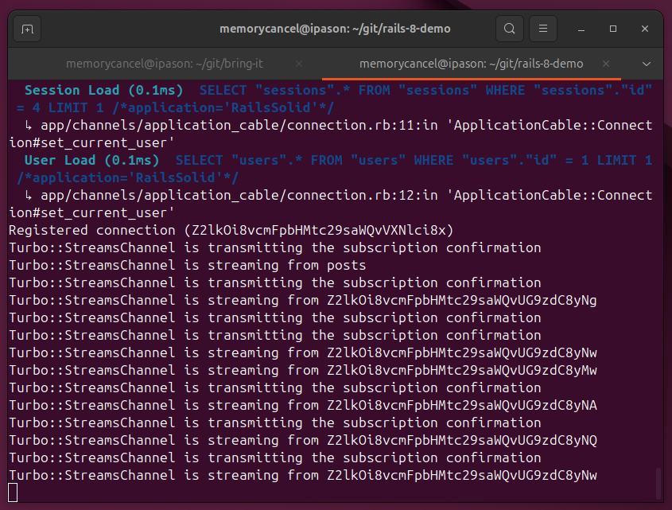

# Rails 8 默认 JavaScript 框架 Stimulus 总结

接上篇

```ruby
# app/views/posts/index.html.erb
<%# 订阅新增 %>
<%= turbo_stream_from 'posts' %>
<%# 订阅每条post的删除和修改 %>
<% @posts.each do |post| %>
  <%= turbo_stream_from post %>
<% end %>
```

我们通过以上方式，订阅每个单独的 post 的状态，posts 列表没新增一条，就需要多开1个channel订阅，当
posts 很多是这会大大增加服务器的负担。



如上图当有 5 条posts时，服务器会开启6个 channel 订阅：



## 1. 异步加载 HTML

我们可以通过异步加载 HTML 的方式解决这个问题，针对文章列表这块，通过异步加载。
步骤：

+ 新增页面 app/views/posts/list.html.erb
+ 新增路由 get "list"
+ app/views/posts/index.html.erb 中，删除订阅，并将posts列表部分“搬进” list.html.erb
+ 新增 app/javascript/controllers/content_loader_controller.js 异步加载逻辑

代码参考：[https://github.com/memorycancel/rails-8-demo/commit/0952d519dcb47e7140b9dfe201e32e9778bae993](https://github.com/memorycancel/rails-8-demo/commit/0952d519dcb47e7140b9dfe201e32e9778bae993)

## 2. 使用注意的点

### 2.1 使用定时器自动刷新

```html
<div data-controller="content-loader"
     data-content-loader-url-value="/messages.html"
     data-content-loader-refresh-interval-value="5000"></div>
```

### 2.2 释放跟踪资源

我们在控制器连接时启动定时器，但从不停止。这意味着如果控制器的元素消失，控制器将继续在后台发出 HTTP 请求。

```javascript
  ...
  disconnect() {
    this.stopRefreshing()
  }
  ...
  stopRefreshing() {
    if (this.refreshTimer) {
      clearInterval(this.refreshTimer)
    }
  }
```

### 2.3 使用 action 参数

可以通过使用 action 参数，实现通过事件（例如：点击）触发异步加载。

```html
<div data-controller="content-loader">
  <a href="#" data-content-loader-url-param="/messages.html" data-action="content-loader#load">Messages</a>
  <a href="#" data-content-loader-url-param="/comments.html" data-action="content-loader#load">Comments</a>
</div>
```

## 3. Rails 中使用 Stimulus 的惯例

Rails 8 默认集成了 Stimulus-rails。

### 3.1 控制器文件名映射到标识符

将控制器文件命名为 `[identifier]_controller.js` ，其中 identifier 与 HTML 中每个控制器的 data-controller 标识符相对应。

Stimulus for Rails 传统上使用`下划线`分隔文件名中的多个单词。控制器文件名中的每个下划线都会转化为其标识符中的`破折号`。

也可以使用子文件夹对控制器进行命名。在命名的控制器文件路径中，每个正斜线都会在其标识符中变成`两个破折号`。

也可以在控制器文件名的任何地方使用破折号代替下划线。Stimulus 对它们的处理方式相同。

| If your controller file is named…| its identifier will be… |
|:--------------------|:------------------|
|clipboard_controller.js|  clipboard|
|date_picker_controller.js| date-picker|
|users/list_item_controller.js| users--list-item|
|local-time-controller.js|  local-time|

### 3.2 其他

其他关于错误处理，调试，hack Stimuls 参考[https://stimulus.hotwired.dev/handbook/installing](https://stimulus.hotwired.dev/handbook/installing)
